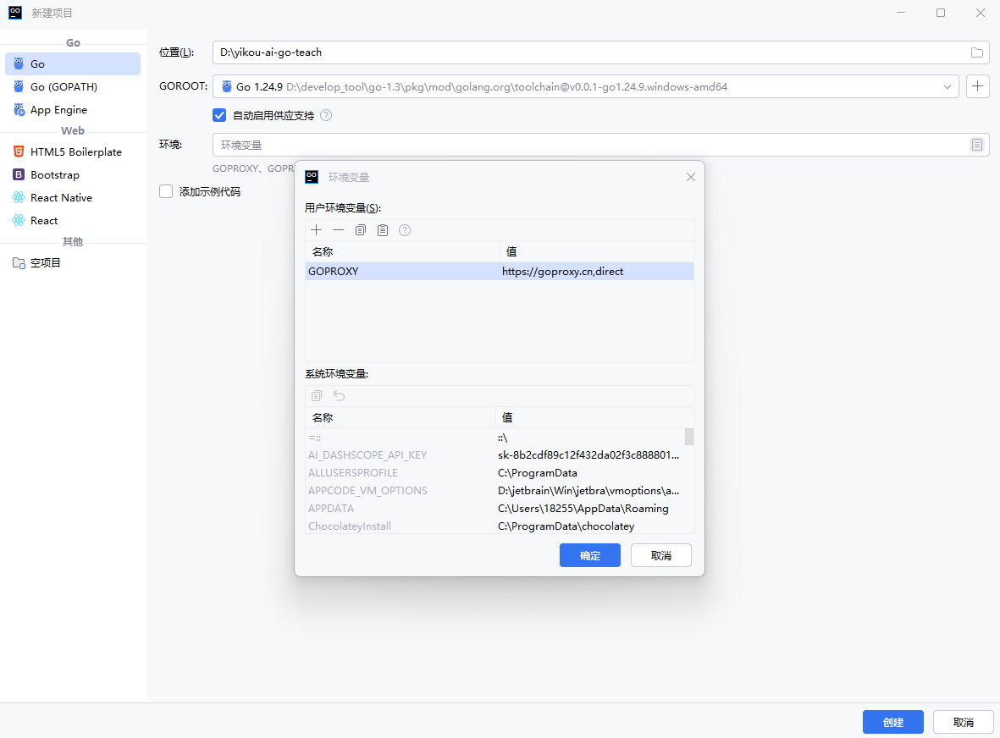
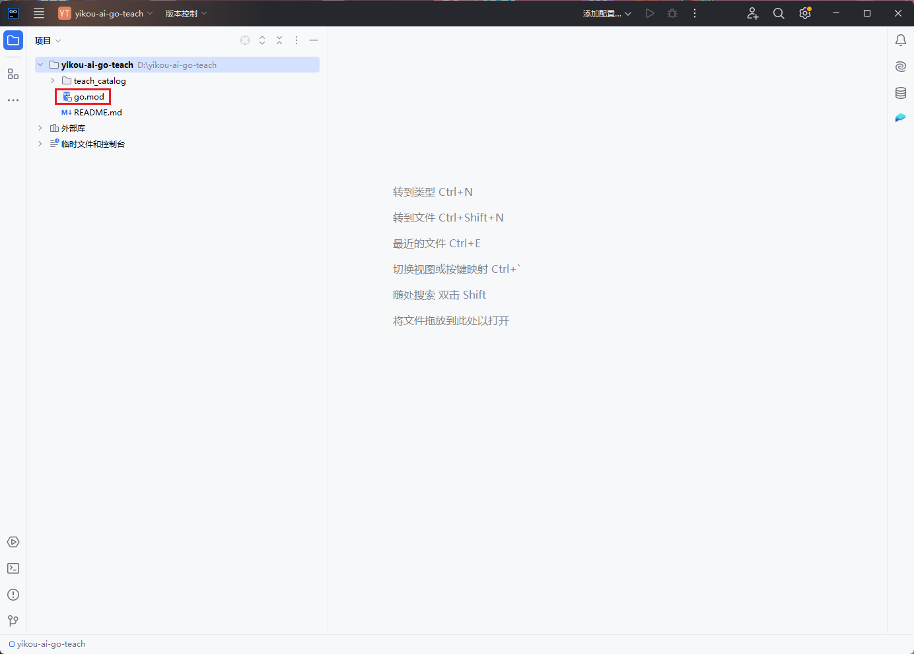
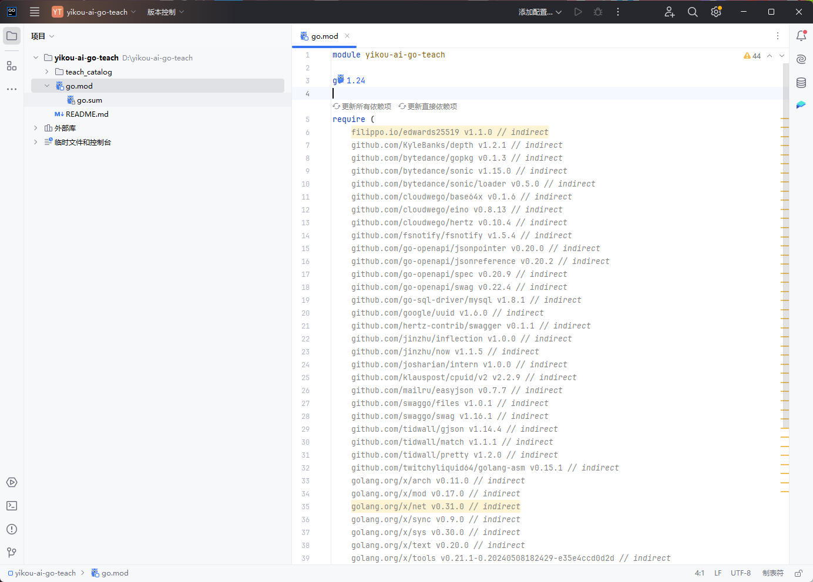
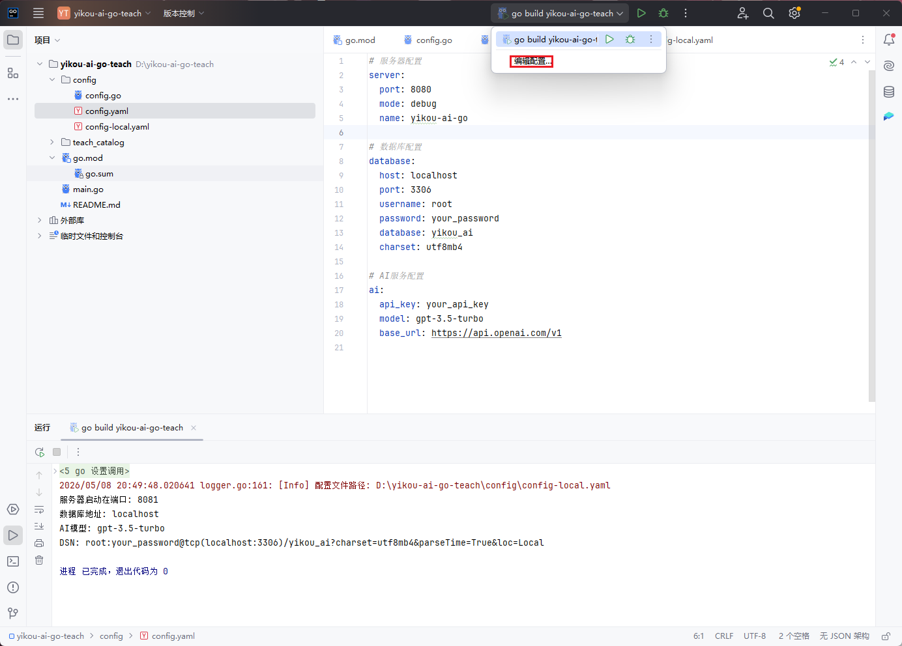
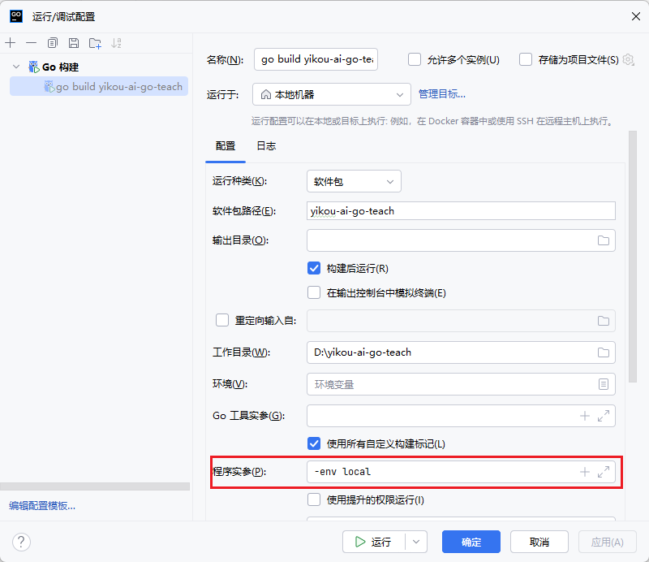
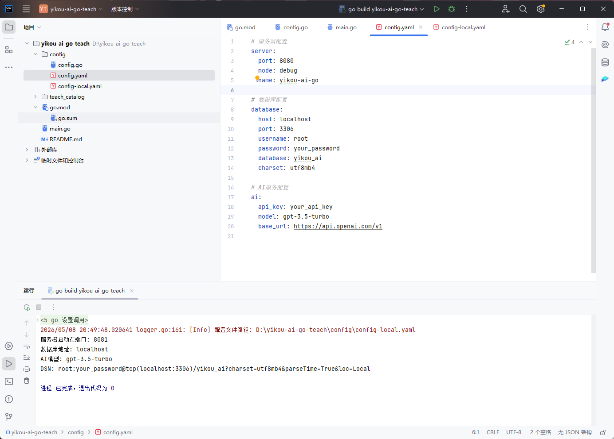
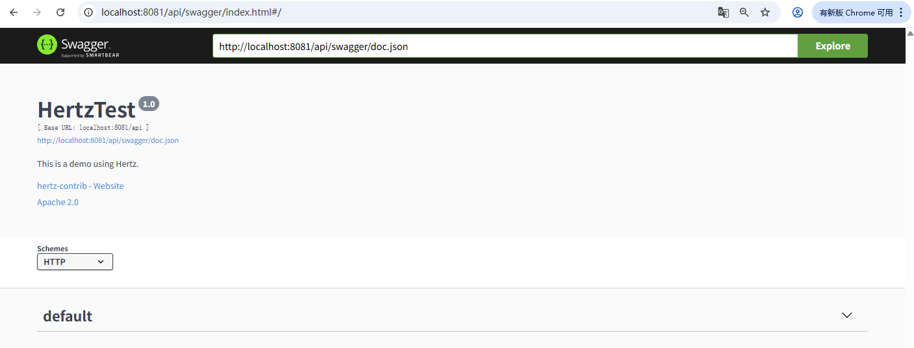
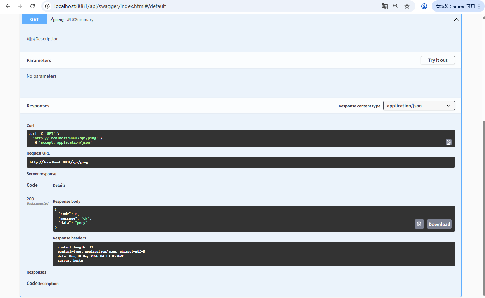

# 第1章：项目环境准备和依赖整合

> 本章目标：掌握企业级Go项目的初始化流程，学会设计清晰的目录结构

## 本章概述

在这一章，我们将从零开始创建一个企业级项目。在本章的开始，要是有小伙伴担忧自己只会后端，不会前端怎么办，别担心，关于前端的代码可以直接克隆仓库复制前端代码到自己的项目中，但是博主自己的前端代码有大部分都是通过vibe coding 生成的，大多都没有什么技术含量，该教程主要教导大家如何使用vibe coding 生成质量好的代码，所以在教程中我并没有太过关注前端的教学。

### 一、环境准备

#### 1. Go 语言环境

**版本要求：**

- Go 版本：≥ 1.24.9（推荐使用最新稳定版）
- 环境变量：已正确配置 GOROOT、GOPATH、PATH

> 注意：具体的 Go 安装步骤这里不再赘述，默认大家已经安装好开发环境。如果还没安装，请参考 Go 官方文档或相关教程。

#### 2. MySQL 数据库

**版本要求：**

- MySQL 版本：8.x（推荐）
- 避免使用过低版本，防止部分SQL 语句执行错误

> 注意：使用 MySQL 8.x 可以避免很多兼容性问题，确保项目构建过程中 SQL 语句能够正确执行。

### 二、开始新建项目

#### 步骤 1：创建项目文件夹

**推荐方式：从新建文件夹开始**

1. 选择合适的磁盘路径作为项目工作区
2. 新建文件夹，命名为项目名称（例如我自己教学使用则命名为：`yikou-ai-go-teach-example`）
3. 这个文件夹将作为项目的根目录


#### 步骤 2：使用 GoLand 创建项目

1. **打开 GoLand IDE**
2. **选择新建项目**

   - 点击 `File` → `New Project`
   - 或在欢迎界面点击 `New Project`
3. **配置项目路径**

   - Location：选择步骤 1 创建的文件夹绝对路径
   - 选择合适的 GOROOT 路径

     
4. **配置环境变量（关键步骤）** *

   这一步非常关键！如果没有正确配置，可能会导致：

   - Go 下载第三方库速度非常慢
   - 依赖下载失败

   **配置方法：**

   - 在环境变量配置区域，添加 `GOPROXY` 环境变量
   - 值选择：`https://goproxy.cn`（国内推荐）
   - 或手动输入：`https://goproxy.io`
     
5. **完成创建**

   点击确定再点击创建后，你将得到一个初见雏形的 Go 项目！

#### 步骤 3：验证项目创建成功

创建完成后，会发现根目录下会有一个go.mod文件，这表示你的项目已经创建成功了



### 三、下载项目依赖

项目创建成功后，我们需要下载一些核心依赖库，这些依赖将在后续开发中使用。让我们逐一安装：

#### 1. Hertz - Go Web 框架

**简介：** Hertz 是一个高性能的 Go HTTP 框架，由字节跳动开源，适合构建微服务和 Web 应用。

**安装命令：**

```bash
go get github.com/cloudwego/hertz
```

到这里，也许会有小伙伴问：为什么不用gin作为项目的web框架呢，gin在企业的使用规模不是比hertz大很多吗？博主对此声明一下，使用Golang开发web项目其实并不是很关注你使用什么框架，现在上市企业有使用gin的，有使用iris的，有使用go-frame的，我不可能同时照顾到所有人的学习要求，只能选择与Eino同生态的Hertz，而且Hertz也只是在gin的基础上加了几层封装而已，你弄懂了Hertz就相当于弄懂了gin，无论选择哪个开发框架，只要你弄懂了分层架构了，即便只学会一个框架也能随机应变兼容其他框架。**所以总结一句话：框架并不重要，重要的是搭建逻辑**。

#### 2. GORM - ORM 库

**简介：** GORM 是 Go 语言最流行的 ORM 库，提供了强大的数据库操作能力。

**安装命令：**

```bash
# 安装 GORM 核心库
go get gorm.io/gorm@v1.31.1 

# 安装 GORM代码生成器库
go get gorm.io/gen

# 安装 MySQL 驱动
go get gorm.io/driver/mysql
```

#### 3. Swaggo - Swagger 文档生成工具

**简介：** Swag 可以自动根据代码注释生成 Swagger API 文档，方便接口测试和文档管理。

**安装命令：**

```bash
# 安装 swag 命令行工具
go install github.com/swaggo/swag/cmd/swag@latest

# 安装 swagger 内嵌文件
go get github.com/swaggo/files

# 安装hertz的swagger拓展库
go get github.com/hertz-contrib/swagger
```

#### 4. Eino - AI 框架

**简介：** Eino 是一个强大的 AI 应用开发框架，帮助你快速集成 AI 能力到项目中。

**安装命令：**

```bash
go get github.com/cloudwego/eino
```

#### 5. Viper-配置动态读取

**介绍：‌**Viper 是 Go 语言中最流行的配置管理库‌，由 spf13 开发并维护，广泛用于 Go 应用程序中处理各类配置需求。它支持多种配置源、格式和高级功能，适用于从简单 CLI 工具到复杂微服务架构的场景。

```bash
go get github.com/spf13/viper 
```

#### 6. 验证依赖安装

安装完成后，可以查看go.mod文件是否有以上依赖的声明：



### 四、定义配置结构体

在企业级项目中，配置管理是非常重要的一环。我们需要定义清晰的配置结构体来管理各种配置信息，如数据库连接、服务器端口、API密钥等。

#### 1. 为什么需要配置结构体？

**使用配置结构体的优势：**

- 集中管理所有配置项
- 支持多环境配置切换
- 类型安全，编译时检查
- 便于扩展和维护

#### 2. 定义配置结构体

先在根目录下创建config目录，然后在该目录下创建 `config.go` 文件，定义配置结构体：

```go
package config

import (
	"fmt"
	"github.com/bytedance/gopkg/util/logger"
	"os"
	"path/filepath"
	"runtime"

	"github.com/spf13/viper"
)

// Config 全局配置结构体
type Config struct {
	Server   ServerConfig   `mapstructure:"server"`
	Database DatabaseConfig `mapstructure:"database"`
	AI       AIConfig       `mapstructure:"ai"`
}

// ServerConfig 服务器配置
type ServerConfig struct {
	Port        int    `mapstructure:"port"` // 服务端口
	ContextPath string `mapstructure:"context_path"` // api路径前缀
}

// DatabaseConfig 数据库配置
type DatabaseConfig struct {
	Host     string `mapstructure:"host"`     // 数据库地址
	Port     int    `mapstructure:"port"`     // 数据库端口
	Username string `mapstructure:"username"` // 用户名
	Password string `mapstructure:"password"` // 密码
	Database string `mapstructure:"database"` // 数据库名
}

// AIConfig AI服务配置
type AIConfig struct {
	APIKey  string `mapstructure:"api_key"`  // API密钥
	Model   string `mapstructure:"model"`    // 模型名称
	BaseURL string `mapstructure:"base_url"` // API基础URL
}

// GlobalConfig 全局配置变量
var GlobalConfig *Config

// GetProjectRootPath 获取项目根路径
// 通过 runtime.Caller 获取当前文件的路径，然后向上查找 go.mod 文件所在目录
func GetProjectRootPath() (string, error) {
	// 获取当前文件的路径
	_, filename, _, ok := runtime.Caller(0)
	if !ok {
		return "", fmt.Errorf("获取当前文件路径失败")
	}

	// 从当前文件路径向上查找，直到找到 go.mod 文件
	dir := filepath.Dir(filename)
	for {
		// 检查当前目录是否存在 go.mod 文件
		goModPath := filepath.Join(dir, "go.mod")
		if _, err := os.Stat(goModPath); err == nil {
			return dir, nil
		}

		// 向上一级目录
		parentDir := filepath.Dir(dir)
		if parentDir == dir {
			// 已经到达根目录，仍未找到 go.mod
			return "", fmt.Errorf("未找到项目根路径（找不到 go.mod 文件）")
		}
		dir = parentDir
	}
}

// InitConfig 初始化配置
// env 参数用于指定配置文件后缀，如 "local" 会读取 config-local.yaml
func InitConfig(env string) {
	// 获取项目根路径
	rootPath, err := GetProjectRootPath()
	if err != nil {
		panic(fmt.Errorf("获取项目根路径失败: %w", err))
	}

	// 拼接配置文件目录路径
	configPath := filepath.Join(rootPath, "config")

	// 确定配置文件名称
	configName := "config"
	if env != "" {
		configName = fmt.Sprintf("config-%s", env)
	}

	// 设置配置文件名和路径
	viper.SetConfigName(configName) // 配置文件名称
	viper.SetConfigType("yml")     // 配置文件类型
	viper.AddConfigPath(configPath) // 配置文件路径

	// 读取环境变量
	viper.AutomaticEnv()

	// 读取配置文件
	if err := viper.ReadInConfig(); err != nil {
		panic(fmt.Errorf("读取配置文件失败: %w", err))
	}

	logger.Infof("配置文件路径: %s\n", viper.ConfigFileUsed())

	// 解析配置到结构体
	GlobalConfig = &Config{}
	if err := viper.Unmarshal(GlobalConfig); err != nil {
		panic(fmt.Errorf("解析配置失败: %w", err))
	}
}

// GetDSN 获取数据库连接字符串
func (c *DatabaseConfig) GetDSN() string {
	return fmt.Sprintf("%s:%s@tcp(%s:%d)/%s?charset=utf8mb4&parseTime=True&loc=Local",
		c.Username,
		c.Password,
		c.Host,
		c.Port,
		c.Database,
	)
}

```

#### 4. 创建配置文件

**新建默认配置文件 `config/config.yml`：**

```yaml
# 服务器配置
server:
  port: 8123
  context_path: /api

# 数据库配置
database:
  host: localhost
  port: 3306
  username: root
  password: your_password
  database: yikou_ai
  charset: utf8mb4

# AI服务配置
ai:
  api_key: your_api_key
  model: gpt-3.5-turbo
  base_url: https://api.openai.com/v1
```

还可以根据不同的环境创建不同的配置文件，然后运行前在ide的运行配置修改运行命令指定运行读取的配置yml文件。





**由于配置文件里面携带了我的隐私信息（ai大模型的apiKey、cos对象存储的apiKey等等），这些隐私信息我都不会push到Github仓库上开源，所以之后的教程里我都是以local环境运行程序**

**配置文件命名规则：**

- `config.yml` - 默认配置文件
- `config-local.yml` - 本地开发环境（使用 `-env local`）
- `config-prod.yml` - 生产环境（使用 `-env prod`）

#### 5. 在主程序中使用配置

创建 `main.go` 主程序文件，并且记得修改包名为main，否则ide无法识别出程序运行入口：

```go
func main() {
	// 解析命令行参数
	env := flag.String("env", "", "运行环境，如 local, dev, test, prod")
	flag.Parse()

	// 初始化配置
	// 如果不指定 -env 参数，默认读取 config.yaml
	// 如果指定 -env local，则读取 config-local.yaml
	// 配置文件路径会自动从项目根目录下的 config 目录读取
	config.InitConfig(*env)

	// 使用配置
	cfg := config.GlobalConfig
	fmt.Printf("服务器启动在端口: %d\n", cfg.Server.Port)
	fmt.Printf("数据库地址: %s\n", cfg.Database.Host)
	fmt.Printf("AI模型: %s\n", cfg.AI.Model)

	// 获取数据库连接字符串
	dsn := cfg.Database.GetDSN()
	fmt.Printf("DSN: %s\n", dsn)
}
```

运行后的输出参考



### 五、编写通用代码

在企业级项目中，统一的错误处理和响应格式是非常重要的。我们需要创建一个通用包（pkg），用于定义错误码、业务错误。

#### 1. 为什么需要统一错误处理？

**传统方式的问题：**

- 错误码散落在代码各处，难以维护
- 错误信息不统一，前端难以处理
- 缺少错误分类，难以定位问题
- 响应格式不一致，增加前后端沟通成本

**统一错误处理的优势：**

- 错误码集中管理，便于维护
- 统一的错误响应格式，前端易于处理
- 清晰的错误分类，便于问题定位
- 标准化的API响应，提高开发效率

#### 2. 创建 pkg 目录结构

在根目录下新建目录pkg，该目录为公共包，用于存放所有公共文件代码

#### 3. 定义业务错误结构体和错误码（business_error.go）

在pkg包下新建文件 `business_error.go`

```go
package errorutil

import (
	"errors"
	"fmt"
)

// BusinessError 自定义错误结构体
type BusinessError struct {
	Code    int
	Message string
}

func (e BusinessError) Error() string {
	return fmt.Sprintf("errorCode: %d, message: %s", e.Code, e.Message)
}

func NewBusinessError(code ErrorNo, message string) BusinessError {
	return BusinessError{
		Code:    int(code),
		Message: message,
	}
}

func NewBusinessErrorByNo(code ErrorNo) BusinessError {
	message, _ := ErrMessageMap[code]
	return BusinessError{
		Code:    int(code),
		Message: message,
	}
}

func (e BusinessError) WithMessage(message string) BusinessError {
	e.Message = message
	return e
}

// ConvertError 将错误转换自定义系统错误
func ConvertError(err error) BusinessError {
	newErr := BusinessError{}
	if errors.As(err, &newErr) {
		return newErr
	}

	newErr = SystemError
	newErr.Message = err.Error()
	return newErr
}

type ErrorNo int

// 错误码枚举
const (
	SuccessErrCode        ErrorNo = 0
	ParamErrCode          ErrorNo = 40000
	NotLoginErrCode       ErrorNo = 40100
	NotAuthErrCode        ErrorNo = 40101
	ForbiddenErrorCode    ErrorNo = 40400
	TooManyRequestErrCode ErrorNo = 40300
	SystemErrorCode       ErrorNo = 50000
	OperationErrorCode    ErrorNo = 51001
)

var ErrMessageMap = map[ErrorNo]string{
	SuccessErrCode:        "ok",
	ParamErrCode:          "请求参数错误",
	NotLoginErrCode:       "未登录",
	NotAuthErrCode:        "无权限",
	ForbiddenErrorCode:    "禁止访问",
	TooManyRequestErrCode: "请求过于频繁",
	SystemErrorCode:       "系统内部异常",
	OperationErrorCode:    "操作失败",
}

// 错误码全局变量
var (
	Success             = NewBusinessErrorByNo(SuccessErrCode)
	ParamsError         = NewBusinessErrorByNo(ParamErrCode)
	NotLoginError       = NewBusinessErrorByNo(NotLoginErrCode)
	NotAuthError        = NewBusinessErrorByNo(NotAuthErrCode)
	ForbiddenError      = NewBusinessErrorByNo(ForbiddenErrorCode)
	TooManyRequestError = NewBusinessErrorByNo(TooManyRequestErrCode)
	SystemError         = NewBusinessErrorByNo(SystemErrorCode)
	OperationError      = NewBusinessErrorByNo(OperationErrorCode)
)

```

#### 4. 定义统一返回结构体（base_response.go）和常用请求api（base_request.go）

在pkg包下新建包response，在包里新建文件  `base_response.go`，定义统一返回结构体：

```go
package response

import (
	"errors"
	"yikou-ai-go-teach/pkg/errorutil"
)

type BaseResponse[T any] struct {
	Code    int    `json:"code"`
	Message string `json:"message"`
	Data    T      `json:"data"`
}

func NewSuccessResponse[T any](data T) *BaseResponse[T] {
	return &BaseResponse[T]{
		Code:    int(errorutil.SuccessErrCode),
		Message: errorutil.Success.Message,
		Data:    data,
	}
}

func NewErrorResponse[T any](err error) *BaseResponse[T] {
	newError := errorutil.BusinessError{}
	if errors.As(err, &newError) {
		return &BaseResponse[T]{
			Code:    newError.Code,
			Message: newError.Message,
		}
	} else {
		newError = errorutil.ConvertError(err)
		return &BaseResponse[T]{
			Code:    newError.Code,
			Message: newError.Message,
		}
	}
}

func NewResponse[T any](code int, message string, data T) *BaseResponse[T] {
	return &BaseResponse[T]{
		Code:    code,
		Message: message,
		Data:    data,
	}
}

type PageResponse[T any] struct {
	Records            []T  `json:"records"`
	PageNum            int  `json:"pageNum"`
	PageSize           int  `json:"pageSize"`
	TotalPage          int  `json:"totalPage"`
	TotalRow           int  `json:"totalRow"`
	OptimizeCountQuery bool `json:"optimizeCountQuery"`
}

```

在pkg包新建request包，再在该包下创建 `base_request.go`文件

```go
package request

type DeleteRequest struct {
	Id int `json:"id"`
}

type PageRequest struct {
	PageNum   int    `json:"pageNum"`
	PageSize  int    `json:"pageSize"`
	SortField string `json:"sortField"`
	SortOrder string `json:"sortOrder"`
}

```

### 六、初始化 Web 服务器

在完成了配置管理、错误处理和统一响应之后，我们需要初始化一个 Web 服务器来提供 HTTP 服务。本节将使用 Hertz 框架来搭建一个高性能的 Web 服务器。

#### 1. 理解 internal 包的作用

在开始创建 Web 服务器之前，我们需要先创建 `internal`包。如果你只是一位刚学完Go没多久的萌新，想必会问：

**什么是 internal 包？**

`internal` 是 Go 语言的一个特殊目录名，Go 编译器会对 `internal` 目录下的代码进行特殊的访问控制：

- **私有性**：`internal` 包中的代码只能被其父目录及其子目录中的代码导入
- **封装性**：防止外部项目依赖你的内部实现细节
- **模块化**：强制良好的代码组织结构

**为什么要使用 internal 包？**

**问题场景：**
假设你的项目结构如下：

```
my-project/
├── user/
│   └── service.go  # 包含敏感的用户逻辑
└── go.mod
```

其他项目可以直接导入你的 `user` 包：

```go
import "github.com/yourname/my-project/user"
```

这会导致：

- 内部实现细节暴露
- 难以重构（因为外部可能依赖）
- 代码耦合度高

**解决方案：使用 internal 包**

```
my-project/
├── internal/
│   └── user/
│       └── service.go  # 私有的用户逻辑
└── go.mod
```

现在，只有 `my-project` 及其子目录可以导入 `internal/user`，其他项目无法导入。

**最佳实践：**

1. **核心业务逻辑放 internal**

   - Handler、Service、Repository 等业务代码
   - 数据模型、业务规则等
2. **可复用工具放 pkg**

   - 错误处理、响应格式等通用工具
   - 工具函数、帮助类等
3. **入口程序放 cmd**

   - main.go 等程序入口文件（当然main文件也可以放在项目根路径下）
   - 不同应用的启动脚本
4. **配置文件放 config**

   - 配置结构体定义
   - 配置文件（yaml、json 等）

在我的开源项目里，我将internal包替换成了biz包，其实这是字节跳动的规范，两种包的命名含义都是一样的，没什么区别

#### 2. 创建测试接口

创建 `internal/handler/ping.go` - 健康检查：

```go
package handler

import (
	"context"
	"github.com/cloudwego/hertz/pkg/app"
	"github.com/cloudwego/hertz/pkg/protocol/consts"
	"yikou-ai-go-teach/pkg/response"
)

type PingResponse response.BaseResponse[string]

func Ping(ctx context.Context, c *app.RequestContext) {
	c.JSON(consts.StatusOK, response.NewSuccessResponse[string]("pong"))
}

```

#### 3. 创建路由配置

创建 `internal/router/router.go` 文件：

```go
package router

import (
	"context"
	"fmt"
	"github.com/bytedance/gopkg/util/logger"
	"github.com/cloudwego/hertz/pkg/app"
	"github.com/cloudwego/hertz/pkg/app/middlewares/server/recovery"
	"github.com/cloudwego/hertz/pkg/app/server"
	"github.com/cloudwego/hertz/pkg/protocol/consts"
	"github.com/hertz-contrib/cors"
	"time"
	"yikou-ai-go-teach/internal/handler"
	"yikou-ai-go-teach/pkg/errorutil"
	"yikou-ai-go-teach/pkg/response"
)

// RegisterRoutes 注册路由
func RegisterRoutes(h *server.Hertz) {
	// 注册全局中间件
	// 处理跨域问题
	h.Use(cors.New(cors.Config{
		AllowAllOrigins:  true,
		AllowMethods:     []string{"GET", "POST", "PUT", "DELETE", "OPTIONS"},
		AllowHeaders:     []string{"Origin", "Content-Type", "Authorization"},
		ExposeHeaders:    []string{"Content-Length"},
		AllowCredentials: false,
		MaxAge:           12 * time.Hour,
	}))
	// 全局异常处理
	h.Use(recovery.Recovery(recovery.WithRecoveryHandler(CustomRecoveryHandler)))

	// 测试接口
	h.GET("/ping", handler.Ping)
}

// CustomRecoveryHandler 全局异常处理器
func CustomRecoveryHandler(ctx context.Context, c *app.RequestContext, err interface{}, stack []byte) {
	logger.Errorf("panic recovered: %v\n%s", err, stack)
	c.JSON(consts.StatusOK, response.NewErrorResponse[any](errorutil.SystemError.WithMessage(fmt.Sprintf("%v", err))))
	c.Abort()
}
```

#### 4. 更新 main.go

修改 `main.go` 文件，可以启动 Web 服务器：

```go
package main

import (
	"flag"
	"github.com/cloudwego/hertz/pkg/app/server"
	"strconv"
	"yikou-ai-go-teach/config"
	"yikou-ai-go-teach/internal/router"
)

// initServer 初始化 Web 服务器
func initServer() *server.Hertz {
	cfg := config.GlobalConfig

	// 创建 Hertz 服务器
	h := server.Default(
		server.WithHostPorts(":" + strconv.Itoa(cfg.Server.Port)),
		server.WithBasePath(cfg.Server.ContextPath),
	)

	// 注册路由
	router.RegisterRoutes(h)
	return h
}

func main() {
	// 解析命令行参数
	env := flag.String("env", "", "运行环境，如 local, dev, test, prod")
	flag.Parse()

	// 初始化配置
	// 如果不指定 -env 参数，默认读取 config.yaml
	// 如果指定 -env local，则读取 config-local.yaml
	// 配置文件路径会自动从项目根目录下的 config 目录读取
	config.InitConfig(*env)

	// 初始化 Web 服务器
	h := initServer()

	// 启动服务器
	h.Spin()
}

```

### 七、测试验证 - Hertz 接入 Swagger

在完成了 Web 服务器的初始化之后，我们需要为 API 添加文档，方便前端开发和接口测试。Swagger 是最流行的 API 文档工具，本节将介绍如何在 Hertz 中接入 Swagger。

#### 1. 什么是 Swagger？

**Swagger 的作用：**

- **自动生成文档**：根据代码注释自动生成 API 文档
- **可视化界面**：提供 Swagger UI 进行接口测试
- **标准化**：遵循 OpenAPI 规范，支持多种工具

#### 2. 添加 Swagger 注释

**在测试接口添加接口注释：**

```go
// Ping
// @Summary   测试接口
// @Description 根据名字返回问候语
// @Accept    json
// @Produce   json
// @Success   200 {object} PingResponse
// @Router    /api/ping [get]
func Ping(ctx context.Context, c *app.RequestContext) {
	c.JSON(consts.StatusOK, response.NewSuccessResponse[string]("pong"))
}
```

#### 3. 修改main文件和增加swaggo的路由注册

修改 `main.go`文件

```go
/ initServer 初始化 Web 服务器
func initServer() *server.Hertz {
	cfg := config.GlobalConfig

	// 动态设置 Swagger 信息
	docs.SwaggerInfo.Host = fmt.Sprintf("localhost:%d", cfg.Server.Port)
	docs.SwaggerInfo.BasePath = cfg.Server.ContextPath

	// 初始化swagger路径
	swaggerPath := fmt.Sprintf("http://localhost:%d%s/swagger/doc.json", cfg.Server.Port, cfg.Server.ContextPath)
	url := swagger.URL(swaggerPath)

	// 创建 Hertz 服务器
	h := server.Default(
		server.WithHostPorts(":"+strconv.Itoa(cfg.Server.Port)),
		server.WithBasePath(cfg.Server.ContextPath),
	)

	// 注册路由
	router.RegisterRoutes(h, url)
	return h
}
```

修改 `router.go`文件

```go
// RegisterRoutes 注册路由
func RegisterRoutes(h *server.Hertz, url func(config *swagger.Config)) {
	// 注册全局中间件
	// 处理跨域问题
	h.Use(cors.New(cors.Config{
		AllowAllOrigins:  true,
		AllowMethods:     []string{"GET", "POST", "PUT", "DELETE", "OPTIONS"},
		AllowHeaders:     []string{"Origin", "Content-Type", "Authorization"},
		ExposeHeaders:    []string{"Content-Length"},
		AllowCredentials: false,
		MaxAge:           12 * time.Hour,
	}))
	// 全局异常处理
	h.Use(recovery.Recovery(recovery.WithRecoveryHandler(CustomRecoveryHandler)))

	// 测试接口
	h.GET("/ping", handler.Ping)
	// swaggo文档
	h.GET("/swagger/*any", swagger.WrapHandler(swaggerFiles.Handler, url))
}
```

#### 4. 生成swagger文档

**生成文档命令：**

```bash
# 在项目根目录执行
swag init
```

**生成的文件结构：**

```
docs/
├── docs.go          # Go 代码
├── swagger.json     # JSON 格式的 API 文档
└── swagger.yaml     # YAML 格式的 API 文档
```

#### 5. 访问 Swagger 文档

**启动服务器，访问 Swagger UI：**

打开浏览器访问：

```bash
http://localhost:8123/api/swagger/index.html
```



若启动main方法失败，可以执行以下指令重新整理项目依赖

```bash
go mod tidy
```

swagger文档能正常访问后，就可以直接进行接口测试了



**以下是swaggo常用注释说明：**

| 注释         | 说明               | 示例                                    |
| ------------ | ------------------ | --------------------------------------- |
| @Summary     | 接口简介           | @Summary 获取用户信息                   |
| @Description | 接口详细描述       | @Description 根据用户ID获取用户详细信息 |
| @Tags        | 接口分组           | @Tags 用户管理                          |
| @Accept      | 接受的Content-Type | @Accept json                            |
| @Produce     | 返回的Content-Type | @Produce json                           |
| @Param       | 参数说明           | @Param id path int true "用户ID"        |
| @Success     | 成功响应           | @Success 200 {object} Response          |
| @Failure     | 失败响应           | @Failure 400 {object} Response          |
| @Router      | 路由路径           | @Router /user/{id} [get]                |

**@Param 参数格式：**

```
@Param [参数名] [参数类型] [数据类型] [是否必须] [描述] [其他选项]
```

**参数类型：**

- `query`：URL 查询参数 `?id=1`
- `path`：URL 路径参数 `/user/{id}`
- `body`：请求体参数
- `header`：请求头参数
- `formData`：表单参数

**示例：**

```go
// @Param        id       path      int   true  "用户ID"
// @Param        name     query     string  false  "用户名"  default(test)
// @Param        request  body      CreateUserRequest  true  "创建用户请求"
// @Param        token    header    string  true  "认证令牌"
```
