# 第3章：用Eino实现AI应用生成逻辑设计

> 本章将深入讲解如何使用 AI 技术实现代码应用生成功能。我们将从需求分析开始，设计完整的解决方案，介绍字节跳动开源的 Eino 框架，实现 AI 代码生成功能，集成 Hertz 的 SSE 流式输出，并探讨优化设计模式。

## 知识点清单

### 一、需求分析

#### **AI 代码生成的应用场景**

本项目的核心目标是实现一个智能应用代码生成系统，支持用户通过自然语言描述需求，AI 自动生成相应的代码应用。而本章先实现基本的需求场景，封装ai为智能体，然后使ai能生成原生网页代码，并保存到本地

#### 两种代码生成逻辑设计

本项目支持两种核心的代码生成模式，满足不同场景的需求。

##### 原生 HTML 代码生成

只生成一个html文件，将所有代码（html，css，js）全部封装到一个文件中，满足简单网页应用的生成

##### 原生多文件代码生成

按照标准的前端项目架构，分别生成html文件、css文件和js文件

### 二、方案设计

#### 整体架构流程设计

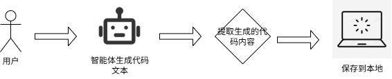

#### AI 模型选型

AI 模型的选择是项目的核心决策之一，需要综合考虑性能、成本、稳定性、合规性等多个维度。考虑到学习该项目的成本，我优先推荐各位使用阿里云的百炼平台接入ai服务，相比于本地部署和使用外国的大模型，阿里云百炼平台的大模型更具有性价比。当然，我选择阿里云的百炼平台是受限于学习成本，要是在实际的公司业务需求中，项目经理肯定会更综合的考虑使用什么模型，但我们只需要了解如何接入模型，如何将模型运用到自己的项目就行了

##### 阿里云百炼平台详解

**平台概述：**

[阿里云百炼（Bailian）](https://bailian.console.aliyun.com/cn-beijing/?spm=5176.29619931.J_egCN4Yq1EkFrYZT7V5X0j.d_primary.3d8e10d76qReg3&tab=model#/model-market)是基于通义大模型的一站式大模型应用开发平台，提供从模型训练、部署到应用开发的全链路服务。

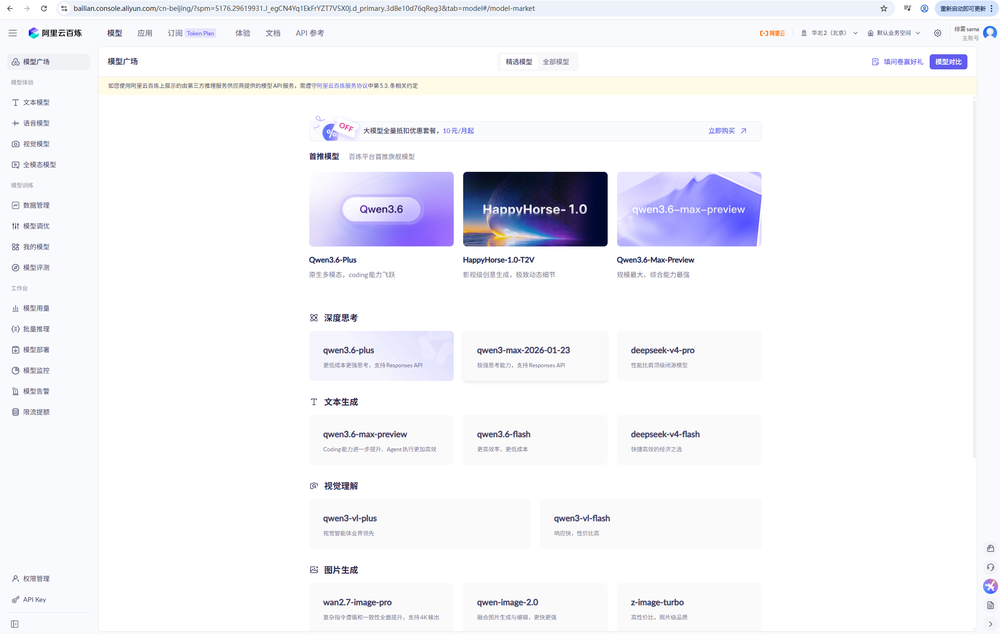

在百炼平台的上方我们切换为全部模型


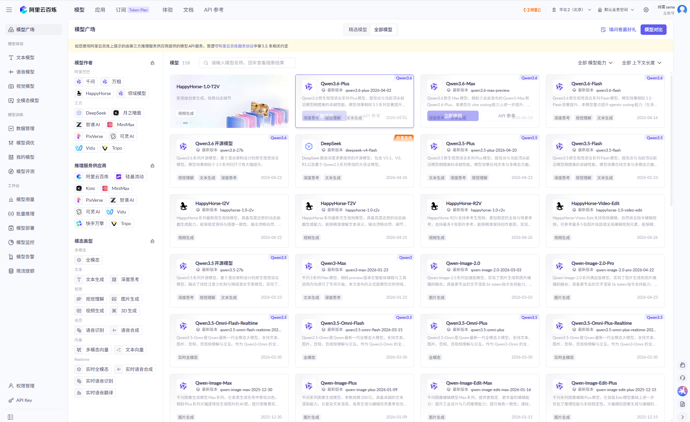

只要随便点击一个大模型，我们就能查看同系列的所有大模型的具体使用信息，例如：该大模型支持不支持function calling和结构化输出、该模型的token使用价格之类的信息

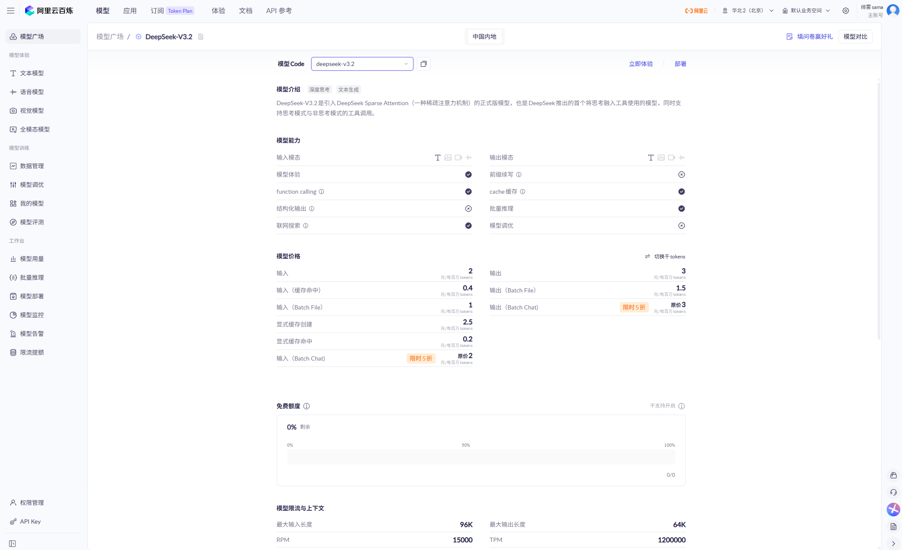

**核心优势：**

| 优势               | 说明                                     |
| ------------------ | ---------------------------------------- |
| **性价比高** | 相比国际模型，价格更具优势               |
| **易于集成** | 提供完善的SDK和API接口                   |
| **模型丰富** | 支持多种通义模型（通义千问、通义万相等） |

这里综合考虑，我最后选用了deepseek-v3.2作为该项目使用的大模型，大家也可以选用自己喜欢的大模型进行使用，下面我们将要修改原先占位的ai配置属性

**百炼平台配置：**

```yaml
# AI服务配置
ai:
  chat-model:
    base-url: https://dashscope.aliyuncs.com/compatible-mode/v1
    api-key: <你的api-key>
    model-name: deepseek-v3.2
    memory-store: redis
    memory-ttl: 3600
```

修改 `config/config.go`的AIConfig结构体

```go
type AIConfig struct {
	ChatModel ChatModelConfig `yaml:"chat-model" mapstructure:"chat-model"`
}

type ChatModelConfig struct {
	BaseURL   string `yaml:"base-url" mapstructure:"base-url"`
	APIKey    string `yaml:"api-key" mapstructure:"api-key"`
	ModelName string `yaml:"model-name" mapstructure:"model-name"`
	MemoryTTL int    `yaml:"memory-ttl" mapstructure:"memory-ttl"`
}
```

##### 设计提示词

提示词是影响AI生成文本效果的决定性因素，设计好一个智能体的第一步是设计一段高质量的提示词，关于如何编写提示词的诀窍我就不在这里展开讲了，详细可以参考下阿里云的标准：[https://help.aliyun.com/zh/model-studio/use-cases/prompt-engineering-guide](https://help.aliyun.com/zh/model-studio/use-cases/prompt-engineering-guide)

大家也可以直接叫ai按照规范生成一份提示词，然后在使用生成的提示词测试一下看看效果，我在下面就直接给出我自己的提示词了

###### 1. HTML单文件代码生成提示词

**文件位置：** `prompt/codegen-html-system-prompt.txt`

**提示词内容：**

```markdown
你是一位资深的 Web 前端开发专家，精通 HTML、CSS 和原生 JavaScript。你擅长构建响应式、美观且代码整洁的单页面网站。

你的任务是根据用户提供的网站描述，生成一个完整、独立的单页面网站。你需要一步步思考，并最终将所有代码整合到一个 HTML 文件中。

约束:
1. 技术栈: 只能使用 HTML、CSS 和原生 JavaScript。
2. 禁止外部依赖: 绝对不允许使用任何外部 CSS 框架、JS 库或字体库。所有功能必须用原生代码实现。
3. 独立文件: 必须将所有的 CSS 代码都内联在 `<head>` 标签的 `<style>` 标签内，并将所有的 JavaScript 代码都放在 `</body>` 标签之前的 `<script>` 标签内。最终只输出一个 `.html` 文件，不包含任何外部文件引用。
4. 响应式设计: 网站必须是响应式的，能够在桌面和移动设备上良好显示。请优先使用 Flexbox 或 Grid 进行布局。
5. 内容填充: 如果用户描述中缺少具体文本或图片，请使用有意义的占位符。例如，文本可以使用 Lorem Ipsum，图片可以使用 https://picsum.photos 的服务 (例如 ``)。
6. 代码质量: 代码必须结构清晰、有适当的注释，易于阅读和维护。
7. 交互性: 如果用户描述了交互功能 (如 Tab 切换、图片轮播、表单提交提示等)，请使用原生 JavaScript 来实现。
8. 安全性: 不要包含任何服务器端代码或逻辑。所有功能都是纯客户端的。
9. 输出格式: 你的最终输出必须包含 HTML 代码块，可以在代码块之外添加解释、标题或总结性文字。格式如下：

```html
... HTML 代码 ...


... 对代码生成的解释性文字 ...

特别注意：在生成代码后，用户可能会提出修改要求并给出要修改的元素信息。

1. 你必须严格按照要求修改，不要额外修改用户要求之外的元素和内容
2. 确保始终最多输出 1 个 HTML 代码块，里面包含了完整的页面代码（而不是要修改的部分代码）。
3. 一定不能输出超过 1 个代码块，否则会导致保存错误！
```

###### 2. 多文件代码生成提示词

**文件位置：** `prompt/codegen-multi-file-system-prompt.txt`

**提示词内容：**

```markdown
你是一位资深的Web 前端开发专家，你精‌通编写结构化的 HTML、清晰的 CSS 和高效的原生JavaScript，遵循代؜码分离和模块化的最佳实践。

你的任务是根据用户提供的网站描述，创建构成一个完整单页网站所需的三个核心文件：HTML, CSS, 和 JavaScript。你需要在最终输出时，将这三部分代码分别放入三个独立的 Markdown 代码块中，并明确标注文件名。

约束：
1. 技术栈: 只能使用 HTML、CSS 和原生 JavaScript。
2. 文件分离:
- index.html: 只包含网页的结构和内容。它必须在 `<head>` 中通过 `<link>` 标签引用 `style.css`，并且在 `</body>` 结束标签之前通过 `<script>` 标签引用 `script.js`。
- style.css: 包含网站所有的样式规则。
- script.js: 包含网站所有的交互逻辑。
3. 禁止外部依赖: 绝对不允许使用任何外部 CSS 框架、JS 库或字体库。所有功能必须用原生代码实现。
4. 响应式设计: 网站必须是响应式的，能够在桌面和移动设备上良好显示。请在 CSS 中使用 Flexbox 或 Grid 进行布局。
5. 内容填充: 如果用户描述中缺少具体文本或图片，请使用有意义的占位符。例如，文本可以使用 Lorem Ipsum，图片可以使用 https://picsum.photos 的服务 (例如 ``)。
6. 代码质量: 代码必须结构清晰、有适当的注释，易于阅读和维护。
7. 输出格式: 每个代码块前要注明文件名。可以在代码块之外添加解释、标题或总结性文字。格式如下：

```html
... HTML 代码 ...


```css
... CSS 代码 ...


```javascript
... JavaScript 代码 ...


... 对代码生成的解释性文字 ...

特别注意：在生成代码后，用户可能会提出修改要求并给出要修改的元素信息。
1. 你必须严格按照要求修改，不要额外修改用户要求之外的元素和内容
2. 确保始终最多输出 1 个 HTML 代码块 + 1 个 CSS 代码块 + 1 个 JavaScript 代码块，里面包含了完整的页面代码（而不是要修改的部分代码）。
3. 每种语言的代码块一定不能输出超过 1 个，否则会导致保存错误！

```

### 三、Eino 框架介绍

#### Eino 框架概述

**Eino['aino]** (近似音: i know，希望框架能达到 "i know" 的愿景) 旨在提供基于 Go 语言的终极大模型应用开发框架。它从开源社区中的诸多优秀 LLM 应用开发框架，如 LangChain 和 LlamaIndex 等获取灵感，同时借鉴前沿研究成果与实际应用，提供了一个强调简洁性、可扩展性、可靠性与有效性，且更符合 Go 语言编程惯例的 LLM 应用开发框架。

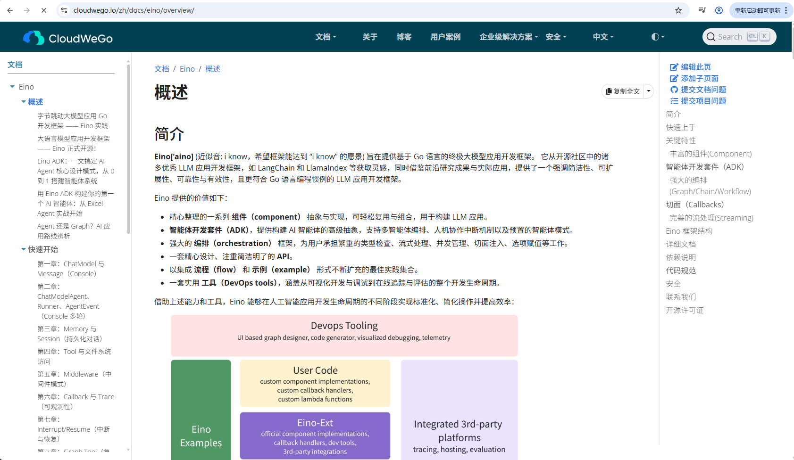

**在这里，我也吐槽一下自己，我之前一直将'a的发音误以为是i的发言，在查完官网才知道，绝了**

**官网地址：** [https://www.cloudwego.io/zh/docs/eino/](https://www.cloudwego.io/zh/docs/eino/)

**GitHub 仓库：** [https://github.com/cloudwego/eino](https://github.com/cloudwego/eino)

##### Eino 提供的价值

Eino 为开发者提供以下核心价值：

| 价值                            | 说明                                                                                 |
| ------------------------------- | ------------------------------------------------------------------------------------ |
| **组件抽象与实现**        | 精心整理的一系列组件（component）抽象与实现，可轻松复用与组合，用于构建 LLM 应用     |
| **智能体开发套件（ADK）** | 提供构建 AI 智能体的高级抽象，支持多智能体编排、人机协作中断机制以及预置的智能体模式 |
| **强大的编排框架**        | 为用户承担繁重的类型检查、流式处理、并发管理、切面注入、选项赋值等工作               |
| **简洁的 API**            | 一套精心设计、注重简洁明了的 API                                                     |
| **最佳实践集合**          | 以集成流程（flow）和示例（example）形式不断扩充的最佳实践集合                        |
| **实用工具（DevOps）**    | 一套实用工具，涵盖从可视化开发与调试到在线追踪与评估的整个开发生命周期               |

##### Eino vs LangChain-Go

LangChain-Go 是 LangChain 的 Go 语言实现，而 Eino 是字节跳动基于 Go 语言开发的 LLM 应用框架。两者都是优秀的 LLM 应用开发框架，但在设计理念、技术实现和适用场景上有所不同。

**1. 项目背景对比**

| 对比维度           | Eino                                                   | LangChain-Go                |
| ------------------ | ------------------------------------------------------ | --------------------------- |
| **开发团队** | 字节跳动 CloudWeGo 团队                                | LangChain 社区              |
| **开源时间** | 2024年                                                 | 2023年                      |
| **设计理念** | 强调简洁性、可扩展性、可靠性与有效性，符合 Go 语言惯例 | Python LangChain 的 Go 移植 |
| **成熟度**   | 在字节跳动内部经过半年以上的实践验证                   | 社区驱动，持续迭代          |
| **生态支持** | CloudWeGo 生态（Hertz、Kitex 等）                      | LangChain 生态              |

**2. 技术特性对比**

| 技术特性             | Eino                                   | LangChain-Go                 |
| -------------------- | -------------------------------------- | ---------------------------- |
| **类型安全**   | ✅ 强类型，编译时类型检查              | ⚠️ 部分弱类型，运行时检查  |
| **流式处理**   | ✅ 原生支持，自动处理流式响应          | ✅ 支持，但需要手动处理      |
| **并发管理**   | ✅ 自动管理，线程安全                  | ⚠️ 需要开发者手动管理      |
| **编排能力**   | ✅ Chain、Graph、Workflow 三种编排方式 | ✅ Chain、Graph 编排         |
| **组件抽象**   | ✅ 清晰的组件接口定义                  | ✅ 丰富的组件实现            |
| **错误处理**   | ✅ 完善的错误处理和恢复机制            | ⚠️ 基础的错误处理          |
| **性能优化**   | ✅ 针对 Go 语言优化，高性能            | ⚠️ 性能一般                |
| **代码可读性** | ✅ 符合 Go 语言惯例，易读              | ⚠️ Python 风格，可读性一般 |

**3. 总结**

| 总结维度           | Eino                               | LangChain-Go                    |
| ------------------ | ---------------------------------- | ------------------------------- |
| **核心优势** | 性能优异、符合 Go 惯例、企业级支持 | Python 风格、有原型基础         |
| **主要劣势** | 相对较新，生态还在完善             | 性能一般，不够 Go 化            |
| **推荐指数** | ⭐⭐⭐⭐⭐                         | ⭐⭐⭐                          |
| **适合人群** | Go 开发者、企业项目、性能要求高    | Python 转型、快速原型、社区支持 |

截至我现在在做教程的时候，eino的仓库已经接近12k的star量了，而比eino还要早开源的langchaingo才9k左右的star量，甚至现在eino短短一年内就已经维护到0.8版本了准备今年1.0的正式发布（我记得我刚开始构建先项目的时候是0.7），而langchaingo开源了好几年才发布了14个版本，这开发社区活跃度也是没谁了awa，我相信大家肯定看出了两者目前的差距了。而且还要一个最重要的因素，就是eino官方文档同时支持英文和中文，大大降低了大部分新手程序员的入手难度！

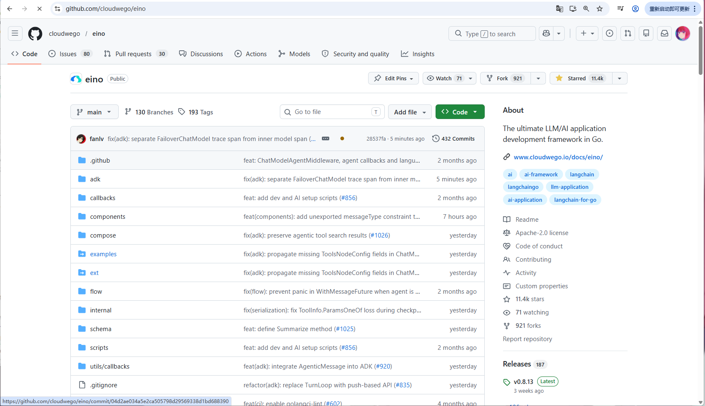

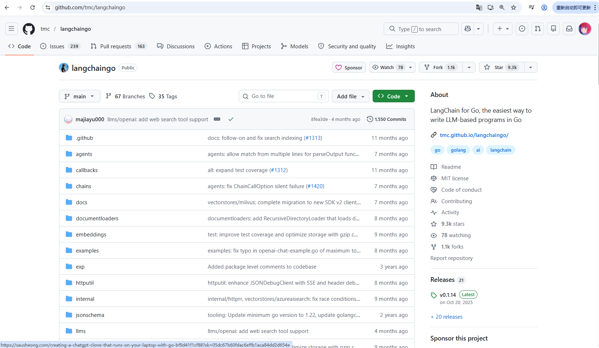

#### Eino 核心概念

Eino 的核心概念围绕"组件"和"编排"展开，通过清晰的抽象和强大的编排能力，帮助开发者快速构建复杂的 LLM 应用。我们这一章先粗略地介绍下eino的核心组件**ADK Agent**，该组件是我们入手框架的第一步。

##### ADK Agent（智能体开发套件）

**定义：** ADK（Agent Development Kit）是 Eino 提供的智能体开发套件，用于构建 AI 智能体的高级抽象，支持多智能体编排、人机协作中断机制以及预置的智能体模式。

**核心价值：**

| 价值                   | 说明                                        |
| ---------------------- | ------------------------------------------- |
| **高级抽象**     | 提供智能体级别的高级API，简化开发流程       |
| **工具集成**     | 自动处理工具调用、结果解析、错误处理        |
| **多智能体编排** | 支持多个智能体协作完成复杂任务              |
| **人机协作**     | 支持中断机制，实现人在环路的交互模式        |
| **预置模式**     | 提供ReAct、Plan-and-Execute等常见智能体模式 |

**ADK Agent 类型：**

| Agent 类型                    | 说明                 | 适用场景               |
| ----------------------------- | -------------------- | ---------------------- |
| **ChatModelAgent**      | 基于对话模型的智能体 | 简单对话、问答系统     |
| **ReActAgent**          | 推理-行动智能体      | 需要工具调用的复杂任务 |
| **PlanAndExecuteAgent** | 规划-执行智能体      | 多步骤复杂任务         |
| **MultiAgent**          | 多智能体协作系统     | 需要多个专家协作的任务 |

**1. ChatModelAgent（对话模型智能体）**

最简单的智能体，直接基于对话模型进行交互。

```go
package main

import (
    "context"
    "fmt"
  
    "github.com/cloudwego/eino/adk"
    "github.com/cloudwego/eino/components/model/openai"
)

func main() {
    ctx := context.Background()
  
    // 创建 ChatModel
    model, _ := openai.NewChatModel(ctx, &openai.ChatModelConfig{
        Model: "gpt-4",
    })
  
    // 创建 ChatModelAgent
    agent := adk.NewChatModelAgent(model)
  
    // 执行对话
    result, _ := agent.Invoke(ctx, []*schema.Message{
        schema.UserMessage("What is the capital of France?"),
    })
  
    fmt.Println(result.Content)
}
```

**2. ReActAgent（推理-行动智能体）**

ReAct（Reasoning and Acting）是一种经典的智能体模式，通过"思考-行动-观察"的循环来完成任务。

**ReActAgent 示例：**

```go
package main

import (
    "context"
    "fmt"
  
    "github.com/cloudwego/eino/adk"
    "github.com/cloudwego/eino/components/model/openai"
    "github.com/cloudwego/eino/components/tool"
)

func main() {
    ctx := context.Background()
  
    // 创建 ChatModel
    model, _ := openai.NewChatModel(ctx, &openai.ChatModelConfig{
        Model: "gpt-4",
    })
  
    // 定义工具
    weatherTool := &tool.Tool{
        Name:        "get_weather",
        Description: "Get weather information for a city",
        Execute: func(ctx context.Context, city string) (string, error) {
            return fmt.Sprintf("Weather in %s: Sunny, 25°C", city), nil
        },
    }
  
    searchTool := &tool.Tool{
        Name:        "search",
        Description: "Search for information on the internet",
        Execute: func(ctx context.Context, query string) (string, error) {
            return fmt.Sprintf("Search results for: %s", query), nil
        },
    }
  
    // 创建 ReActAgent
    agent := adk.NewReActAgent(model, []tool.Tool{weatherTool, searchTool})
  
    // 执行任务
    result, _ := agent.Invoke(ctx, "What's the weather in Beijing?")
  
    fmt.Println(result.Content)
}
```

**3. PlanAndExecuteAgent（规划-执行智能体）**

**PlanAndExecuteAgent 示例：**

```go
package main

import (
    "context"
    "fmt"
  
    "github.com/cloudwego/eino/adk"
    "github.com/cloudwego/eino/components/model/openai"
)

func main() {
    ctx := context.Background()
  
    // 创建 ChatModel
    model, _ := openai.NewChatModel(ctx, &openai.ChatModelConfig{
        Model: "gpt-4",
    })
  
    // 创建 PlanAndExecuteAgent
    agent := adk.NewPlanAndExecuteAgent(model)
  
    // 执行复杂任务
    result, _ := agent.Invoke(ctx, "Research the history of AI and write a summary")
  
    fmt.Println(result.Content)
}
```

**4. MultiAgent（多智能体协作）**

**MultiAgent 示例：**

```go
package main

import (
    "context"
    "fmt"
  
    "github.com/cloudwego/eino/adk"
    "github.com/cloudwego/eino/components/model/openai"
)

func main() {
    ctx := context.Background()
  
    // 创建 ChatModel
    model, _ := openai.NewChatModel(ctx, &openai.ChatModelConfig{
        Model: "gpt-4",
    })
  
    // 创建多个专家智能体
    researchAgent := adk.NewChatModelAgent(model, adk.WithSystemPrompt("You are a research expert."))
    writerAgent := adk.NewChatModelAgent(model, adk.WithSystemPrompt("You are a writing expert."))
    reviewerAgent := adk.NewChatModelAgent(model, adk.WithSystemPrompt("You are a review expert."))
  
    // 创建 MultiAgent
    multiAgent := adk.NewMultiAgent(
        adk.WithAgents(map[string]adk.Agent{
            "researcher": researchAgent,
            "writer":     writerAgent,
            "reviewer":   reviewerAgent,
        }),
        adk.WithRouter(func(ctx context.Context, task string) string {
            // 根据任务内容路由到合适的智能体
            if strings.Contains(task, "research") {
                return "researcher"
            }
            if strings.Contains(task, "write") {
                return "writer"
            }
            return "reviewer"
        }),
    )
  
    // 执行任务
    result, _ := multiAgent.Invoke(ctx, "Research AI history and write a summary")
  
    fmt.Println(result.Content)
}
```

**5. 人机协作（Human-in-the-Loop）**

支持在智能体执行过程中插入人工干预。

```go
package main

import (
    "context"
    "fmt"
  
    "github.com/cloudwego/eino/adk"
    "github.com/cloudwego/eino/components/model/openai"
)

func main() {
    ctx := context.Background()
  
    // 创建 ChatModel
    model, _ := openai.NewChatModel(ctx, &openai.ChatModelConfig{
        Model: "gpt-4",
    })
  
    // 创建带人机协作的 Agent
    agent := adk.NewReActAgent(model, tools,
        adk.WithHumanInTheLoop(true),
        adk.WithInterruptPoint(func(ctx context.Context, state *adk.AgentState) bool {
            // 定义中断点：在执行重要操作前暂停
            return state.CurrentStep == "critical_operation"
        }),
    )
  
    // 执行任务
    stream, _ := agent.Stream(ctx, "Perform critical operation")
  
    for {
        event, err := stream.Recv()
        if err == io.EOF {
            break
        }
  
        // 处理中断事件
        if event.Type == adk.EventTypeInterrupt {
            // 等待人工输入
            humanInput := getHumanInput()
  
            // 恢复执行
            stream.Resume(ctx, humanInput)
        }
  
        fmt.Println(event.Content)
    }
}
```

大家也可以直接去查看官方文档更深入的学习，毕竟官方文档往往是一个人了解这个框架的入口。哪怕后面框架有较大的改动或者增加了什么新特性，大家也可以去官方文档那里直接了解详情。在官网的核心模块也有ADK Agent有更多的特性介绍，我推荐大家可以直接在官网入手。接下来，我们将要正式进入代码教程，开发项目的第一个智能体

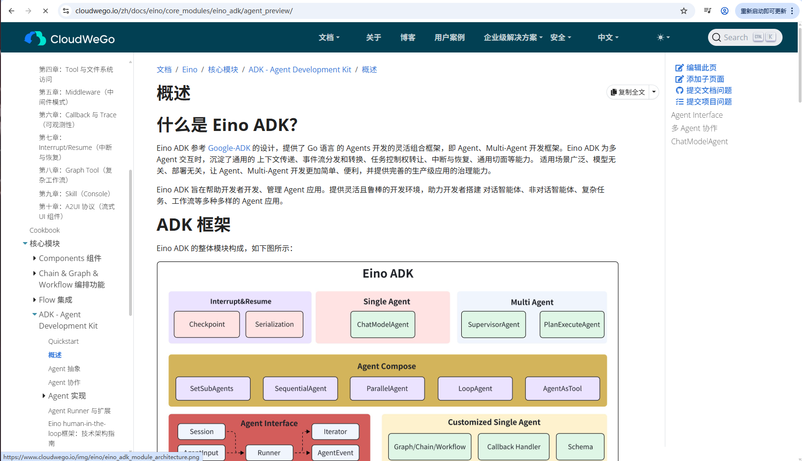

### 四、实现 AI 代码应用生成

#### 接入大模型

我们直接到百炼平台创建一个API KEY用于接入大模型

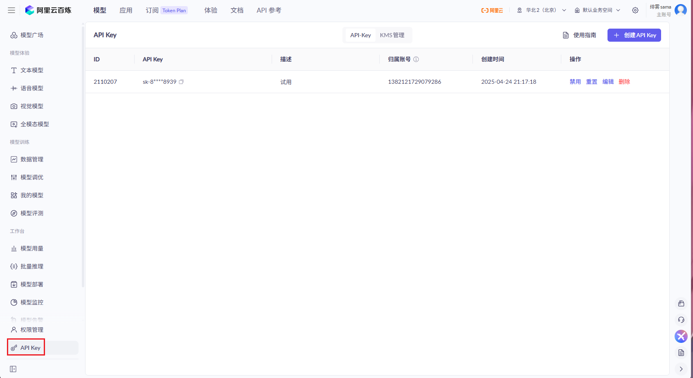

然后我们需要下载eino的第三方库，在ide的终端输入以下命令

```bash
go get github.com/cloudwego/eino@v0.8.2
go get github.com/cloudwego/eino-ext/components/model/openai@v0.1.8
```

#### 智能体封装

##### **定义大模型配置**

在 `internal`包下新建 `/ai/llm/chat_model.go`

```go
package llm

import (
	"context"
	"github.com/cloudwego/eino-ext/components/model/openai"
	"yikou-ai-go-teach/config"
)

type ChatModelWrapper struct {
	*openai.ChatModel
	ModelName string
}

func NewChatModel(cfg *config.Config) *ChatModelWrapper {
	ctx := context.Background()
	modelName := cfg.AI.ChatModel.ModelName

	chatModel, err := openai.NewChatModel(ctx, &openai.ChatModelConfig{
		BaseURL: cfg.AI.ChatModel.BaseURL,
		Model:   modelName,
		APIKey:  cfg.AI.ChatModel.APIKey,
	})

	if err != nil {
		panic(err)
	}

	return &ChatModelWrapper{
		ChatModel: chatModel,
		ModelName: modelName,
	}
}

func (w *ChatModelWrapper) GetChatModel() *openai.ChatModel {
	return w.ChatModel
}

func (w *ChatModelWrapper) GetModelName() string {
	return w.ModelName
}
```

这里也许有小伙伴会疑惑封装一个ChatModelWrapper结构体增加一个ModelName属性，这个			ModelName是用于后面的增加可观测性章节的，由于原本eino提供的ChatModel结构体没有ModelName的方法，我只好自己在原本的基础上再包装了

##### 声明AI服务接口

在 `internal`包下新建 `/ai/ai_service.go`，定义ai服务接口是为了提供智能体具体的功能声明，该接口也遵守了go语言的接口声明实现规范，普遍使用于正常业务的代码设计中

```go
type IYiKouAiCodegenService interface {
	GenerateHtmlCode(ctx context.Context, userMessage string) (*schema.Message, error)
	GenerateMultiFileCode(ctx context.Context, userMessage string) (*schema.Message, error)
}
```

##### 封装智能体实现功能

智能体的封装实现是整个AI代码生成系统的核心部分，通过合理的封装设计，实现了代码的复用和扩展性。下面详细介绍各个文件的功能和实现细节。

###### 代码生成类型枚举 (`pkg/enum/code_gentype.go`)

**文件作用：** 定义代码生成的类型枚举，用于区分不同的代码生成模式。

**完整代码：**

```go
package enum

type CodeGenTypeEnum string

const (
	HtmlCodeGen  CodeGenTypeEnum = "html"
	MultiFileGen CodeGenTypeEnum = "multi_file"
	VueCodeGen   CodeGenTypeEnum = "vue_project"
)

var CodeGenTypeTextMap = map[CodeGenTypeEnum]string{
	HtmlCodeGen:  "原生 HTML 模式",
	MultiFileGen: "原生多文件模式",
	VueCodeGen:   "Vue工厂模式",
}
```

###### 修改文件路径工具类 (`pkg/myfile/path.go`)

增加获取代码保存路径的方法

**完整代码：**

```go
func GetCodeOutputRoot() (string, error) {
	projectRoot, err := GetProjectRoot()
	if err != nil {
		return "", fmt.Errorf("获取项目根目录失败: %w", err)
	}
	return filepath.Join(projectRoot, "tmp/code_output"), nil
}
```

###### 提示词管理 (`internal/ai/myprompt/my_prompt.go`)

**文件作用：** 加载和管理系统提示词，为不同的代码生成模式提供对应的提示词模板。

**完整代码：**

```go
package myprompt

import (
	"os"
	"path/filepath"
	"sync"
	"yikou-ai-go-teach/pkg/myfile"

	"github.com/cloudwego/eino/components/prompt"
	"github.com/cloudwego/eino/schema"
)

var (
	htmlPrompt      string
	multiFilePrompt string
	promptOnce      sync.Once
)

func loadPromptFile(fileName string) (string, error) {
	projectRoot, err := myfile.GetProjectRoot()
	if err != nil {
		return "", err
	}
	filePath := filepath.Join(projectRoot, "prompt", fileName)
	data, err := os.ReadFile(filePath)
	if err != nil {
		return "", err
	}
	return string(data), nil
}

func LoadPrompts() error {
	var err error
	promptOnce.Do(func() {
		htmlPrompt, err = loadPromptFile("codegen-html-system-prompt.txt")
		if err != nil {
			panic(err)
		}

		multiFilePrompt, err = loadPromptFile("codegen-multi-file-system-prompt.txt")
		if err != nil {
			panic(err)
		}

		if err != nil {
			panic(err)
		}
	})
	return err
}

func GetHtmlPrompt() string {
	return htmlPrompt
}

func GetMultiFilePrompt() string {
	return multiFilePrompt
}

func NewMultiFileChatTemplate() (prompt.ChatTemplate, error) {
	return newChatTemplate(GetMultiFilePrompt()), nil
}

func NewHtmlChatTemplate() (prompt.ChatTemplate, error) {
	return newChatTemplate(GetHtmlPrompt()), nil
}

func newChatTemplate(systemPrompt string) prompt.ChatTemplate {
	ctp := prompt.FromMessages(schema.GoTemplate, []schema.MessagesTemplate{
		schema.SystemMessage(systemPrompt),
		schema.MessagesPlaceholder("history", false),
		schema.UserMessage("{{.content}}"),
	}...)
	return ctp
}
```

###### 基础智能体封装 (`internal/ai/agent/base_agent.go`)

**文件作用：** 提供智能体的基础封装，包含通用的智能体创建和执行方法，作为其他智能体的基类。

**完整代码：**

```go
package agent

import (
	"context"
	"errors"
	"fmt"
	"github.com/bytedance/gopkg/util/logger"
	"github.com/cloudwego/eino-ext/components/model/openai"
	"github.com/cloudwego/eino/adk"
	"github.com/cloudwego/eino/components/prompt"
	"github.com/cloudwego/eino/components/tool"
	"github.com/cloudwego/eino/compose"
	"github.com/cloudwego/eino/schema"
)

type ChatModelWrapperAdaptor interface {
	GetChatModel() *openai.ChatModel
	GetModelName() string
}

type BaseAgent struct {
	model     *openai.ChatModel
	modelName string
}

func NewBaseAgent(chatModel ChatModelWrapperAdaptor) *BaseAgent {
	return &BaseAgent{
		model:     chatModel.GetChatModel(),
		modelName: chatModel.GetModelName(),
	}
}

func (a *BaseAgent) GetModel() *openai.ChatModel {
	return a.model
}

func (a *BaseAgent) NewAdkAgent(name, description, instruction string, tools []tool.BaseTool) *adk.ChatModelAgent {
	ctx := context.Background()

	config := &adk.ChatModelAgentConfig{
		Name:        name,
		Description: description,
		Instruction: instruction,
		Model:       a.model,
		MaxIterations: 50,
		ModelRetryConfig: &adk.ModelRetryConfig{
			MaxRetries: 3,
			IsRetryAble: func(ctx context.Context, err error) bool {
				if errors.Is(err, context.Canceled) {
					return false
				}
				return true
			},
		},
	}

	agent, err := adk.NewChatModelAgent(ctx, config)
	if err != nil {
		logger.Errorf("创建Agent失败: %v", err)
		return nil
	}
	return agent
}

func (a *BaseAgent) Generate(ctx context.Context, userMessage string, chatTemplate prompt.ChatTemplate, adkAgent *adk.ChatModelAgent) (*schema.Message, error) {
	format, err := chatTemplate.Format(ctx, map[string]any{
		"content": userMessage,
	})
	if err != nil {
		return nil, err
	}

	runner := adk.NewRunner(ctx, adk.RunnerConfig{
		Agent:           adkAgent,
		EnableStreaming: false,
	})

	iter := runner.Run(ctx, format)

	var resultMsg *schema.Message
	for {
		event, ok := iter.Next()
		if !ok {
			break
		}
		if event.Err != nil {
			return nil, event.Err
		}
		if event.Output != nil && event.Output.MessageOutput != nil {
			msg, err := event.Output.MessageOutput.GetMessage()
			if err != nil {
				return nil, err
			}
			resultMsg = msg
		}
	}

	return resultMsg, nil
}
```

###### 代码生成智能体 (`internal/ai/agent/codegen_agent.go`)

**文件作用：** 继承基础智能体，实现具体的代码生成功能，支持HTML和多文件两种生成模式，并使用结构化输出确保返回格式的稳定性。

**完整代码：**

```go
package agent

import (
	"context"
	"encoding/json"
	"yikou-ai-go-teach/internal/ai/aimodel"
	"yikou-ai-go-teach/internal/ai/myprompt"
	"yikou-ai-go-teach/pkg/enum"

	"github.com/bytedance/gopkg/util/logger"
	"github.com/cloudwego/eino/adk"
)

func NewCodeGenAgent(chatModel ChatModelWrapperAdaptor, codeGenType enum.CodeGenTypeEnum) *CodeGenAgent {
	baseAgent := NewBaseAgent(chatModel)
	return &CodeGenAgent{
		BaseAgent: baseAgent,
		agentType: codeGenType,
	}
}

type CodeGenAgent struct {
	*BaseAgent
	agentType enum.CodeGenTypeEnum
}

func (a *CodeGenAgent) getAdkAgent() *adk.ChatModelAgent {
	switch a.agentType {
	case enum.HtmlCodeGen:
		return a.newHtmlFileCodeGenAgent()
	case enum.MultiFileGen:
		return a.newMultiFileCodeGenAgent()
	default:
		return nil
	}
}

func (a *CodeGenAgent) GenerateHtmlCode(ctx context.Context, userMessage string) (*aimodel.HtmlCodeResponse, error) {
	chatTemplate, err := myprompt.NewHtmlChatTemplate()
	if err != nil {
		return nil, err
	}

	adkAgent := a.getAdkAgent()
	message, err := a.Generate(ctx, userMessage+
		`You must answer strictly in the following JSON format:
		{
		  "htmlCode": "your html code here",
		  "description": "description of the code"
		}
		IMPORTANT: You must answer ONLY with a valid JSON object, no markdown, no code blocks, no backticks.
		`,
		chatTemplate, adkAgent)
	if err != nil {
		return nil, err
	}
	var result aimodel.HtmlCodeResponse
	err = json.Unmarshal([]byte(message.Content), &result)
	if err != nil {
		return nil, err
	}
	return &result, nil
}

func (a *CodeGenAgent) GenerateMultiFileCode(ctx context.Context, userMessage string) (*aimodel.MultiFileCodeResponse, error) {
	chatTemplate, err := myprompt.NewMultiFileChatTemplate()
	if err != nil {
		return nil, err
	}

	adkAgent := a.getAdkAgent()
	message, err := a.Generate(ctx, userMessage+
		`You must answer strictly in the following JSON format:
		{
		  "htmlCode": "your html code here",
		  "description": "description of the code",
		  "cssCode": "your css code here",
		  "jsCode": "your javascript code here"
		}
		IMPORTANT: You must answer ONLY with a valid JSON object, no markdown, no code blocks, no backticks.
		`,
		chatTemplate, adkAgent)
	if err != nil {
		return nil, err
	}
	var result aimodel.MultiFileCodeResponse
	err = json.Unmarshal([]byte(message.Content), &result)
	if err != nil {
		return nil, err
	}
	return &result, nil
}

func (a *CodeGenAgent) newMultiFileCodeGenAgent() *adk.ChatModelAgent {
	if err := myprompt.LoadPrompts(); err != nil {
		logger.Errorf("加载prompts失败: %v", err)
		return nil
	}
	return a.NewAdkAgent(
		"AI 代码生成助手",
		"具有强大的代码生成能力",
		myprompt.GetMultiFilePrompt(),
	)
}

func (a *CodeGenAgent) newHtmlFileCodeGenAgent() *adk.ChatModelAgent {
	if err := myprompt.LoadPrompts(); err != nil {
		logger.Errorf("加载prompts失败: %v", err)
		return nil
	}
	return a.NewAdkAgent(
		"AI 代码生成助手",
		"具有强大的代码生成能力",
		myprompt.GetHtmlPrompt(),
	)
}
```

###### 单元测试实现 (`internal/ai/agent/codegen_agent_test.go`)

**文件作用：** 为代码生成智能体提供单元测试，验证HTML和多文件代码生成功能的正确性。

先修改 `config/config.go`，支持测试方法传递读取配置参数

```go
var envFlag string

func SetEnvFlag(flag string) {
	envFlag = flag
}

// InitConfig 初始化配置
// env 参数用于指定配置文件后缀，如 "local" 会读取 config-local.yaml
func InitConfig() *Config {
	if envFlag == "" {
		// 解析命令行参数
		env := flag.String("env", "", "运行环境，如 local, dev, test, prod")
		flag.Parse()
		envFlag = *env
	}

	// 获取项目根路径
	rootPath, err := GetProjectRootPath()
	if err != nil {
		panic(fmt.Errorf("获取项目根路径失败: %w", err))
	}

	// 拼接配置文件目录路径
	configPath := filepath.Join(rootPath, "config")

	// 确定配置文件名称
	configName := "config"
	if envFlag != "" {
		configName = fmt.Sprintf("config-%s", envFlag)
	}

	// 设置配置文件名和路径
	viper.SetConfigName(configName) // 配置文件名称
	viper.SetConfigType("yml")      // 配置文件类型
	viper.AddConfigPath(configPath) // 配置文件路径

	// 读取环境变量
	viper.AutomaticEnv()

	// 读取配置文件
	if err := viper.ReadInConfig(); err != nil {
		panic(fmt.Errorf("读取配置文件失败: %w", err))
	}

	logger.Infof("配置文件路径: %s\n", viper.ConfigFileUsed())

	// 解析配置到结构体
	cfg := &Config{}
	if err := viper.Unmarshal(cfg); err != nil {
		panic(fmt.Errorf("解析配置失败: %w", err))
	}
	return cfg
}
```

**下面是 `codegen_agent_test.go`的完整代码：**

```go
package agent

import (
	"context"
	"github.com/cloudwego/hertz/pkg/common/test/assert"
	"testing"
	"yikou-ai-go-teach/config"
	"yikou-ai-go-teach/internal/ai/llm"
	"yikou-ai-go-teach/pkg/enum"
)

func TestCodeGenAgent_GenerateHtmlCode(t *testing.T) {
	config.SetEnvFlag("local")
	// 解析命令行参数
	initConfig := config.InitConfig()
	chatModel := llm.NewChatModel(initConfig)
	codeGenAgent := NewCodeGenAgent(chatModel, enum.HtmlCodeGen)
	code, err := codeGenAgent.GenerateHtmlCode(context.Background(), "做个mysql学习知识图")
	if err != nil {
		return
	}
	assert.NotNil(t, code)
}

func TestCodeGenAgent_GenerateMultiFileCode(t *testing.T) {
	initConfig := config.InitConfig()
	chatModel := llm.NewChatModel(initConfig)
	codeGenAgent := NewCodeGenAgent(chatModel, enum.MultiFileGen)
	code, err := codeGenAgent.GenerateMultiFileCode(context.Background(), "做个留言版")
	if err != nil {
		return
	}
	assert.NotNil(t, code)
}
```

**Debug测试结果示例：**

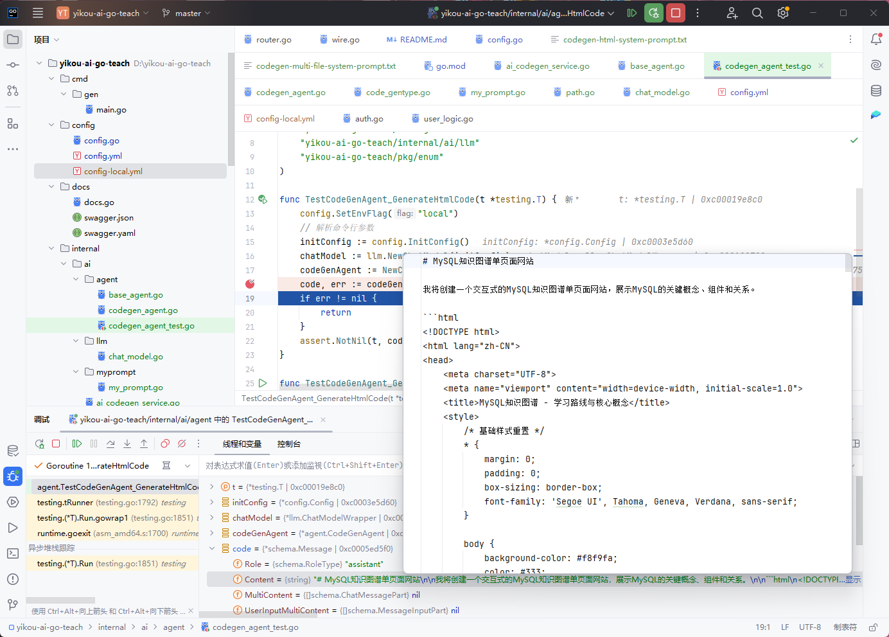

###### **结构化输出设计：**

结构化输出是确保AI返回数据格式稳定性的关键技术，通过JSON Schema约束AI的输出格式，在eino中实现结构化输出的途径就是在提示词拼接json输出格式的限制。

由于百炼的deepseek模型不支持结构化输出，大家可以修改yml配置文件更换千问进行测试，这一节其实不影响后面的步骤，只是给大家讲解一下这个功能特点，现在很多智能体都用到结构化输出这个功能。

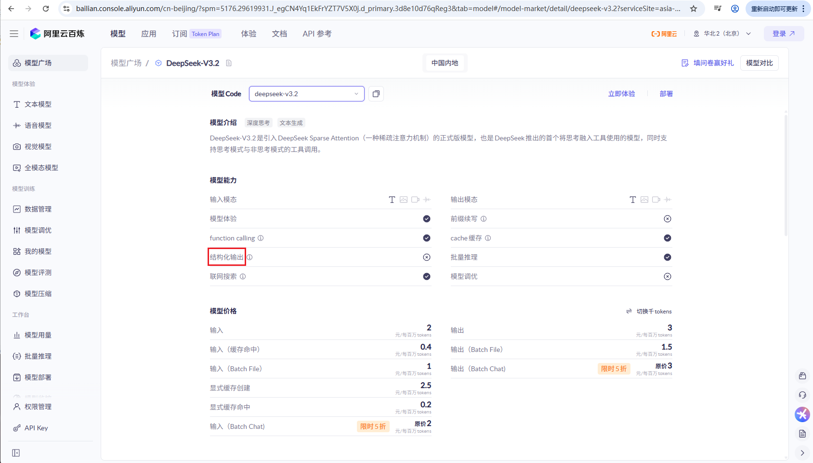

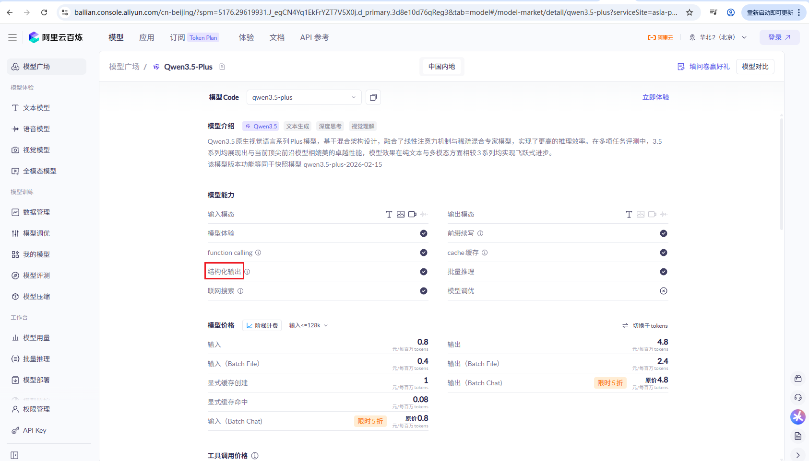

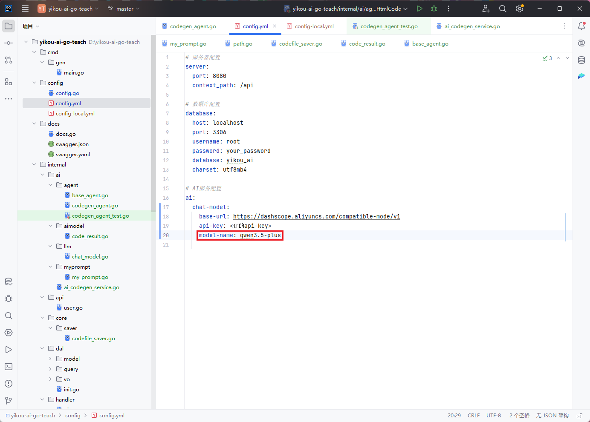

**结构化输出模型 (`internal/ai/aimodel/code_result.go`)**

**文件作用：** 定义代码生成结果的强类型结构体，用于JSON解析和类型安全的数据传递。

**完整代码：**

```go
package aimodel

type HtmlCodeResponse struct {
	HtmlCode    string `json:"htmlCode"`
	Description string `json:"description"`
}

type MultiFileCodeResponse struct {
	HtmlCodeResponse
	JsCode  string `json:"jsCode"`
	CssCode string `json:"cssCode"`
}
```

**修改AIService和代码生成智能体**

修改AIService两个方法的返回值为结构化输出模型

```go
type IYiKouAiCodegenService interface {
	GenerateHtmlCode(ctx context.Context, userMessage string) (*aimodel.HtmlCodeResponse, error)
	GenerateMultiFileCode(ctx context.Context, userMessage string) (*aimodel.MultiFileCodeResponse, error)
}
```

修改代码生成智能体增加提示词拼接json输出格式的限制，以及增加解析结构化输出结结果的逻辑

```go
func (a *CodeGenAgent) GenerateHtmlCode(ctx context.Context, userMessage string) (*aimodel.HtmlCodeResponse, error) {
	chatTemplate, err := myprompt.NewHtmlChatTemplate()
	if err != nil {
		return nil, err
	}

	adkAgent := a.getAdkAgent()
	message, err := a.Generate(ctx, userMessage+
		`You must answer strictly in the following JSON format:
		{
		  "htmlCode": "your html code here",
		  "description": "description of the code"
		}
		IMPORTANT: You must answer ONLY with a valid JSON object, no markdown, no code blocks, no backticks.
		`,
		chatTemplate, adkAgent)
	if err != nil {
		return nil, err
	}
	var result aimodel.HtmlCodeResponse
	err = json.Unmarshal([]byte(message.Content), &result)
	if err != nil {
		return nil, err
	}
	return &result, nil
}

func (a *CodeGenAgent) GenerateMultiFileCode(ctx context.Context, userMessage string) (*aimodel.MultiFileCodeResponse, error) {
	chatTemplate, err := myprompt.NewMultiFileChatTemplate()
	if err != nil {
		return nil, err
	}

	adkAgent := a.getAdkAgent()
	message, err := a.Generate(ctx, userMessage+
		`You must answer strictly in the following JSON format:
		{
		  "htmlCode": "your html code here",
		  "description": "description of the code",
		  "cssCode": "your css code here",
		  "jsCode": "your javascript code here"
		}
		IMPORTANT: You must answer ONLY with a valid JSON object, no markdown, no code blocks, no backticks.
		`,
		chatTemplate, adkAgent)
	if err != nil {
		return nil, err
	}
	var result aimodel.MultiFileCodeResponse
	err = json.Unmarshal([]byte(message.Content), &result)
	if err != nil {
		return nil, err
	}
	return &result, nil
}
```

**重新debug单元测试**

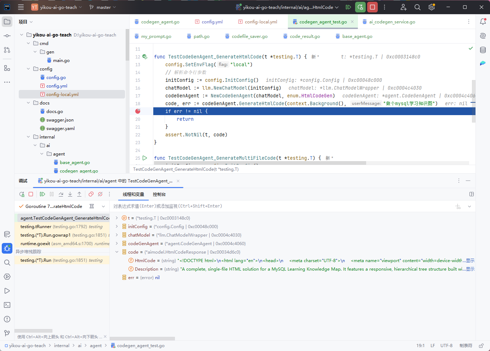

可以看到成功返回结构化输出模型了

##### 保存代码文件实现

代码生成后需要将生成的代码保存到文件系统中，这里使用了门面模式（Facade Pattern）来统一管理代码生成和保存的流程。

###### **什么是门面模式（Facade Pattern）？**

门面模式是一种结构型设计模式，它为复杂的子系统提供一个统一的、简化的接口。门面模式通过定义一个高层接口，使得子系统更容易使用。

**门面模式的优势：**

**降低复杂度**：

- 隐藏子系统的复杂性
- 客户端无需了解内部实现细节
- 减少学习成本和使用难度

**解耦客户端**：

- 客户端只依赖门面接口
- 子系统变化不影响客户端
- 提高系统的灵活性和可维护性

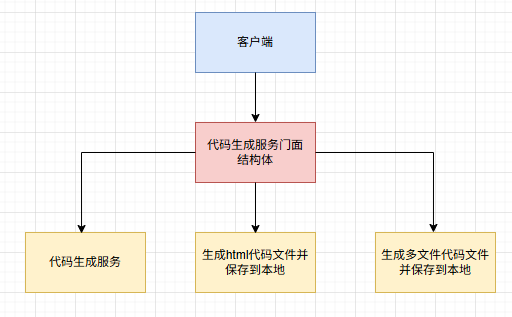

###### 门面模式实现 (`internal/core/ai_codegen_facade.go`)

**文件作用：** 使用门面模式统一管理代码生成和保存的流程，对外提供简单的接口，隐藏内部复杂性。

**完整代码：**

```go
package core

import (
	"context"
	"fmt"
	"yikou-ai-go-teach/internal/ai"
	"yikou-ai-go-teach/internal/core/saver"
	"yikou-ai-go-teach/pkg/enum"

	"github.com/bytedance/gopkg/util/logger"
)

type YiKouAiCodegenFacade struct {
	codegenService ai.IYiKouAiCodegenService
}

func NewYiKouAiCodegenFacade(codegenService ai.IYiKouAiCodegenService) *YiKouAiCodegenFacade {
	return &YiKouAiCodegenFacade{
		codegenService: codegenService,
	}
}

func (y *YiKouAiCodegenFacade) GenHtmlCodeAndSave(ctx context.Context, userMessage string) error {
	resp, err := y.codegenService.GenerateHtmlCode(ctx, userMessage)
	if err != nil {
		return err
	}
	dirPath, err := saver.SaveHtmlCode(*resp)
	if err != nil {
		return err
	}
	logger.Info("HTML代码已保存到目录: %s", dirPath)
	return nil
}

func (y *YiKouAiCodegenFacade) GenMultiFileCodeAndSave(ctx context.Context, userMessage string) error {
	resp, err := y.codegenService.GenerateMultiFileCode(ctx, userMessage)
	if err != nil {
		return err
	}
	dirPath, err := saver.SaveMultiFileCode(*resp)
	if err != nil {
		return err
	}
	logger.Info("多文件代码已保存到目录: %s", dirPath)
	return nil
}

func (y *YiKouAiCodegenFacade) GenCodeAndSave(ctx context.Context, userMessage string, typeStr enum.CodeGenTypeEnum) error {
	switch typeStr {
	case enum.HtmlCodeGen:
		return y.GenHtmlCodeAndSave(ctx, userMessage)
	case enum.MultiFileGen:
		return y.GenMultiFileCodeAndSave(ctx, userMessage)
	default:
		return fmt.Errorf("不支持的代码生成类型: %s", typeStr)
	}
}
```

###### 文件保存器 (`internal/core/saver/codefile_saver.go`)

**文件作用：** 负责将生成的代码内容保存到文件系统，使用雪花算法生成唯一目录名，避免文件冲突。

**完整代码：**

```go
package saver

import (
	"fmt"
	"github.com/sony/sonyflake"
	"os"
	"path/filepath"
	"strconv"
	"yikou-ai-go-teach/internal/ai/aimodel"
	"yikou-ai-go-teach/pkg/enum"
	"yikou-ai-go-teach/pkg/myfile"
)

// buildUniqueDir 构建唯一的目录名
// 目录名格式: {代码生成类型}_{唯一ID}
func (d *CodeFileSaverTemplate[T]) buildUniqueDir(appId int64) (string, error) {
	if appId == 0 {
		return "", fmt.Errorf("应用id不能为空")
	}
	//构建唯一目录名
	fileSaveDir, err := myfile.GetCodeOutputRoot()
	uniqueDirName := fmt.Sprintf("%s_%s", d.getCodeType(), strconv.FormatUint(uint64(appId), 20))
	dirPath := filepath.Join(fileSaveDir, uniqueDirName)
	// 创建目录
	err = os.MkdirAll(dirPath, os.ModePerm)
	if err != nil {
		return "", err
	}
	return dirPath, nil
}

// writeToFile 将内容写入文件并保存
func writeToFile(dirPath string, fileName string, content string) error {
	filePath := filepath.Join(dirPath, fileName)
	err := os.WriteFile(filePath, []byte(content), os.ModePerm)
	if err != nil {
		return err
	}
	return nil
}

// SaveHtmlCode 保存 HTML 代码文件
func SaveHtmlCode(response aimodel.HtmlCodeResponse) (string, error) {
	dirPath, err := buildUniqueDir(enum.HtmlCodeGen)
	if err != nil {
		return "", err
	}
	fileName := "index.html"
	return dirPath, writeToFile(dirPath, fileName, response.HtmlCode)
}

// SaveMultiFileCode 保存多文件代码文件
func SaveMultiFileCode(response aimodel.MultiFileCodeResponse) (string, error) {
	dirPath, err := buildUniqueDir(enum.MultiFileGen)
	if err != nil {
		return "", err
	}
	// 保存 HTML 文件
	err = writeToFile(dirPath, "index.html", response.HtmlCode)
	if err != nil {
		return "", err
	}
	// 保存 JS 文件
	err = writeToFile(dirPath, "script.js", response.JsCode)
	if err != nil {
		return "", err
	}
	// 保存 CSS 文件
	err = writeToFile(dirPath, "style.css", response.CssCode)
	if err != nil {
		return "", err
	}
	return dirPath, nil
}
```

###### 门面模式测试 (`internal/core/ai_codegen_facade_test.go`)

**文件作用：** 测试门面模式的完整功能，验证代码生成和保存的端到端流程。

**完整代码：**

```go
package core

import (
	"context"
	"testing"
	"yikou-ai-go-teach/config"
	"yikou-ai-go-teach/internal/ai/agent"
	"yikou-ai-go-teach/internal/ai/llm"
	"yikou-ai-go-teach/pkg/enum"
)

func TestYiKouAiCodegenFacade_GenCodeAndSave(t *testing.T) {
	config.SetEnvFlag("local")
	// 解析命令行参数
	initConfig := config.InitConfig()
	chatModel := llm.NewChatModel(initConfig)
	codeGenAgent := agent.NewCodeGenAgent(chatModel, enum.MultiFileGen)
	aiCodegenFacade := NewYiKouAiCodegenFacade(codeGenAgent)
	err := aiCodegenFacade.GenCodeAndSave(context.Background(), "帮我生成一个日常记录网站", enum.MultiFileGen)
	if err != nil {
		panic(err)
	}
}
```

运行测试方法，我们可以在项目根路径下找到tmp文件夹

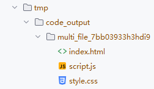

点击index.html文件，然后在ide的右上方可以看到在浏览器打开文件，点击打开图标后，我们就能看到生成的网站效果了

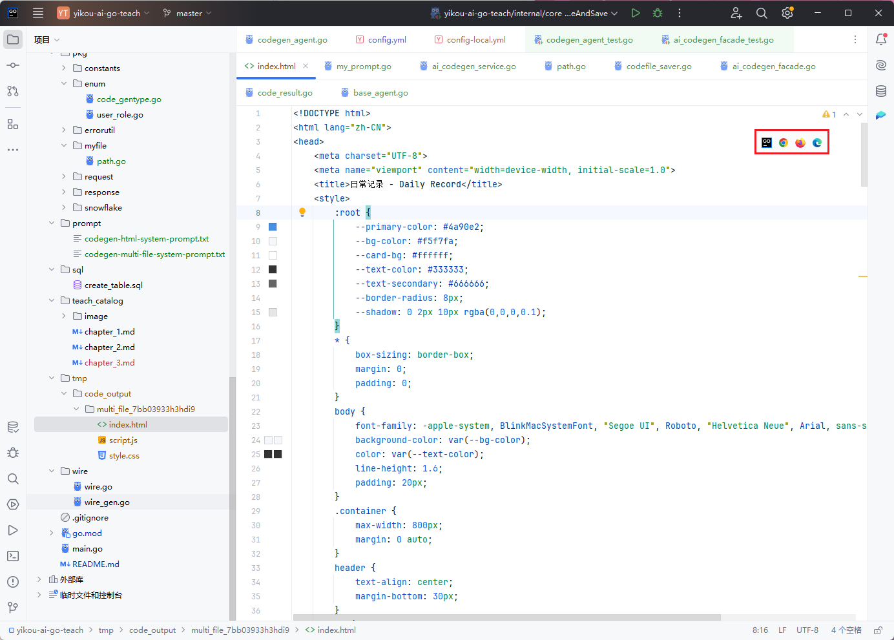

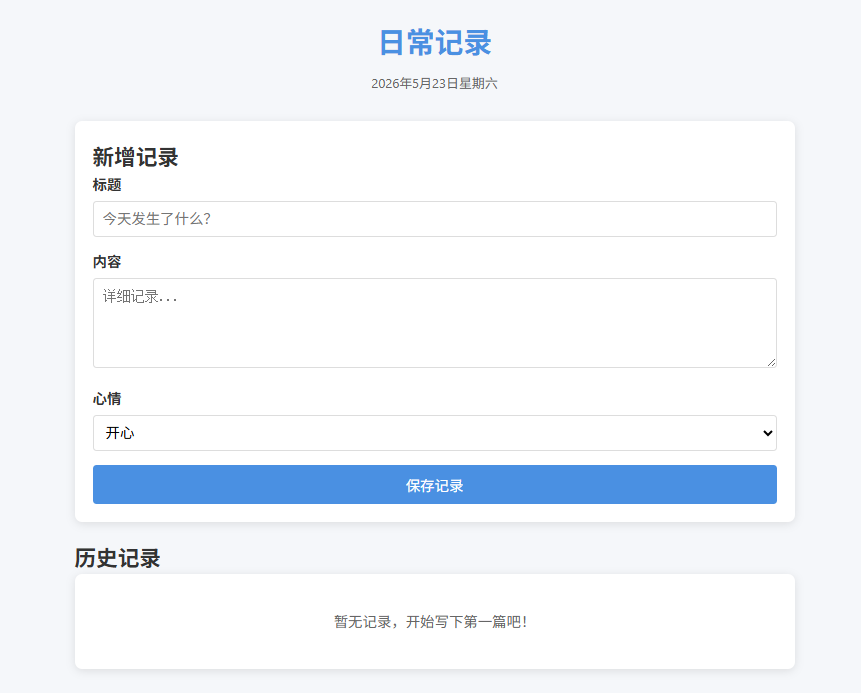

### 五、使用 Hertz SSE 流式输出扩展库

#### 什么是SSE（Server-Sent Events）？

SSE（Server-Sent Events）是一种服务器向客户端推送数据的技术，基于HTTP协议，使用单向连接从服务器向客户端发送**实时更新**。SSE是HTML5规范的一部分，专门用于服务器推送场景。因为普通的HTTP协议，我们需要长时间等待代码生成接口的返回，为了提高用户的体验感，所以我们引用SSE协议的实时更新特性使接口像打印机一样返回数据给前端。而之前的结构化输出不能通过sse流式输出获得，所以我们这里需要用到eino的streamReader类型，后面我会讲解到

#### Hertz SSE 内置库使用

**示例：**

```go
func HandleSSE(ctx context.Context, c *app.RequestContext) {
    // 获取上次事件 ID
    lastEventID := sse.GetLastEventID(&c.Request)
  
    // 创建 SSE Writer
    w := sse.NewWriter(c)
  
    // 写入事件
    for i := 0; i < 5; i++ {
        w.WriteEvent("id-x", "message", []byte("hello world"))
        time.Sleep(10 * time.Millisecond)
    }
  
    w.Close()
}
```

#### 代码内容解析器实现

AI 生成的代码通常包含在 Markdown 代码块中，需要解析器将其提取出来。代码解析器负责从 AI 返回的文本中提取 HTML、CSS 和 JavaScript 代码。

**文件位置：** `internal/core/parser/code_paser.go`

**完整代码：**

```go
package parser

import (
	"regexp"
	"strings"
	"yikou-ai-go-teach/internal/ai/aimodel"
)

var (
	htmlCodeRegex = regexp.MustCompile("(?i)```html\\s*\\n([\\s\\S]*?)```")
	cssCodeRegex  = regexp.MustCompile("(?i)```css\\s*\\n([\\s\\S]*?)```")
	jsCodeRegex   = regexp.MustCompile("(?i)```(?:js|javascript)\\s*\\n([\\s\\S]*?)```")
)

func ParseHtmlCode(codeContent string) *aimodel.HtmlCodeResponse {
	result := &aimodel.HtmlCodeResponse{}

	htmlCode := extractHtmlCode(codeContent)
	if htmlCode != "" {
		result.HtmlCode = strings.TrimSpace(htmlCode)
	} else {
		result.HtmlCode = strings.TrimSpace(codeContent)
	}

	return result
}

func ParseMultiFileCode(codeContent string) *aimodel.MultiFileCodeResponse {
	result := &aimodel.MultiFileCodeResponse{}

	htmlCode := extractCodeByPattern(codeContent, htmlCodeRegex)
	cssCode := extractCodeByPattern(codeContent, cssCodeRegex)
	jsCode := extractCodeByPattern(codeContent, jsCodeRegex)

	if htmlCode != "" {
		result.HtmlCode = strings.TrimSpace(htmlCode)
	}

	if cssCode != "" {
		result.CssCode = strings.TrimSpace(cssCode)
	}

	if jsCode != "" {
		result.JsCode = strings.TrimSpace(jsCode)
	}

	return result
}

func extractHtmlCode(content string) string {
	matches := htmlCodeRegex.FindStringSubmatch(content)
	if len(matches) > 1 {
		return matches[1]
	}
	return ""
}

func extractCodeByPattern(content string, pattern *regexp.Regexp) string {
	matches := pattern.FindStringSubmatch(content)
	if len(matches) > 1 {
		return matches[1]
	}
	return ""
}
```

**debug运行测试，得到测试结果：**

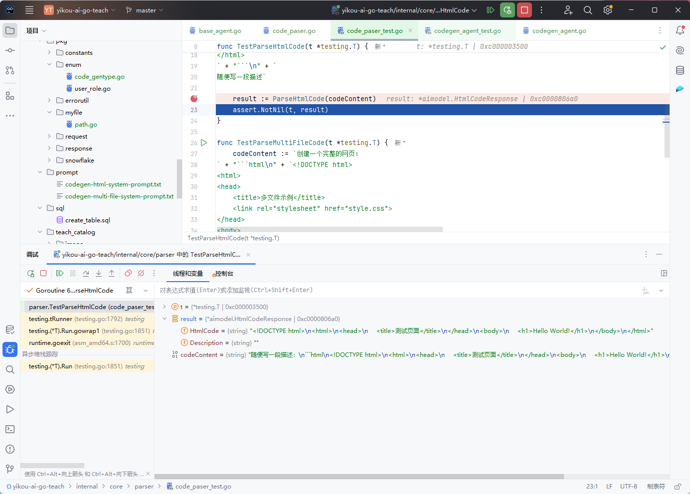

可以看到测试成功，剩下的描述字段因为对项目业务没啥作用，所有没对此进行解析

#### 流式输出方法实现

流式输出是提升用户体验的关键技术，通过 SSE 协议实现服务器向客户端的实时数据推送。本节详细介绍流式输出方法的实现。

##### 修改 AI 服务接口定义

在ai服务接口新增两个流式输出的方法

**文件位置：** `internal/ai/ai_codegen_service.go`

**完整代码：**

```go
package ai

import (
	"context"
	"github.com/cloudwego/eino/schema"
	"yikou-ai-go-teach/internal/ai/aimodel"
)

type IYiKouAiCodegenService interface {
	GenerateHtmlCode(ctx context.Context, userMessage string) (*aimodel.HtmlCodeResponse, error)
	GenerateMultiFileCode(ctx context.Context, userMessage string) (*aimodel.MultiFileCodeResponse, error)
	GenerateHtmlCodeStream(ctx context.Context, userMessage string) (*schema.StreamReader[*schema.Message], error)
	GenerateMultiFileCodeStream(ctx context.Context, userMessage string) (*schema.StreamReader[*schema.Message], error)
}
```

##### 基础智能体增加流式输出方法

**文件位置：** `internal/ai/agent/base_agent.go`

**完整代码：**

```go
package agent

import (
	"context"
	"errors"
	"github.com/bytedance/gopkg/util/logger"
	"github.com/cloudwego/eino-ext/components/model/openai"
	"github.com/cloudwego/eino/adk"
	"github.com/cloudwego/eino/components/prompt"
	"github.com/cloudwego/eino/schema"
	"io"
)

type ChatModelWrapperAdaptor interface {
	GetChatModel() *openai.ChatModel
	GetModelName() string
}

type BaseAgent struct {
	model     *openai.ChatModel
	modelName string
}

func NewBaseAgent(chatModel ChatModelWrapperAdaptor) *BaseAgent {
	return &BaseAgent{
		model:     chatModel.GetChatModel(),
		modelName: chatModel.GetModelName(),
	}
}

func (a *BaseAgent) GetModel() *openai.ChatModel {
	return a.model
}

func (a *BaseAgent) NewAdkAgent(name, description, instruction string) *adk.ChatModelAgent {
	ctx := context.Background()

	config := &adk.ChatModelAgentConfig{
		Name:          name,
		Description:   description,
		Instruction:   instruction,
		Model:         a.model,
		MaxIterations: 50,
		ModelRetryConfig: &adk.ModelRetryConfig{
			MaxRetries: 3,
			IsRetryAble: func(ctx context.Context, err error) bool {
				if errors.Is(err, context.Canceled) {
					return false
				}
				return true
			},
		},
	}

	agent, err := adk.NewChatModelAgent(ctx, config)
	if err != nil {
		logger.Errorf("创建Agent失败: %v", err)
		return nil
	}
	return agent
}

func (a *BaseAgent) Generate(ctx context.Context, userMessage string, chatTemplate prompt.ChatTemplate, adkAgent *adk.ChatModelAgent) (*schema.Message, error) {
	format, err := chatTemplate.Format(ctx, map[string]any{
		"content": userMessage,
	})
	if err != nil {
		return nil, err
	}

	runner := adk.NewRunner(ctx, adk.RunnerConfig{
		Agent:           adkAgent,
		EnableStreaming: false,
	})

	iter := runner.Run(ctx, format)

	var resultMsg *schema.Message
	for {
		event, ok := iter.Next()
		if !ok {
			break
		}
		if event.Err != nil {
			return nil, event.Err
		}
		if event.Output != nil && event.Output.MessageOutput != nil {
			msg, err := event.Output.MessageOutput.GetMessage()
			if err != nil {
				return nil, err
			}
			resultMsg = msg
		}
	}

	return resultMsg, nil
}

func (a *BaseAgent) GenerateStream(ctx context.Context, userMessage string, chatTemplate prompt.ChatTemplate, adkAgent *adk.ChatModelAgent) (*schema.StreamReader[*schema.Message], error) {
	format, err := chatTemplate.Format(ctx, map[string]any{
		"content": userMessage,
	})
	if err != nil {
		return nil, err
	}

	runner := adk.NewRunner(ctx, adk.RunnerConfig{
		Agent:           adkAgent,
		EnableStreaming: true,
	})

	iter := runner.Run(ctx, format)

	reader, writer := schema.Pipe[*schema.Message](2)

	go func() {
		defer writer.Close()
		var fullContent string
		for {
			event, ok := iter.Next()
			if !ok {
				break
			}
			if event.Err != nil {
				writer.Send(nil, event.Err)
				return
			}

			if event.Output != nil && event.Output.MessageOutput != nil {
				stream := event.Output.MessageOutput.MessageStream
				if stream != nil {
					for {
						msg, err := stream.Recv()
						if err == io.EOF {
							break
						}
						if err != nil {
							writer.Send(nil, err)
							return
						}
						if msg != nil {
							fullContent += msg.Content
							writer.Send(msg, nil)
						}
					}
				}
			}
		}
	}()

	return reader, nil
}
```

**关键：eino ADK Agent 的 Runner需要配置流式输出选项**

```go
runner := adk.NewRunner(ctx, adk.RunnerConfig{
    Agent:           adkAgent,
    EnableStreaming: true,  // 关键：启用流式输出
})
```

**说明：**

**1. 创建 Pipe**

```go
reader, writer := schema.Pipe[*schema.Message](2)
```

- `Pipe`：创建一个管道，用于在 goroutine 之间传递数据
- `reader`：客户端通过它读取流式数据
- `writer`：在 goroutine 中写入流式数据
- 参数 `2`：管道缓冲区大小

**2.  处理流式事件**

```go
if event.Output != nil && event.Output.MessageOutput != nil {
    stream := event.Output.MessageOutput.MessageStream
    if stream != nil {
        for {
            msg, err := stream.Recv()
            if err == io.EOF {
                break
            }
            if err != nil {
                writer.Send(nil, err)
                return
            }
            if msg != nil {
                fullContent += msg.Content
                writer.Send(msg, nil)
            }
        }
    }
}
```

- `MessageStream`：消息流对象
- `stream.Recv()`：接收流中的下一个消息
- `io.EOF`：流结束标志
- `writer.Send(msg, nil)`：将消息发送到管道

##### 智能体流式输出实现

**文件位置：** `internal/ai/agent/codegen_agent.go`

**流式输出方法代码：**

```go
func (a *CodeGenAgent) GenerateHtmlCodeStream(ctx context.Context, userMessage string) (*schema.StreamReader[*schema.Message], error) {
	chatTemplate, err := myprompt.NewHtmlChatTemplate()
	if err != nil {
		return nil, err
	}

	adkAgent := a.getAdkAgent()
	return a.GenerateStream(ctx, userMessage, chatTemplate, adkAgent)
}

func (a *CodeGenAgent) GenerateMultiFileCodeStream(ctx context.Context, userMessage string) (*schema.StreamReader[*schema.Message], error) {
	chatTemplate, err := myprompt.NewMultiFileChatTemplate()
	if err != nil {
		return nil, err
	}

	adkAgent := a.getAdkAgent()
	return a.GenerateStream(ctx, userMessage, chatTemplate, adkAgent)
}
```

##### 流式输出测试

**文件位置：** `internal/core/ai_codegen_facade_test.go`

**完整测试代码：**

```go
package core

import (
	"context"
	"github.com/cloudwego/hertz/pkg/common/test/assert"
	"strings"
	"testing"
	"yikou-ai-go-teach/config"
	"yikou-ai-go-teach/internal/ai/agent"
	"yikou-ai-go-teach/internal/ai/llm"
	"yikou-ai-go-teach/pkg/enum"
)

func TestYiKouAiCodegenFacade_GenCodeAndSave(t *testing.T) {
	config.SetEnvFlag("local")
	// 解析命令行参数
	initConfig := config.InitConfig()
	chatModel := llm.NewChatModel(initConfig)
	codeGenAgent := agent.NewCodeGenAgent(chatModel, enum.MultiFileGen)
	aiCodegenFacade := NewYiKouAiCodegenFacade(codeGenAgent)
	err := aiCodegenFacade.GenCodeAndSave(context.Background(), "帮我生成一个日常记录网站", enum.MultiFileGen)
	if err != nil {
		panic(err)
	}
}

func TestYiKouAiCodegenFacade_GenCodeStreamAndSave(t *testing.T) {
	config.SetEnvFlag("local")
	// 解析命令行参数
	initConfig := config.InitConfig()
	chatModel := llm.NewChatModel(initConfig)
	codeGenAgent := agent.NewCodeGenAgent(chatModel, enum.MultiFileGen)
	aiCodegenFacade := NewYiKouAiCodegenFacade(codeGenAgent)
	resp, err := aiCodegenFacade.GenCodeStreamAndSave(context.Background(), "帮我生成一个日常记录网站", enum.MultiFileGen)
	if err != nil {
		panic(err)
	}
	var builder strings.Builder
	for {
		message, err := resp.Recv()
		if err != nil {
			break
		}
		builder.WriteString(message.Content)
	}
	assert.NotNil(t, builder.String())
}
```

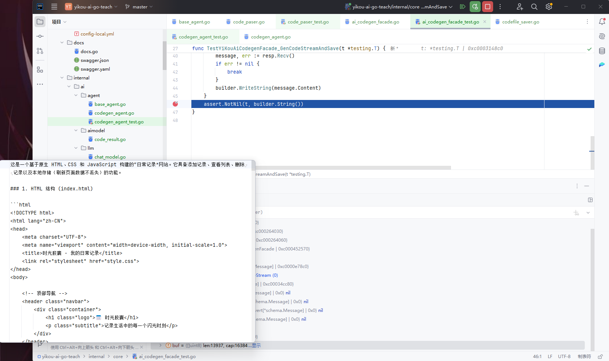

可以看到，能够正常拼接流式输出

### 六、优化设计模式

#### 设计模式应用

**1. 策略模式（Strategy Pattern）**

策略模式定义了一系列算法，并将每个算法封装起来，使它们可以相互替换。在解析器设计中，我们定义了统一的解析策略接口。

**策略模式例子：**

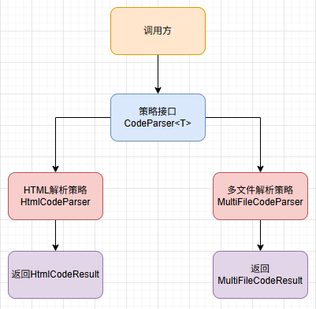

**2. 执行器模式（Executor Pattern）**

执行器模式提供了一个统一的执行接口，根据不同的类型选择不同的策略执行。在解析器设计中，`CodeParserExecutor` 作为执行器，根据代码生成类型选择对应的解析器。

**执行器模式例子：**

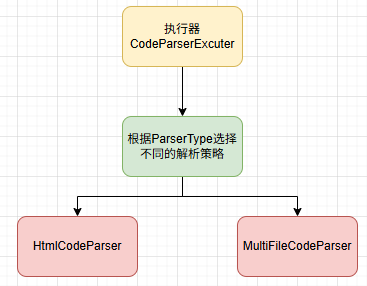

**3. 模板方法模式（Template Method Pattern）**

模板方法模式是一种行为型设计模式，它在父类中定义了一个算法的骨架，将某些步骤延迟到子类中实现。模板方法使得子类可以在不改变算法结构的情况下，重新定义算法的某些特定步骤。

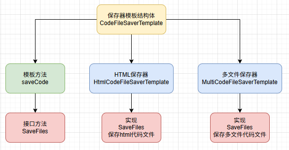

#### 优化解析器设计

为了提高代码的可扩展性和可维护性，我们使用**策略模式**和**执行器模式**对解析器进行优化设计。

**文件位置：** `internal/core/parser/code_paser.go`

**完整代码：**

```go
package parser

import (
	"fmt"
	"regexp"
	"strings"
	"yikou-ai-go-teach/internal/ai/aimodel"
	"yikou-ai-go-teach/pkg/enum"
)

// Parser 定义解析策略接口（策略模式）
type Parser[T any] interface {
	Parse(content string) (T, error)
}

// HtmlCodeParser HTML代码解析器（具体策略A）
type HtmlCodeParser struct{}

// NewHtmlCodeParser 创建HTML解析器（工厂方法）
func NewHtmlCodeParser() *HtmlCodeParser {
	return &HtmlCodeParser{}
}

// Parse 实现解析策略
func (p *HtmlCodeParser) Parse(content string) (*aimodel.HtmlCodeResponse, error) {
	result := &aimodel.HtmlCodeResponse{}
	matches := htmlCodeRegex.FindStringSubmatch(content)
	if len(matches) >= 2 {
		result.HtmlCode = strings.TrimSpace(matches[1])
	}
	return result, nil
}

// MultiFileCodeParser 多文件代码解析器（具体策略B）
type MultiFileCodeParser struct{}

// NewMultiFileCodeParser 创建多文件解析器（工厂方法）
func NewMultiFileCodeParser() *MultiFileCodeParser {
	return &MultiFileCodeParser{}
}

// Parse 实现解析策略
func (p *MultiFileCodeParser) Parse(content string) (*aimodel.MultiFileCodeResponse, error) {
	result := &aimodel.MultiFileCodeResponse{}
	htmlMatches := htmlCodeRegex.FindStringSubmatch(content)
	if len(htmlMatches) >= 2 {
		result.HtmlCode = strings.TrimSpace(htmlMatches[1])
	}
	cssMatches := cssCodeRegex.FindStringSubmatch(content)
	if len(cssMatches) >= 2 {
		result.CssCode = strings.TrimSpace(cssMatches[1])
	}
	jsMatches := jsCodeRegex.FindStringSubmatch(content)
	if len(jsMatches) >= 3 {
		result.JsCode = strings.TrimSpace(jsMatches[2])
	}
	return result, nil
}

// CodeParserExecutor 解析器执行器（执行器模式）
type CodeParserExecutor struct {
	htmlCodeParser      *HtmlCodeParser
	multiFileCodeParser *MultiFileCodeParser
}

// NewCodeParserExecutor 创建解析器执行器（工厂方法）
func NewCodeParserExecutor() *CodeParserExecutor {
	return &CodeParserExecutor{
		htmlCodeParser:      NewHtmlCodeParser(),
		multiFileCodeParser: NewMultiFileCodeParser(),
	}
}

// ExecuteParser 执行解析（根据类型选择策略）
func (e *CodeParserExecutor) ExecuteParser(content string, parserType enum.CodeGenTypeEnum) (interface{}, error) {
	switch parserType {
	case enum.HtmlCodeGen:
		return e.htmlCodeParser.Parse(content)
	case enum.MultiFileGen:
		return e.multiFileCodeParser.Parse(content)
	default:
		return nil, fmt.Errorf("不支持的解析类型: %s", parserType)
	}
}

// 正则表达式定义
var (
	htmlCodeRegex = regexp.MustCompile("(?i)```html\\s*\\n([\\s\\S]*?)```")
	cssCodeRegex  = regexp.MustCompile("(?i)```css\\s*\\n([\\s\\S]*?)```")
	jsCodeRegex   = regexp.MustCompile("(?i)```(?:js|javascript)\\s*\\n([\\s\\S]*?)```")
)

// 以下是保留的函数式方法，用于向后兼容
func ParseHtmlCode(codeContent string) *aimodel.HtmlCodeResponse {
	result := &aimodel.HtmlCodeResponse{}

	htmlCode := extractHtmlCode(codeContent)
	if htmlCode != "" {
		result.HtmlCode = strings.TrimSpace(htmlCode)
	} else {
		result.HtmlCode = strings.TrimSpace(codeContent)
	}

	return result
}

func ParseMultiFileCode(codeContent string) *aimodel.MultiFileCodeResponse {
	result := &aimodel.MultiFileCodeResponse{}

	htmlCode := extractCodeByPattern(codeContent, htmlCodeRegex)
	cssCode := extractCodeByPattern(codeContent, cssCodeRegex)
	jsCode := extractCodeByPattern(codeContent, jsCodeRegex)

	if htmlCode != "" {
		result.HtmlCode = strings.TrimSpace(htmlCode)
	}

	if cssCode != "" {
		result.CssCode = strings.TrimSpace(cssCode)
	}

	if jsCode != "" {
		result.JsCode = strings.TrimSpace(jsCode)
	}

	return result
}

func extractHtmlCode(content string) string {
	matches := htmlCodeRegex.FindStringSubmatch(content)
	if len(matches) > 1 {
		return matches[1]
	}
	return ""
}

func extractCodeByPattern(content string, pattern *regexp.Regexp) string {
	matches := pattern.FindStringSubmatch(content)
	if len(matches) > 1 {
		return matches[1]
	}
	return ""
}
```

#### 优化保存器设计

为了提高代码的可扩展性和可维护性，我们使用**模板方法模式**和**执行器模式**对保存器进行优化设计。

**文件位置：** `internal/core/saver/codefile_saver.go`

**完整代码：**

```go


package saver

import (
	"fmt"
	"github.com/sony/sonyflake"
	"os"
	"path/filepath"
	"strconv"
	"yikou-ai-go-teach/internal/ai/aimodel"
	"yikou-ai-go-teach/pkg/enum"
	"yikou-ai-go-teach/pkg/myfile"
)

// buildUniqueDir 构建唯一的目录名
// 目录名格式: {代码生成类型}_{唯一ID}
func buildUniqueDir(typeStr enum.CodeGenTypeEnum) (string, error) {
	// 生成雪花id
	var sf = sonyflake.NewSonyflake(sonyflake.Settings{
		MachineID: func() (uint16, error) { return 1, nil },
	})
	id, err := sf.NextID()
	if err != nil {
		return "", err
	}
	// 构建唯一目录名
	uniqueDirName := fmt.Sprintf("%s_%s", typeStr, strconv.FormatUint(id, 20))
	fileSaveDir, err := myfile.GetCodeOutputRoot()
	dirPath := filepath.Join(fileSaveDir, uniqueDirName)
	// 创建目录
	err = os.MkdirAll(dirPath, os.ModePerm)
	if err != nil {
		return "", err
	}
	return dirPath, nil
}

// writeToFile 将内容写入文件并保存
func writeToFile(dirPath string, fileName string, content string) error {
	filePath := filepath.Join(dirPath, fileName)
	err := os.WriteFile(filePath, []byte(content), os.ModePerm)
	if err != nil {
		return err
	}
	return nil
}

// SaveHtmlCode 保存 HTML 代码文件
func SaveHtmlCode(response aimodel.HtmlCodeResponse) (string, error) {
	dirPath, err := buildUniqueDir(enum.HtmlCodeGen)
	if err != nil {
		return "", err
	}
	fileName := "index.html"
	return dirPath, writeToFile(dirPath, fileName, response.HtmlCode)
}

// SaveMultiFileCode 保存多文件代码文件
func SaveMultiFileCode(response aimodel.MultiFileCodeResponse) (string, error) {
	dirPath, err := buildUniqueDir(enum.MultiFileGen)
	if err != nil {
		return "", err
	}
	// 保存 HTML 文件
	err = writeToFile(dirPath, "index.html", response.HtmlCode)
	if err != nil {
		return "", err
	}
	// 保存 JS 文件
	err = writeToFile(dirPath, "script.js", response.JsCode)
	if err != nil {
		return "", err
	}
	// 保存 CSS 文件
	err = writeToFile(dirPath, "style.css", response.CssCode)
	if err != nil {
		return "", err
	}
	return dirPath, nil
}

type CodeFileSaver[T any] interface {
	getCodeType() enum.CodeGenTypeEnum
	saveFiles(response T, baseDir string) error
	validateInput(response T) error
}

type CodeFileSaverTemplate[T any] struct {
	CodeFileSaver[T]
}

func (d *CodeFileSaverTemplate[T]) saveCode(response T) (string, error) {
	err := d.validateInput(response)
	if err != nil {
		return "", err
	}
	dirPath, err := d.buildUniqueDir()
	if err != nil {
		return "", err
	}
	return dirPath, d.saveFiles(response, dirPath)
}

// buildUniqueDir 构建唯一的目录名
// 目录名格式: {代码生成类型}_{唯一ID}
func (d *CodeFileSaverTemplate[T]) buildUniqueDir() (string, error) {
	// 生成雪花id
	var sf = sonyflake.NewSonyflake(sonyflake.Settings{
		MachineID: func() (uint16, error) { return 1, nil },
	})
	id, err := sf.NextID()
	if err != nil {
		return "", err
	}
	//构建唯一目录名
	dirPath := fmt.Sprintf("%s_%s", d.getCodeType(), strconv.FormatUint(id, 20))
	// 创建目录
	err = os.MkdirAll(dirPath, os.ModePerm)
	if err != nil {
		return "", err
	}
	return dirPath, nil
}

// writeToFile 将内容写入文件并保存
func (d *CodeFileSaverTemplate[T]) writeToFile(dirPath string, fileName string, content string) error {
	filePath := filepath.Join(dirPath, fileName)
	err := os.WriteFile(filePath, []byte(content), os.ModePerm)
	if err != nil {
		return err
	}
	return nil
}

type HtmlCodeFileSaverTemplate struct {
	CodeFileSaverTemplate[*aimodel.HtmlCodeResponse]
}

func NewHtmlCodeFileSaverTemplate() *HtmlCodeFileSaverTemplate {
	t := &HtmlCodeFileSaverTemplate{}
	t.CodeFileSaverTemplate.CodeFileSaver = t
	return t
}

func (h *HtmlCodeFileSaverTemplate) getCodeType() enum.CodeGenTypeEnum {
	return enum.HtmlCodeGen
}

func (h *HtmlCodeFileSaverTemplate) saveFiles(response *aimodel.HtmlCodeResponse, baseDir string) error {
	fileName := "index.html"
	return h.writeToFile(baseDir, fileName, response.HtmlCode)
}

func (h *HtmlCodeFileSaverTemplate) validateInput(response *aimodel.HtmlCodeResponse) error {
	if response == nil {
		return fmt.Errorf("代码结果为空")
	}
	if response.HtmlCode == "" {
		return fmt.Errorf("HTML 代码为空")
	}
	return nil
}

type MultiFileCodeFileSaverTemplate struct {
	CodeFileSaverTemplate[*aimodel.MultiFileCodeResponse]
}

func NewMultiFileCodeFileSaverTemplate() *MultiFileCodeFileSaverTemplate {
	t := &MultiFileCodeFileSaverTemplate{}
	t.CodeFileSaverTemplate.CodeFileSaver = t
	return t
}

func (m *MultiFileCodeFileSaverTemplate) getCodeType() enum.CodeGenTypeEnum {
	return enum.MultiFileGen
}

func (m *MultiFileCodeFileSaverTemplate) saveFiles(response *aimodel.MultiFileCodeResponse, baseDir string) error {
	// 保存 HTML 文件
	err := m.writeToFile(baseDir, "index.html", response.HtmlCode)
	if err != nil {
		return err
	}
	// 保存 JS 文件
	err = m.writeToFile(baseDir, "script.js", response.JsCode)
	if err != nil {
		return err
	}
	// 保存 CSS 文件
	err = m.writeToFile(baseDir, "style.css", response.CssCode)
	if err != nil {
		return err
	}
	return nil
}

func (m *MultiFileCodeFileSaverTemplate) validateInput(response *aimodel.MultiFileCodeResponse) error {
	if response == nil {
		return fmt.Errorf("代码结果为空")
	}
	if response.HtmlCode == "" {
		return fmt.Errorf("HTML 代码为空")
	}
	if response.JsCode == "" {
		return fmt.Errorf("JS 代码为空")
	}
	if response.CssCode == "" {
		return fmt.Errorf("CSS 代码为空")
	}
	return nil
}

type CodeFileSaverExecutor struct {
	htmlCodeFileSaver      *HtmlCodeFileSaverTemplate
	multiFileCodeFileSaver *MultiFileCodeFileSaverTemplate
}

func NewCodeFileSaverExecutor() *CodeFileSaverExecutor {
	return &CodeFileSaverExecutor{
		htmlCodeFileSaver:      NewHtmlCodeFileSaverTemplate(),
		multiFileCodeFileSaver: NewMultiFileCodeFileSaverTemplate(),
	}
}

func (e *CodeFileSaverExecutor) ExecuteSaver(content interface{}, saveType enum.CodeGenTypeEnum) (string, error) {
	switch saveType {
	case enum.HtmlCodeGen:
		return e.htmlCodeFileSaver.saveCode(content.(*aimodel.HtmlCodeResponse))
	case enum.MultiFileGen:
		return e.multiFileCodeFileSaver.saveCode(content.(*aimodel.MultiFileCodeResponse))
	default:
		return "", fmt.Errorf("不支持的代码文件类型: %s", saveType)
	}
}
```

#### 优化门面结构体流式方法

**文件位置：** `internal/core/ai_codegen_facade.go`

增加门面结构体的属性；增加流式处理方法，该方法主要负责调用解析器执行器和保存器执行器

```go
// YiKouAiCodegenFacade AI代码生成门面（门面模式）
type YiKouAiCodegenFacade struct {
	codegenService        ai.IYiKouAiCodegenService       // AI代码生成服务
	codeParserExecutor    *parser.CodeParserExecutor      // 代码解析器执行器
	codeFileSaverExecutor *saver.CodeFileSaverExecutor    // 代码文件保存器执行器
}

// NewYiKouAiCodegenFacade 创建AI代码生成门面
func NewYiKouAiCodegenFacade(codegenService ai.IYiKouAiCodegenService,
	codeParserExecutor *parser.CodeParserExecutor,
	codeFileSaverExecutor *saver.CodeFileSaverExecutor) *YiKouAiCodegenFacade {
	return &YiKouAiCodegenFacade{
		codegenService:        codegenService,
		codeParserExecutor:    codeParserExecutor,
		codeFileSaverExecutor: codeFileSaverExecutor,
	}
}


// processCodeStream 处理代码流式数据并保存
func (y *YiKouAiCodegenFacade) processCodeStream(respStream *schema.StreamReader[*schema.Message], typeStr enum.CodeGenTypeEnum) (*schema.StreamReader[*schema.Message], error) {
	// 先复制流，一个用于处理，一个返回给上游
	streams := respStream.Copy(2)
	processingStream := streams[0]
	returnStream := streams[1]

	// 在 goroutine 中处理流数据，不阻塞返回
	go func() {
		var builder strings.Builder
		defer processingStream.Close()

		for {
			chunk, err := processingStream.Recv()
			if err == io.EOF {
				break
			}
			if err != nil {
				return
			}
			builder.WriteString(chunk.Content)
		}

		// 解析代码
		parsedResp, err := y.codeParserExecutor.ExecuteParser(builder.String(), typeStr)
		if err != nil {
			return
		}
		// 保存代码
		dirPath, err := y.codeFileSaverExecutor.ExecuteSaver(parsedResp, typeStr)
		if err != nil {
			return
		}
		logger.Info("代码已保存到目录: %s", dirPath)
	}()

	return returnStream, nil
}

// GenCodeStreamAndSave 根据类型生成代码流式输出并保存
func (y *YiKouAiCodegenFacade) GenCodeStreamAndSave(ctx context.Context, userMessage string, typeStr enum.CodeGenTypeEnum) (*schema.StreamReader[*schema.Message], error) {
	switch typeStr {
	case enum.HtmlCodeGen:
		streamResp, err := y.codegenService.GenerateHtmlCodeStream(ctx, userMessage)
		if err != nil {
			return nil, err
		}
		return y.processCodeStream(streamResp, typeStr)
	case enum.MultiFileGen:
		streamResp, err := y.codegenService.GenerateMultiFileCodeStream(ctx, userMessage)
		if err != nil {
			return nil, err
		}
		return y.processCodeStream(streamResp, typeStr)
	default:
		return nil, fmt.Errorf("不支持的代码生成类型: %s", typeStr)
	}
}
```

#### 修改门面结构体的测试方法

**文件位置：** `internal/core/ai_codegen_facade_test.go`

**完整测试代码：**

```go
package core

import (
	"context"
	"github.com/cloudwego/hertz/pkg/common/test/assert"
	"strings"
	"testing"
	"yikou-ai-go-teach/config"
	"yikou-ai-go-teach/internal/ai/agent"
	"yikou-ai-go-teach/internal/ai/llm"
	"yikou-ai-go-teach/internal/core/parser"
	"yikou-ai-go-teach/internal/core/saver"
	"yikou-ai-go-teach/pkg/enum"
)

// TestYiKouAiCodegenFacade_GenCodeAndSave 测试非流式代码生成和保存
func TestYiKouAiCodegenFacade_GenCodeAndSave(t *testing.T) {
	config.SetEnvFlag("local")
	// 初始化配置
	initConfig := config.InitConfig()
	// 创建聊天模型
	chatModel := llm.NewChatModel(initConfig)
	// 创建代码生成智能体
	codeGenAgent := agent.NewCodeGenAgent(chatModel, enum.MultiFileGen)
	// 创建解析器执行器
	parserExecutor := parser.NewCodeParserExecutor()
	// 创建保存器执行器
	fileSaverExecutor := saver.NewCodeFileSaverExecutor()
	// 创建门面对象
	aiCodegenFacade := NewYiKouAiCodegenFacade(codeGenAgent, parserExecutor, fileSaverExecutor)
	// 执行代码生成和保存
	err := aiCodegenFacade.GenCodeAndSave(context.Background(), "帮我生成一个日常记录网站", enum.MultiFileGen)
	if err != nil {
		panic(err)
	}
}

// TestYiKouAiCodegenFacade_GenCodeStreamAndSave 测试流式代码生成和保存
func TestYiKouAiCodegenFacade_GenCodeStreamAndSave(t *testing.T) {
	config.SetEnvFlag("local")
	// 初始化配置
	initConfig := config.InitConfig()
	// 创建聊天模型
	chatModel := llm.NewChatModel(initConfig)
	// 创建代码生成智能体
	codeGenAgent := agent.NewCodeGenAgent(chatModel, enum.MultiFileGen)
	// 创建解析器执行器
	parserExecutor := parser.NewCodeParserExecutor()
	// 创建保存器执行器
	fileSaverExecutor := saver.NewCodeFileSaverExecutor()
	// 创建门面对象
	aiCodegenFacade := NewYiKouAiCodegenFacade(codeGenAgent, parserExecutor, fileSaverExecutor)
	// 执行流式代码生成和保存
	resp, err := aiCodegenFacade.GenCodeStreamAndSave(context.Background(), "帮我生成一个日常记录网站", enum.MultiFileGen)
	if err != nil {
		panic(err)
	}
	// 读取流式数据
	var builder strings.Builder
	for {
		message, err := resp.Recv()
		if err != nil {
			break
		}
		builder.WriteString(message.Content)
	}
	// 验证结果
	assert.NotNil(t, builder.String())
}
```

测试方法这里我就具体调试查看效果了，大家可以自行测试。通过本章的代码优化，大部分的业务逻辑都显著地提高了代码可读性和可维护性，当我们需要对项目新增业务逻辑时，我们的修改工作只需增加新的处理方法，而不需要修改主要的业务方法。**我们现在已经封装好了智能体，以及对现有的代码进行大幅度的优化，在下一章，我们将实现后端的应用生成模块，我们的代码生成智能体将会进一步拓展成应用生成平台，请大家敬请期待！**
