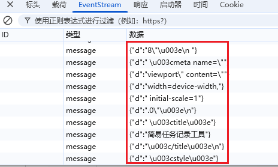
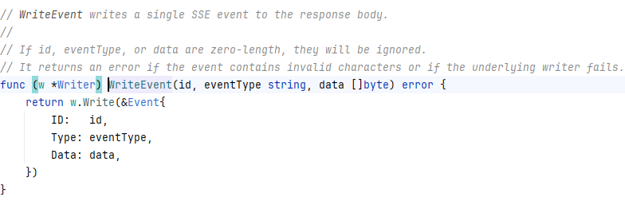
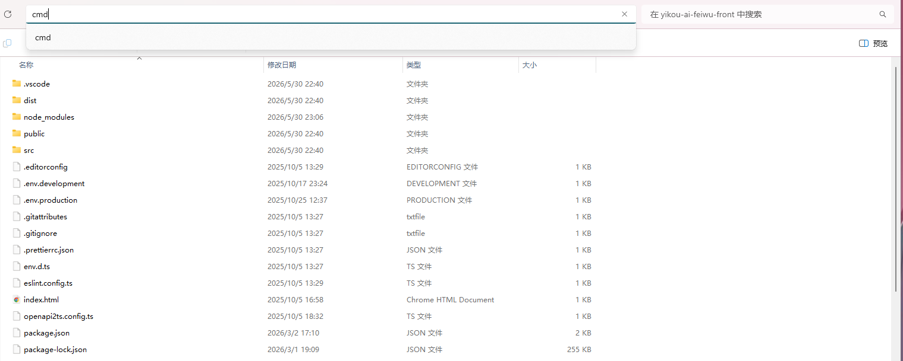
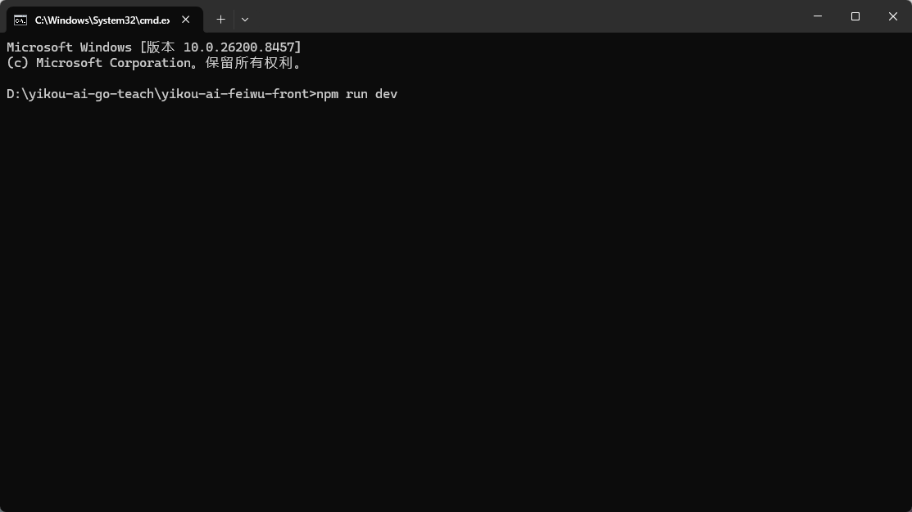
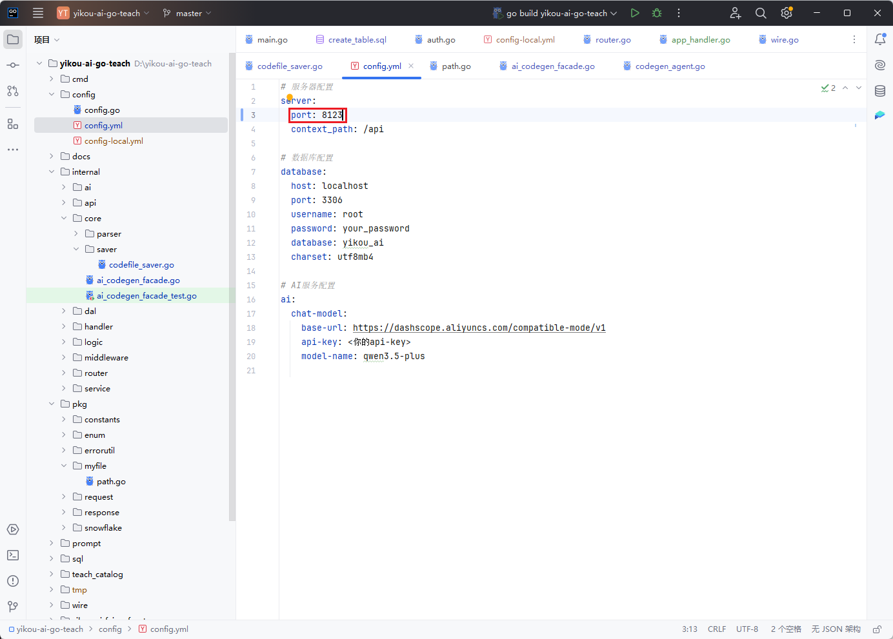
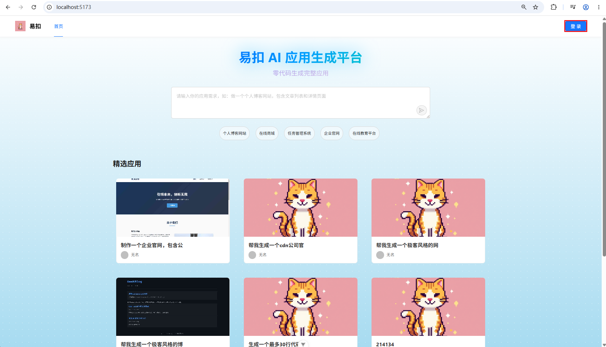
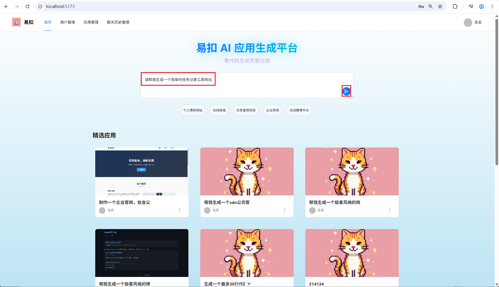
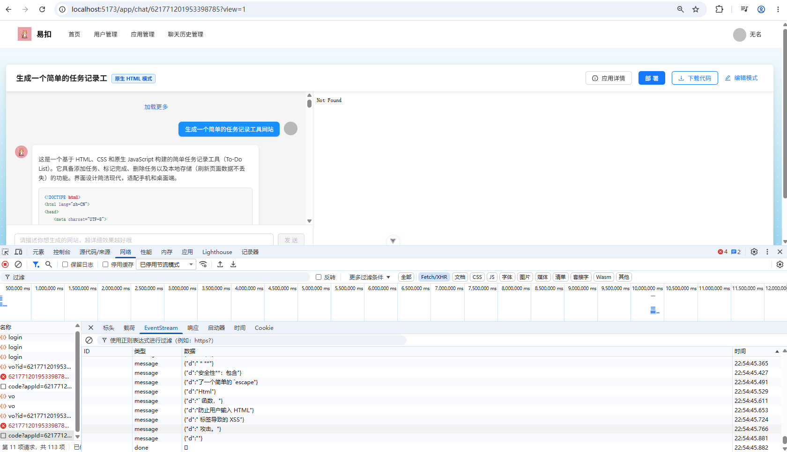

# 第4章：后端项目应用模块搭建

> 本章将讲解如何开发应用模块的基础部分和如何将第3章实现的 AI 代码生成核心功能集成到完整的后端应用模块中。

## 知识点清单

### 一、方案设计

#### 业务需求描述

在前面的章节，我们已经封装好了代码生成智能体。在接下来的章节，我们将进一步构建一个 AI 代码生成平台，用户可以通过自然语言描述需求提示词，AI 智能体 自动生成对应的代码文件。为了满足需求，我们需要实现以下核心功能：

**核心业务功能：**

| 功能模块           | 功能描述                   | 技术实现            |
| ------------------ | -------------------------- | ------------------- |
| **应用管理** | 创建、编辑、删除、查询应用 | CRUD 操作           |
| **代码生成** | 根据用户描述生成代码       | AI 模型 + Eino 框架 |
| **代码部署** | 将生成的代码部署到服务器   | 静态文件服务        |
| **应用展示** | 展示用户创建的应用列表     | 分页查询、排序      |

#### 数据库表设计

执行以下sql语句，并且执行gorm实体结构体的生成脚本，直接生成应用表的dao文件

##### 应用表（app）

应用表存储用户创建的应用信息，包括应用名称、封面、初始 Prompt、代码生成类型、部署信息等。

**表结构：**

```sql
create table app
(
    id           bigint auto_increment comment 'id' primary key,
    appName      varchar(256)                       null comment '应用名称',
    cover        varchar(512)                       null comment '应用封面',
    initPrompt   text                               null comment '应用初始化的 prompt',
    codeGenType  varchar(64)                        null comment '代码生成类型（枚举）',
    deployKey    varchar(64)                        null comment '部署标识',
    deployedTime datetime                           null comment '部署时间',
    priority     int      default 0                 not null comment '优先级',
    userId       bigint                             not null comment '创建用户id',
    editTime     datetime default CURRENT_TIMESTAMP not null comment '编辑时间',
    createTime   datetime default CURRENT_TIMESTAMP not null comment '创建时间',
    updateTime   datetime default CURRENT_TIMESTAMP not null on update CURRENT_TIMESTAMP comment '更新时间',
    isDelete     tinyint  default 0                 not null comment '是否删除',
    UNIQUE KEY uk_deployKey (deployKey),
    INDEX idx_appName (appName),
    INDEX idx_userId (userId)
) comment '应用' collate = utf8mb4_unicode_ci;
```

**字段说明：**

| 字段名       | 类型         | 说明                | 约束                | 业务含义                                                |
| ------------ | ------------ | ------------------- | ------------------- | ------------------------------------------------------- |
| id           | bigint       | 应用 ID，自增主键   | PRIMARY KEY         | 唯一标识一个应用                                        |
| appName      | varchar(256) | 应用名称            | NULL                | 用户定义的应用名称，如"个人博客"                        |
| cover        | varchar(512) | 应用封面图片 URL    | NULL                | 应用展示的封面图片                                      |
| initPrompt   | text         | 应用初始化的 Prompt | NULL                | AI 生成代码的系统提示词，定义应用的基本功能和样式       |
| codeGenType  | varchar(64)  | 代码生成类型        | NULL                | 枚举值：html（单文件）、multi_file（多文件）            |
| deployKey    | varchar(64)  | 部署标识            | UNIQUE              | 唯一的部署标识，用于生成访问链接，如 "my-blog-20240101" |
| deployedTime | datetime     | 部署时间            | NULL                | 应用最后一次部署的时间                                  |
| priority     | int          | 优先级              | NOT NULL, DEFAULT 0 | 应用展示的优先级，数值越大越靠前                        |
| userId       | bigint       | 创建用户 ID         | NOT NULL            | 关联用户表，标识应用的创建者                            |
| editTime     | datetime     | 最后编辑时间        | NOT NULL            | 用户最后一次编辑应用的时间                              |
| createTime   | datetime     | 创建时间            | NOT NULL            | 应用创建的时间                                          |
| updateTime   | datetime     | 更新时间            | NOT NULL            | 数据库记录更新的时间                                    |
| isDelete     | tinyint      | 是否删除            | NOT NULL, DEFAULT 0 | 软删除标记，0:未删除, 1:已删除                          |

**索引说明：**

| 索引名       | 索引类型 | 字段      | 说明                                       |
| ------------ | -------- | --------- | ------------------------------------------ |
| PRIMARY      | 主键索引 | id        | 主键                                       |
| uk_deployKey | 唯一索引 | deployKey | 保证部署标识唯一性，用于生成唯一的访问链接 |
| idx_appName  | 普通索引 | appName   | 提升按应用名称搜索的性能                   |
| idx_userId   | 普通索引 | userId    | 提升按用户 ID 查询应用的性能               |

### 二、实现应用模块基础接口

应用模块是本项目的核心模块之一，提供应用的创建、查询、更新、删除等功能。本节将按照每个接口的完整流程，从 API 层、Handler 层到 Service 层，详细讲解每个接口的实现。

#### 路由配置

**文件位置：** `internal/router/router.go`

**应用模块路由分组**

```go
appRoute := h.Group("/app")
{
    // 公开接口（无需登录）
    appRoute.POST("/good/list/page/vo", appHandler.ListGoodApp)
    appRoute.GET("/get/vo", middleware.AuthMiddleware(enum.UserRole, db), appHandler.GetAppVo)

    // 用户接口（需要登录）
    appRoute.POST("/my/list/page/vo", middleware.AuthMiddleware(enum.UserRole, db), appHandler.ListMyApp)
    appRoute.POST("/add", middleware.AuthMiddleware(enum.UserRole, db), appHandler.AddApp)
    appRoute.POST("/update", middleware.AuthMiddleware(enum.UserRole, db), appHandler.UpdateApp)
    appRoute.POST("/delete", middleware.AuthMiddleware(enum.UserRole, db), appHandler.DeleteApp)

    // 管理员接口（需要管理员权限）
    appRoute.POST("/admin/update", middleware.AuthMiddleware(enum.AdminRole, db), appHandler.AdminUpdateApp)
    appRoute.POST("/admin/delete", middleware.AuthMiddleware(enum.AdminRole, db), appHandler.AdminDeleteApp)
    appRoute.GET("/admin/get/vo", middleware.AuthMiddleware(enum.AdminRole, db), appHandler.AdminGetAppVo)
    appRoute.POST("/admin/list/page/vo", middleware.AuthMiddleware(enum.AdminRole, db), appHandler.AdminListApp)
}
```

#### 接口实现详解

##### 新增应用接口

**接口路径：** `POST /app/add`
**功能说明：** 用户创建新应用，填写初始 Prompt，系统自动生成应用名称和 ID。

###### API 层

**文件位置：** `internal/api/app.go`

**请求结构体：**

```go
type YiKouAppAddRequest struct {
    InitPrompt string `json:"initPrompt"`
}
```

**请求字段说明：**

| 字段名     | 类型   | JSON 标签  | 说明                                 | 必填 |
| ---------- | ------ | ---------- | ------------------------------------ | ---- |
| InitPrompt | string | initPrompt | 应用初始化 Prompt，AI 根据此生成代码 | 是   |

**响应结构体：**

```go
type YiKouAppAddResponse response.BaseResponse[string]
```

**响应数据说明：**

- 返回新创建的应用 ID（string 类型）

###### Handler 层

**文件位置：** `internal/handler/app_handler.go`

**控制器结构体：**

```go
type AppHandler struct {
    appService  service.IAppService  // 应用服务接口
    userService service.IUserService // 用户服务接口
}

func NewAppHandler(
    appService service.IAppService,
    userService service.IUserService,
) *AppHandler {
    return &AppHandler{
        appService:  appService,
        userService: userService,
    }
}
```

**接口实现：**

```go
// AddApp 新增应用
// @Summary 新增应用
// @Description 新增应用
// @Tags 应用模块
// @Accept json
// @Produce json
// @Param req body api.YiKouAppAddRequest true "新增应用请求"
// @Success 200 {object} api.YiKouAppAddResponse "应用ID"
// @Router /app/add [post]
func (a *AppHandler) AddApp(ctx context.Context, c *app.RequestContext) {
    // 1. 绑定和验证请求参数
    req := &api.YiKouAppAddRequest{}
    err := c.BindAndValidate(req)
    if err != nil {
        c.JSON(consts.StatusOK, response.NewErrorResponse[any](err))
        return
    }
  
    // 2. 获取当前登录用户
    userVo, err := a.userService.GetLoginUserVo(ctx, c)
    if err != nil {
        c.JSON(consts.StatusOK, response.NewErrorResponse[any](err))
        return
    }
  
    // 3. 调用服务层创建应用
    appId, err := a.appService.AddApp(ctx, req, userVo.ID)
    if err != nil {
        c.JSON(consts.StatusOK, response.NewErrorResponse[any](err))
        return
    }
  
    // 4. 返回成功响应
    c.JSON(consts.StatusOK, response.NewSuccessResponse[string](strconv.Itoa(int(appId))))
}
```

###### Service 层

**文件位置：** `internal/logic/app_logic.go`

**服务结构体：**

```go
type AppService struct {
    aiCodeGenFacade *core.YiKouAiCodegenFacade  // AI 代码生成门面
    userService     service.IUserService         // 用户服务接口
    db              *gorm.DB                     // 数据库连接
}

func NewAppService(
    aiCodeGenFacade *core.YiKouAiCodegenFacade,
    userService service.IUserService,
    db *gorm.DB,
) *AppService {
    return &AppService{
        aiCodeGenFacade: aiCodeGenFacade,
        userService:     userService,
        db:              db,
    }
}
```

**业务逻辑实现：**

```go
func (s *AppService) AddApp(ctx context.Context, req *api.YiKouAppAddRequest, userId int64) (int64, error) {
    // 1. 参数校验
    if req.InitPrompt == "" {
        return 0, errorutil.ParamsError.WithMessage("初始化prompt不能为空")
    }

    // 2. 生成应用名称（截取前12个字符）
    appName := req.InitPrompt
    count := 0
    for i := range appName {
        if count >= 12 {
            appName = appName[:i]
            break
        }
        count++
    }

    // 3. 生成应用 ID（雪花算法）
    appId, err := snowflake.GenerateSnowFlakeId()
    if err != nil {
        return 0, err
    }

    // 4. 构建应用实体
    newApp := &model.App{
        ID:          appId,
        AppName:     appName,
        InitPrompt:  req.InitPrompt,
        UserID:      userId,
        CodeGenType: string(enum.HtmlCodeGen),
        Priority:    0,
    }
  
    // 5. 保存到数据库
    err = query.Use(s.db).App.
        Select(query.App.ID, query.App.AppName, query.App.InitPrompt, 
               query.App.UserID, query.App.Priority, query.App.CodeGenType).
        Create(newApp)
    if err != nil {
        return 0, err
    }

    logger.Infof("应用创建成功，ID: %d, 类型: %s", appId, enum.HtmlCodeGen)
    return newApp.ID, nil
}
```

##### 更新应用接口

**接口路径：** `POST /app/update`
**功能说明：** 用户更新自己的应用信息，只能更新应用名称。

###### API 层

**请求结构体：**

```go
type YiKouAppUpdateRequest struct {
    request.DeleteRequest
    AppName string `json:"appName"`
}
```

**请求字段说明：**

| 字段名  | 类型   | JSON 标签 | 说明                            | 必填 |
| ------- | ------ | --------- | ------------------------------- | ---- |
| Id      | int    | id        | 应用 ID（继承自 DeleteRequest） | 是   |
| AppName | string | appName   | 应用名称                        | 否   |

**响应结构体：**

```go
type YiKouAppUpdateResponse response.BaseResponse[bool]
```

**响应数据说明：**

- 返回是否更新成功（bool 类型）

###### Handler 层

**接口实现：**

```go
func (a *AppHandler) UpdateApp(ctx context.Context, c *app.RequestContext) {
    req := &api.YiKouAppUpdateRequest{}
    err := c.BindAndValidate(req)
    if err != nil {
        c.JSON(consts.StatusOK, response.NewErrorResponse[any](err))
        return
    }
    userVo, err := a.userService.GetLoginUserVo(ctx, c)
    if err != nil {
        c.JSON(consts.StatusOK, response.NewErrorResponse[any](err))
        return
    }
    success, err := a.appService.UpdateApp(ctx, req, userVo.ID)
    if err != nil {
        c.JSON(consts.StatusOK, response.NewErrorResponse[any](err))
        return
    }
    c.JSON(consts.StatusOK, response.NewSuccessResponse[bool](success))
}
```

###### Service 层

**业务逻辑实现：**

```go
func (s *AppService) UpdateApp(ctx context.Context, req *api.YiKouAppUpdateRequest, userId int64) (bool, error) {
    // 1. 参数校验
    if req.Id == 0 {
        return false, errorutil.ParamsError.WithMessage("应用ID不能为空")
    }

    // 2. 查询应用
    app, err := query.Use(s.db).App.Where(query.App.ID.Eq(int64(req.Id))).First()
    if err != nil {
        return false, err
    }

    // 3. 权限校验
    if app.UserID != userId {
        return false, errorutil.ParamsError.WithMessage("无权修改该应用")
    }

    // 4. 构建更新字段
    updateMap := make(map[string]interface{})
    if req.AppName != "" {
        updateMap["appName"] = req.AppName
    }

    // 5. 执行更新
    _, err = query.Use(s.db).App.Where(query.App.ID.Eq(int64(req.Id))).Updates(updateMap)
    if err != nil {
        return false, err
    }
    return true, nil
}
```

##### 删除应用接口

**接口路径：** `POST /app/delete`
**功能说明：** 用户删除自己的应用，使用逻辑删除（软删除）。

###### API 层

**请求结构体：**

```go
type DeleteRequest struct {
    Id int `json:"id"`
}
```

**请求字段说明：**

| 字段名 | 类型 | JSON 标签 | 说明    | 必填 |
| ------ | ---- | --------- | ------- | ---- |
| Id     | int  | id        | 应用 ID | 是   |

**响应结构体：**

```go
type YiKouAppDeleteResponse response.BaseResponse[bool]
```

**响应数据说明：**

- 返回是否删除成功（bool 类型）

###### Handler 层

**接口实现：**

```go
func (a *AppHandler) DeleteApp(ctx context.Context, c *app.RequestContext) {
    req := &request.DeleteRequest{}
    err := c.BindAndValidate(req)
    if err != nil {
        c.JSON(consts.StatusOK, response.NewErrorResponse[any](err))
        return
    }
    userVo, err := a.userService.GetLoginUserVo(ctx, c)
    if err != nil {
        c.JSON(consts.StatusOK, response.NewErrorResponse[any](err))
        return
    }
    success, err := a.appService.DeleteApp(ctx, int64(req.Id), userVo.ID)
    if err != nil {
        c.JSON(consts.StatusOK, response.NewErrorResponse[any](err))
        return
    }
    c.JSON(consts.StatusOK, response.NewSuccessResponse[bool](success))
}
```

###### Service 层

**业务逻辑实现：**

```go
func (s *AppService) DeleteApp(ctx context.Context, id int64, userId int64) (bool, error) {
    // 1. 查询应用
    app, err := query.Use(s.db).App.Where(query.App.ID.Eq(id)).First()
    if err != nil {
        return false, err
    }

    // 2. 权限校验
    if app.UserID != userId {
        return false, errorutil.ParamsError.WithMessage("无权删除该应用")
    }

    // 3. 逻辑删除应用
    _, err = query.Use(s.db).App.Where(query.App.ID.Eq(id)).Update(query.App.IsDelete, 1)
    if err != nil {
        return false, err
    }
    return true, nil
}
```

##### 获取应用详情接口

**接口路径：** `GET /app/get/vo`
**功能说明：** 根据 ID 获取应用详情，返回应用 VO（包含用户信息）。

###### API 层

**请求参数：**

- `id`（query 参数）：应用 ID

**响应结构体：**

```go
type YiKouAppGetVoResponse response.BaseResponse[vo.AppVo]
```

**AppVo 结构体：**

```go
type AppVo struct {
    ID           int64     `json:"id"`
    AppName      string    `json:"appName"`
    Cover        string    `json:"cover"`
    InitPrompt   string    `json:"initPrompt"`
    CodeGenType  string    `json:"codeGenType"`
    DeployKey    string    `json:"deployKey"`
    DeployedTime time.Time `json:"deployedTime"`
    Priority     int32     `json:"priority"`
    UserID       int64     `json:"userId"`
    User         UserVo    `json:"user"`
    CreateTime   time.Time `json:"createTime"`
    UpdateTime   time.Time `json:"updateTime"`
}
```

###### Handler 层

**接口实现：**

```go
func (a *AppHandler) GetAppVo(ctx context.Context, c *app.RequestContext) {
    // 1. 获取查询参数
    id := c.Query("id")
    if id == "" {
        c.JSON(consts.StatusOK, response.NewErrorResponse[any](errorutil.ParamsError))
        return
    }
    idInt64, _ := strconv.ParseInt(id, 10, 64)
  
    // 2. 获取当前登录用户
    userVo, err := a.userService.GetLoginUserVo(ctx, c)
    if err != nil {
        c.JSON(consts.StatusOK, response.NewErrorResponse[any](err))
        return
    }
  
    // 3. 调用服务层获取应用详情
    appVo, err := a.appService.GetAppVo(ctx, idInt64, userVo.ID)
    if err != nil {
        c.JSON(consts.StatusOK, response.NewErrorResponse[any](err))
        return
    }
  
    // 4. 返回应用详情
    c.JSON(consts.StatusOK, response.NewSuccessResponse[vo.AppVo](appVo))
}
```

###### Service 层

**业务逻辑实现：**

```go
func (s *AppService) GetAppVo(ctx context.Context, id int64, userId int64) (vo.AppVo, error) {
    // 1. 获取应用实体
    app, err := s.GetApp(ctx, id, userId)
    if err != nil {
        return vo.AppVo{}, err
    }

    // 2. 获取用户信息
    userVo, err := s.userService.GetUserVo(ctx, app.UserID)
    if err != nil {
        return vo.AppVo{}, err
    }

    // 3. 构建应用 VO
    appVo := vo.AppVo{
        ID:           app.ID,
        AppName:      app.AppName,
        Cover:        app.Cover,
        InitPrompt:   app.InitPrompt,
        CodeGenType:  app.CodeGenType,
        DeployKey:    app.DeployKey,
        DeployedTime: app.DeployedTime,
        Priority:     app.Priority,
        UserID:       app.UserID,
        User:         userVo,
        CreateTime:   app.CreateTime,
        UpdateTime:   app.UpdateTime,
    }
    return appVo, nil
}
```

**GetApp 方法：**

```go
func (s *AppService) GetApp(ctx context.Context, id int64, userId int64) (*model.App, error) {
    // 1. 查询应用
    app, err := query.Use(s.db).App.Where(query.App.ID.Eq(id)).First()
    if err != nil {
        return nil, err
    }

    // 2. 权限校验
    if app.UserID != userId {
        return nil, errorutil.ParamsError.WithMessage("无权查看该应用")
    }
    return app, nil
}
```

##### 我的应用列表接口

**接口路径：** `POST /app/my/list/page/vo`
**功能说明：** 分页获取当前用户的应用列表，支持按应用名称模糊查询和排序。

###### API 层

**请求结构体：**

```go
type YiKouAppMyListRequest struct {
    request.PageRequest
    AppName string `json:"appName"`
}
```

**PageRequest 基础结构体：**

```go
type PageRequest struct {
    PageNum   int    `json:"pageNum"`
    PageSize  int    `json:"pageSize"`
    SortField string `json:"sortField"`
    SortOrder string `json:"sortOrder"`
}
```

**请求字段说明：**

| 字段名    | 类型   | JSON 标签 | 说明                       | 必填 |
| --------- | ------ | --------- | -------------------------- | ---- |
| PageNum   | int    | pageNum   | 页码，默认 1               | 否   |
| PageSize  | int    | pageSize  | 每页大小，默认 20，最大 20 | 否   |
| SortField | string | sortField | 排序字段                   | 否   |
| SortOrder | string | sortOrder | 排序方式（asc/desc）       | 否   |
| AppName   | string | appName   | 应用名称（模糊查询）       | 否   |

**响应结构体：**

```go
type YiKouAppMyListResponse response.BaseResponse[response.PageResponse[vo.AppVo]]
```

**PageResponse 结构体：**

```go
type PageResponse[T any] struct {
    Records            []T   `json:"records"`
    PageNum            int   `json:"pageNum"`
    PageSize           int   `json:"pageSize"`
    TotalPage          int   `json:"totalPage"`
    TotalRow           int   `json:"totalRow"`
    OptimizeCountQuery bool  `json:"optimizeCountQuery"`
}
```

###### Handler 层

**接口实现：**

```go
func (a *AppHandler) ListMyApp(ctx context.Context, c *app.RequestContext) {
    req := &api.YiKouAppMyListRequest{}
    err := c.BindAndValidate(req)
    if err != nil {
        c.JSON(consts.StatusOK, response.NewErrorResponse[any](err))
        return
    }
    userVo, err := a.userService.GetLoginUserVo(ctx, c)
    if err != nil {
        c.JSON(consts.StatusOK, response.NewErrorResponse[any](err))
        return
    }
    pageResponse, err := a.appService.ListMyApp(ctx, req, userVo.ID)
    if err != nil {
        c.JSON(consts.StatusOK, response.NewErrorResponse[any](err))
        return
    }
    c.JSON(consts.StatusOK, response.NewSuccessResponse[*response.PageResponse[vo.AppVo]](pageResponse))
}
```

###### Service 层

**业务逻辑实现：**

```go
func (s *AppService) ListMyApp(ctx context.Context, req *api.YiKouAppMyListRequest, userId int64) (*response.PageResponse[vo.AppVo], error) {
    // 1. 参数校验和默认值设置
    if req.PageNum <= 0 {
        req.PageNum = 1
    }
    if req.PageSize <= 0 {
        req.PageSize = 20
    }
    if req.PageSize > 20 {
        req.PageSize = 20
    }

    // 2. 构建查询条件
    queryBuilder := query.Use(s.db).App.Where(query.App.IsDelete.Eq(0), query.App.UserID.Eq(userId))

    if req.AppName != "" {
        queryBuilder = queryBuilder.Where(query.App.AppName.Like("%" + req.AppName + "%"))
    }

    // 3. 查询总数
    totalCount, err := queryBuilder.Count()
    if err != nil {
        return nil, err
    }

    // 4. 计算分页信息
    totalPage := int((totalCount + int64(req.PageSize) - 1) / int64(req.PageSize))
    offset := (req.PageNum - 1) * req.PageSize

    // 5. 设置排序
    if req.SortField != "" {
        if orderExpr, ok := query.App.GetFieldByName(req.SortField); ok {
            if req.SortOrder == "desc" {
                queryBuilder = queryBuilder.Order(orderExpr.Desc())
            } else {
                queryBuilder = queryBuilder.Order(orderExpr)
            }
        } else {
            queryBuilder = queryBuilder.Order(query.App.CreateTime.Desc())
        }
    } else {
        queryBuilder = queryBuilder.Order(query.App.CreateTime.Desc())
    }

    // 6. 执行分页查询
    appList, err := queryBuilder.Offset(offset).Limit(req.PageSize).Find()
    if err != nil {
        return nil, err
    }

    // 7. 转换为AppVo列表
    appVoList, err := s.GetAppVoList(ctx, appList)
    if err != nil {
        return nil, err
    }

    // 8. 构建分页响应
    pageResponse := &response.PageResponse[vo.AppVo]{
        Records:            appVoList,
        PageNum:            req.PageNum,
        PageSize:           req.PageSize,
        TotalPage:          totalPage,
        TotalRow:           int(totalCount),
        OptimizeCountQuery: false,
    }

    return pageResponse, nil
}
```

##### 精选应用列表接口

**接口路径：** `POST /app/good/list/page/vo`
**功能说明：** 分页获取精选应用列表（priority > 0），无需登录，支持多条件查询。

###### API 层

**请求结构体：**

```go
type YiKouAppFeaturedListRequest struct {
    request.PageRequest
    AppName     string `json:"appName"`
    CodeGenType string `json:"codeGenType"`
    InitPrompt  string `json:"initPrompt"`
    Priority    int32  `json:"priority"`
}
```

**请求字段说明：**

| 字段名      | 类型   | JSON 标签   | 说明                       | 必填 |
| ----------- | ------ | ----------- | -------------------------- | ---- |
| PageNum     | int    | pageNum     | 页码，默认 1               | 否   |
| PageSize    | int    | pageSize    | 每页大小，默认 20，最大 20 | 否   |
| SortField   | string | sortField   | 排序字段                   | 否   |
| SortOrder   | string | sortOrder   | 排序方式（asc/desc）       | 否   |
| AppName     | string | appName     | 应用名称（模糊查询）       | 否   |
| CodeGenType | string | codeGenType | 代码生成类型               | 否   |
| InitPrompt  | string | initPrompt  | 初始化 Prompt（模糊查询）  | 否   |
| Priority    | int32  | priority    | 优先级                     | 否   |

**响应结构体：**

```go
type YiKouAppFeaturedListResponse response.BaseResponse[response.PageResponse[vo.AppVo]]
```

###### Handler 层

**接口实现：**

```go
func (a *AppHandler) ListGoodApp(ctx context.Context, c *app.RequestContext) {
    req := &api.YiKouAppFeaturedListRequest{}
    err := c.BindAndValidate(req)
    if err != nil {
        c.JSON(consts.StatusOK, response.NewErrorResponse[any](err))
        return
    }
    pageResponse, err := a.appService.ListGoodApp(ctx, req)
    if err != nil {
        c.JSON(consts.StatusOK, response.NewErrorResponse[any](err))
        return
    }
    c.JSON(consts.StatusOK, response.NewSuccessResponse[*response.PageResponse[vo.AppVo]](pageResponse))
}
```

###### Service 层

**业务逻辑实现：**

```go
func (s *AppService) ListGoodApp(ctx context.Context, req *api.YiKouAppFeaturedListRequest) (*response.PageResponse[vo.AppVo], error) {
    // 1. 参数校验和默认值设置
    if req.PageNum <= 0 {
        req.PageNum = 1
    }
    if req.PageSize <= 0 {
        req.PageSize = 20
    }
    if req.PageSize > 20 {
        req.PageSize = 20
    }

    // 2. 构建查询条件（精选应用：priority > 0）
    queryBuilder := query.Use(s.db).App.Where(query.App.IsDelete.Eq(0), query.App.Priority.Gt(0))

    // 3. 添加查询条件
    if req.AppName != "" {
        queryBuilder = queryBuilder.Where(query.App.AppName.Like("%" + req.AppName + "%"))
    }
    if req.CodeGenType != "" {
        queryBuilder = queryBuilder.Where(query.App.CodeGenType.Eq(req.CodeGenType))
    }
    if req.InitPrompt != "" {
        queryBuilder = queryBuilder.Where(query.App.InitPrompt.Like("%" + req.InitPrompt + "%"))
    }
    if req.Priority != 0 {
        queryBuilder = queryBuilder.Where(query.App.Priority.Eq(req.Priority))
    }

    // 4. 查询总数
    totalCount, err := queryBuilder.Count()
    if err != nil {
        return nil, err
    }

    // 5. 计算分页信息
    totalPage := int((totalCount + int64(req.PageSize) - 1) / int64(req.PageSize))
    offset := (req.PageNum - 1) * req.PageSize

    // 6. 设置排序（默认按优先级降序、创建时间降序）
    if req.SortField != "" {
        if orderExpr, ok := query.App.GetFieldByName(req.SortField); ok {
            if req.SortOrder == "desc" {
                queryBuilder = queryBuilder.Order(orderExpr.Desc())
            } else {
                queryBuilder = queryBuilder.Order(orderExpr)
            }
        } else {
            queryBuilder = queryBuilder.Order(query.App.Priority.Desc(), query.App.CreateTime.Desc())
        }
    } else {
        queryBuilder = queryBuilder.Order(query.App.Priority.Desc(), query.App.CreateTime.Desc())
    }

    // 7. 执行分页查询
    appList, err := queryBuilder.Offset(offset).Limit(req.PageSize).Find()
    if err != nil {
        return nil, err
    }

    // 8. 转换为AppVo列表
    appVoList, err := s.GetAppVoList(ctx, appList)
    if err != nil {
        return nil, err
    }

    // 9. 构建分页响应
    pageResponse := &response.PageResponse[vo.AppVo]{
        Records:   appVoList,
        PageNum:   req.PageNum,
        PageSize:  req.PageSize,
        TotalPage: totalPage,
        TotalRow:  int(totalCount),
    }

    return pageResponse, nil
}
```

##### 管理员更新应用接口

**接口路径：** `POST /app/admin/update`
**功能说明：** 管理员更新应用信息，可更新应用名称、封面和优先级，无需权限校验。

###### API 层

**请求结构体：**

```go
type YiKouAppAdminUpdateRequest struct {
    Id       string `json:"id"`
    AppName  string `json:"appName"`
    Cover    string `json:"cover"`
    Priority int32  `json:"priority"`
}
```

**响应结构体：**

```go
type YiKouAppAdminUpdateResponse response.BaseResponse[bool]
```

###### Handler 层

**接口实现：**

```go
func (a *AppHandler) AdminUpdateApp(ctx context.Context, c *app.RequestContext) {
    req := &api.YiKouAppAdminUpdateRequest{}
    err := c.BindAndValidate(req)
    if err != nil {
        c.JSON(consts.StatusOK, response.NewErrorResponse[any](err))
        return
    }
    success, err := a.appService.AdminUpdateApp(ctx, req)
    if err != nil {
        c.JSON(consts.StatusOK, response.NewErrorResponse[any](err))
        return
    }
    c.JSON(consts.StatusOK, response.NewSuccessResponse[bool](success))
}
```

###### Service 层

**业务逻辑实现：**

```go
func (s *AppService) AdminUpdateApp(ctx context.Context, req *api.YiKouAppAdminUpdateRequest) (bool, error) {
    // 1. 参数校验
    if req.Id == "" {
        return false, errorutil.ParamsError.WithMessage("应用ID不能为空")
    }
    appId, err := strconv.Atoi(req.Id)
    if err != nil {
        return false, err
    }
  
    // 2. 查询应用
    _, err = query.Use(s.db).App.Where(query.App.ID.Eq(int64(appId))).First()
    if err != nil {
        return false, err
    }

    // 3. 构建更新字段
    updateMap := make(map[string]interface{})
    if req.AppName != "" {
        updateMap["appName"] = req.AppName
    }
    if req.Cover != "" {
        updateMap["cover"] = req.Cover
    }
    updateMap["priority"] = req.Priority

    // 4. 执行更新
    _, err = query.Use(s.db).App.Where(query.App.ID.Eq(int64(appId))).Updates(updateMap)
    if err != nil {
        return false, err
    }
    return true, nil
}
```

##### 管理员删除应用接口

**接口路径：** `POST /app/admin/delete`
**功能说明：** 管理员删除应用，使用逻辑删除，无需权限校验。

###### API 层

**请求结构体：**

```go
type DeleteRequest struct {
    Id int `json:"id"`
}
```

**响应结构体：**

```go
type YiKouAppAdminDeleteResponse response.BaseResponse[bool]
```

###### Handler 层

**接口实现：**

```go
func (a *AppHandler) AdminDeleteApp(ctx context.Context, c *app.RequestContext) {
    req := &request.DeleteRequest{}
    err := c.BindAndValidate(req)
    if err != nil {
        c.JSON(consts.StatusOK, response.NewErrorResponse[any](err))
        return
    }
    success, err := a.appService.AdminDeleteApp(ctx, int64(req.Id))
    if err != nil {
        c.JSON(consts.StatusOK, response.NewErrorResponse[any](err))
        return
    }
    c.JSON(consts.StatusOK, response.NewSuccessResponse[bool](success))
}
```

###### Service 层

**业务逻辑实现：**

```go
func (s *AppService) AdminDeleteApp(ctx context.Context, id int64) (bool, error) {
    // 逻辑删除应用
    _, err := query.Use(s.db).App.Where(query.App.ID.Eq(id)).Update(query.App.IsDelete, 1)
    if err != nil {
        return false, err
    }
    return true, nil
}
```

##### 管理员获取应用详情接口

**接口路径：** `GET /app/admin/get/vo`
**功能说明：** 管理员根据 ID 获取应用详情，无需权限校验。

###### API 层

**请求参数：**

- `id`（query 参数）：应用 ID

**响应结构体：**

```go
type YiKouAppAdminGetResponse response.BaseResponse[vo.AppVo]
```

###### Handler 层

**接口实现：**

```go
func (a *AppHandler) AdminGetAppVo(ctx context.Context, c *app.RequestContext) {
    id := c.Query("id")
    if id == "" {
        c.JSON(consts.StatusOK, response.NewErrorResponse[any](errorutil.ParamsError))
        return
    }
    idInt64, _ := strconv.ParseInt(id, 10, 64)
    appVo, err := a.appService.AdminGetAppVo(ctx, idInt64)
    if err != nil {
        c.JSON(consts.StatusOK, response.NewErrorResponse[any](err))
        return
    }
    c.JSON(consts.StatusOK, response.NewSuccessResponse[vo.AppVo](appVo))
}
```

###### Service 层

**业务逻辑实现：**

```go
func (s *AppService) AdminGetAppVo(ctx context.Context, id int64) (vo.AppVo, error) {
    // 1. 查询应用
    app, err := query.Use(s.db).App.Where(query.App.ID.Eq(id)).First()
    if err != nil {
        return vo.AppVo{}, err
    }

    // 2. 获取用户信息
    userVo, err := s.userService.GetUserVo(ctx, app.UserID)
    if err != nil {
        return vo.AppVo{}, err
    }

    // 3. 构建应用 VO
    appVo := vo.AppVo{
        ID:           app.ID,
        AppName:      app.AppName,
        Cover:        app.Cover,
        InitPrompt:   app.InitPrompt,
        CodeGenType:  app.CodeGenType,
        DeployKey:    app.DeployKey,
        DeployedTime: app.DeployedTime,
        Priority:     app.Priority,
        UserID:       app.UserID,
        User:         userVo,
        CreateTime:   app.CreateTime,
        UpdateTime:   app.UpdateTime,
    }
    return appVo, nil
}
```

##### 管理员应用列表接口

**接口路径：** `POST /app/admin/list/page/vo`
**功能说明：** 管理员分页获取所有应用列表，支持多条件查询，无需权限校验。

###### API 层

**请求结构体：**

```go
type YiKouAppAdminListRequest struct {
    request.PageRequest
    ID           string `json:"id"`
    AppName      string `json:"appName"`
    Cover        string `json:"cover"`
    InitPrompt   string `json:"initPrompt"`
    CodeGenType  string `json:"codeGenType"`
    DeployKey    string `json:"deployKey"`
    DeployedTime string `json:"deployedTime"`
    Priority     int32  `json:"priority"`
    UserID       int64  `json:"userId"`
}
```

**响应结构体：**

```go
type YiKouAppAdminListResponse response.BaseResponse[response.PageResponse[model.App]]
```

**注意：** 管理员列表返回的是 `model.App` 实体，而不是 `vo.AppVo`。

###### Handler 层

**接口实现：**

```go
func (a *AppHandler) AdminListApp(ctx context.Context, c *app.RequestContext) {
    req := &api.YiKouAppAdminListRequest{}
    err := c.BindAndValidate(req)
    if err != nil {
        c.JSON(consts.StatusOK, response.NewErrorResponse[any](err))
        return
    }
    pageResponse, err := a.appService.AdminListApp(ctx, req)
    if err != nil {
        c.JSON(consts.StatusOK, response.NewErrorResponse[any](err))
        return
    }
    c.JSON(consts.StatusOK, response.NewSuccessResponse[*response.PageResponse[*model.App]](pageResponse))
}
```

###### Service 层

**业务逻辑实现：**

```go
func (s *AppService) AdminListApp(ctx context.Context, req *api.YiKouAppAdminListRequest) (*response.PageResponse[*model.App], error) {
    // 1. 参数校验和默认值设置
    if req.PageNum <= 0 {
        req.PageNum = 1
    }
    if req.PageSize <= 0 {
        req.PageSize = 20
    }
    if req.PageSize > 20 {
        req.PageSize = 20
    }

    // 2. 构建查询条件
    queryBuilder := query.Use(s.db).App.Where(query.App.IsDelete.Eq(0))

    // 3. 添加查询条件
    if req.ID != "" {
        id, _ := strconv.ParseInt(req.ID, 10, 64)
        queryBuilder = queryBuilder.Where(query.App.ID.Eq(id))
    }
    if req.AppName != "" {
        queryBuilder = queryBuilder.Where(query.App.AppName.Like("%" + req.AppName + "%"))
    }
    if req.Cover != "" {
        queryBuilder = queryBuilder.Where(query.App.Cover.Like("%" + req.Cover + "%"))
    }
    if req.InitPrompt != "" {
        queryBuilder = queryBuilder.Where(query.App.InitPrompt.Like("%" + req.InitPrompt + "%"))
    }
    if req.CodeGenType != "" {
        queryBuilder = queryBuilder.Where(query.App.CodeGenType.Eq(req.CodeGenType))
    }
    if req.DeployKey != "" {
        queryBuilder = queryBuilder.Where(query.App.DeployKey.Like("%" + req.DeployKey + "%"))
    }
    if req.Priority != 0 {
        queryBuilder = queryBuilder.Where(query.App.Priority.Eq(req.Priority))
    }
    if req.UserID != 0 {
        queryBuilder = queryBuilder.Where(query.App.UserID.Eq(req.UserID))
    }

    // 4. 查询总数
    totalCount, err := queryBuilder.Count()
    if err != nil {
        return nil, err
    }

    // 5. 计算分页信息
    totalPage := int((totalCount + int64(req.PageSize) - 1) / int64(req.PageSize))
    offset := (req.PageNum - 1) * req.PageSize

    // 6. 设置排序
    if req.SortField != "" {
        if orderExpr, ok := query.App.GetFieldByName(req.SortField); ok {
            if req.SortOrder == "desc" {
                queryBuilder = queryBuilder.Order(orderExpr.Desc())
            } else {
                queryBuilder = queryBuilder.Order(orderExpr)
            }
        } else {
            queryBuilder = queryBuilder.Order(query.App.CreateTime.Desc())
        }
    } else {
        queryBuilder = queryBuilder.Order(query.App.CreateTime.Desc())
    }

    // 7. 执行分页查询
    appList, err := queryBuilder.Offset(offset).Limit(req.PageSize).Find()
    if err != nil {
        return nil, err
    }

    // 8. 构建分页响应
    pageResponse := &response.PageResponse[*model.App]{
        Records:   appList,
        PageNum:   req.PageNum,
        PageSize:  req.PageSize,
        TotalPage: totalPage,
        TotalRow:  int(totalCount),
    }

    return pageResponse, nil
}
```

### 三、实现应用生成接口

应用生成接口是本项目的核心功能，实现了用户与应用的AI对话，实时生成代码并保存。本节我将详细讲解应用生成接口的实现，包括流式响应、代码解析、代码保存等关键流程。

#### 接口实现详解

##### Handler 层实现

**文件位置：** `internal/handler/app_handler.go`

**接口实现：**

```go
// ChatToGenCode 应用聊天生成代码（流式）
// @Summary 应用聊天生成代码（流式）
// @Description 应用聊天生成代码（流式）
// @Tags 应用模块
// @Accept json
// @Produce json
// @Param appId  query string true "应用ID"
// @Param message query string true "消息"
// @Router /app/chat/gen/code [get]
func (a *AppHandler) ChatToGenCode(ctx context.Context, c *app.RequestContext) {
    // 1. 设置 SSE 响应头
    c.Header("Content-Type", "text/event-stream")
    c.Header("Cache-Control", "no-cache")
    c.Header("Connection", "keep-alive")
    c.Header("X-Accel-Buffering", "no")
  
    // 2. 获取请求参数
    appIdStr := c.Query("appId")
    w := sse.NewWriter(c)
    lastEventID := sse.GetLastEventID(&c.Request)

    if appIdStr == "" {
        c.JSON(consts.StatusOK, response.NewErrorResponse[any](errorutil.ParamsError.WithMessage("应用ID不能为空")))
        return
    }
    message := c.Query("message")
    if message == "" {
        _ = w.WriteEvent(lastEventID, "error", []byte("消息不能为空"))
        _ = w.WriteEvent(lastEventID, "done", []byte{1})
        return
    }
  
    // 3. 获取当前登录用户
    userVo, err := a.userService.GetLoginUserVo(ctx, c)
    if err != nil {
        _ = w.WriteEvent(lastEventID, "error", []byte(fmt.Sprintf("%v", err)))
        _ = w.WriteEvent(lastEventID, "done", []byte{1})
        return
    }
  
    // 4. 转换应用ID
    appId, err := strconv.ParseInt(appIdStr, 10, 64)
    if err != nil {
        _ = w.WriteEvent(lastEventID, "error", []byte(fmt.Sprintf("%v", err)))
        _ = w.WriteEvent(lastEventID, "done", []byte{1})
        return
    }

    // 5. 获取流数据
    streamResp, err := a.appService.ChatToGenCode(ctx, appId, message, &userVo)
    if err != nil {
        _ = w.WriteEvent(lastEventID, "error", []byte(fmt.Sprintf("%v", err)))
        _ = w.WriteEvent(lastEventID, "done", []byte{1})
        return
    }
    defer streamResp.Close()

    // 6. 流式返回数据
    var aiResponseBuilder strings.Builder
    for {
        select {
        case <-ctx.Done():
            logger.Info("连接中断")
            _ = w.WriteEvent(lastEventID, "done", []byte{1})
            return
        default:
        }

        chunk, err := streamResp.Recv()
        if err == io.EOF || errors.Is(err, context.Canceled) {
            break
        }
        if err != nil {
            _ = w.WriteEvent(lastEventID, "error", []byte(fmt.Sprintf("%v", err)))
            _ = w.WriteEvent(lastEventID, "done", []byte{1})
            return
        }
        aiResponseBuilder.WriteString(chunk.Content)

        // 7. 发送SSE事件
        wrapper := &map[string]string{
            "d": chunk.Content,
        }
        data, err := json.Marshal(wrapper)
        if err != nil {
            logger.Errorf("序列化数据失败: %v\n", err)
            continue
        }

        err = w.WriteEvent(lastEventID, "message", data)
        if err != nil {
            _ = w.WriteEvent(lastEventID, "error", []byte(fmt.Sprintf("%v", err)))
            _ = w.WriteEvent(lastEventID, "done", []byte{1})
            return
        }
    }

    // 8. 发送完成事件
    _ = w.WriteEvent(lastEventID, "done", []byte{1})
}
```

**以下是我将会对某些步骤进行详解，因为我自己在当初在开发这个代码生成接口时踩了不少坑，所以我现在通过我踩过的坑给你们讲解一些重点步骤**

###### 设置 SSE 响应头

**代码：**

```go
c.Header("Content-Type", "text/event-stream")
c.Header("Cache-Control", "no-cache")
c.Header("Connection", "keep-alive")
c.Header("X-Accel-Buffering", "no")
```

**详细说明：**

| 响应头            | 值                | 说明                                          |
| ----------------- | ----------------- | --------------------------------------------- |
| Content-Type      | text/event-stream | SSE协议要求的MIME类型，告诉浏览器这是流式事件 |
| Cache-Control     | no-cache          | 禁止缓存，确保实时接收数据                    |
| Connection        | keep-alive        | 保持长连接，不断开TCP连接                     |
| X-Accel-Buffering | no                | 禁用Nginx缓冲，确保数据实时传输               |

###### 获取流数据

**代码：**

```go
streamResp, err := a.appService.ChatToGenCode(ctx, appId, message, &userVo)
if err != nil {
    _ = w.WriteEvent(lastEventID, "error", []byte(fmt.Sprintf("%v", err)))
    _ = w.WriteEvent(lastEventID, "done", []byte{1})
    return
}
defer streamResp.Close()
```

**流式响应说明：**

- `streamResp`是 `*schema.StreamReader[*schema.Message]`类型
- 使用 `Recv()`方法接收流数据
- 使用 `Close()`方法关闭流
- 必须使用defer确保流关闭，避免资源泄漏

###### 循环读取流式数据

**代码：**

```go
var aiResponseBuilder strings.Builder
for {
    select {
    case <-ctx.Done():
        logger.Info("连接中断")
        _ = w.WriteEvent(lastEventID, "done", []byte{1})
        return
    default:
    }

    chunk, err := streamResp.Recv()
    if err == io.EOF || errors.Is(err, context.Canceled) {
        break
    }
    if err != nil {
        _ = w.WriteEvent(lastEventID, "error", []byte(fmt.Sprintf("%v", err)))
        _ = w.WriteEvent(lastEventID, "done", []byte{1})
        return
    }
    aiResponseBuilder.WriteString(chunk.Content)
  
    // ... 发送SSE事件
}
```

**详细说明：**

| 操作             | 说明           | 技术点             |
| ---------------- | -------------- | ------------------ |
| strings.Builder  | 构建完整响应   | 用于收集所有流数据 |
| for循环          | 持续接收流数据 | 直到EOF或错误      |
| select           | 监听上下文取消 | 处理连接中断       |
| Recv()           | 接收流数据块   | 返回Message结构体  |
| io.EOF           | 流结束标志     | 正常结束           |
| context.Canceled | 上下文取消     | 用户取消或超时     |

###### 发送SSE事件

**代码：**

```go
wrapper := &map[string]string{
    "d": chunk.Content,
}
data, err := json.Marshal(wrapper)
if err != nil {
    logger.Errorf("序列化数据失败: %v\n", err)
    continue
}

err = w.WriteEvent(lastEventID, "message", data)
if err != nil {
    _ = w.WriteEvent(lastEventID, "error", []byte(fmt.Sprintf("%v", err)))
    _ = w.WriteEvent(lastEventID, "done", []byte{1})
    return
}
```

原生的data数据在传输数据的时候会丢失空格，影响了原本的内容格式。这里我们可以包装成json格式发送给前端，由前端再去解析json格式，这样就保证了格式的一致性了

**SSE事件格式：**



###### 发送完成事件

**代码：**

```go
_ = w.WriteEvent(lastEventID, "done", []byte{1})
```

**完成事件说明：**

- 流正常结束后发送
- 前端收到此事件后关闭SSE连接
- 数据为 `[]byte{1}`，表示成功完成

这里我也是踩过一个非常致命的坑，我在前端调试的过程中，发现每次后端结束流的时候都没有发送完成事件。后来我发现，原来是因为hertz的sse库发送事件必须得夹带数据，不然就不会发送，当场整个人都红温了



##### Service 层实现

**文件位置：** `internal/logic/app_logic.go`

**业务逻辑实现：**

```go
func (s *AppService) ChatToGenCode(ctx context.Context, appId int64, message string, loginUser *vo.UserVo) (*schema.StreamReader[*schema.Message], error) {
    // 1. 校验参数
    if message == "" {
        return nil, errorutil.ParamsError.WithMessage("消息不能为空")
    }
    if appId == 0 || appId < 0 {
        return nil, errorutil.ParamsError.WithMessage("应用ID不能为空")
    }
  
    // 2. 校验应用是否存在
    app, err := query.Use(s.db).App.Where(query.App.ID.Eq(appId), query.App.IsDelete.Eq(0)).First()
    if err != nil {
        return nil, err
    }
  
    // 3. 校验用户是否有权限使用该应用
    if app.UserID != loginUser.ID {
        return nil, errorutil.NotAuthError.WithMessage("无权使用该应用")
    }
  
    // 4. 获取代码生成类型
    if enum.CodeGenTypeTextMap[enum.CodeGenTypeEnum(app.CodeGenType)] == "" {
        return nil, errorutil.ParamsError.WithMessage("应用代码生成类型不支持")
    }
  
    // 5. 调用代码生成服务
    return s.aiCodeGenFacade.GenCodeStreamAndSave(ctx, message, enum.CodeGenTypeEnum(app.CodeGenType), appId)
}
```

##### 修改 AI 代码生成门面结构体

**文件位置：** `internal/core/ai_codegen_facade.go`

**流式生成并保存代码方法增加appId参数：**

```go
func (y *YiKouAiCodegenFacade) GenCodeStreamAndSave(ctx context.Context, userMessage string, typeStr enum.CodeGenTypeEnum, appId int64) (*schema.StreamReader[*schema.Message], error) {
    switch typeStr {
    case enum.HtmlCodeGen:
        streamResp, err := y.codegenService.GenerateHtmlCodeStream(ctx, userMessage)
        if err != nil {
            return nil, err
        }
        return y.processCodeStream(streamResp, typeStr, appId)
    case enum.MultiFileGen:
        streamResp, err := y.codegenService.GenerateMultiFileCodeStream(ctx, userMessage)
        if err != nil {
            return nil, err
        }
        return y.processCodeStream(streamResp, typeStr, appId)
    default:
        return nil, fmt.Errorf("不支持的代码生成类型: %s", typeStr)
    }
}
```

**处理代码流方法也一样：**

```go
func (y *YiKouAiCodegenFacade) processCodeStream(respStream *schema.StreamReader[*schema.Message], typeStr enum.CodeGenTypeEnum, appId int64) (*schema.StreamReader[*schema.Message], error) {
    // 1. 复制流，一个用于处理，一个返回给上游
    streams := respStream.Copy(2)
    processingStream := streams[0]
    returnStream := streams[1]

    // 2. 在 goroutine 中处理流数据，不阻塞返回
    go func() {
        var builder strings.Builder
        defer processingStream.Close()

        // 3. 接收完整的流数据
        for {
            chunk, err := processingStream.Recv()
            if err == io.EOF {
                break
            }
            if err != nil {
                return
            }
            builder.WriteString(chunk.Content)
        }

        // 4. 解析代码
        parsedResp, err := y.codeParserExecutor.ExecuteParser(builder.String(), typeStr)
        if err != nil {
            return
        }
  
        // 5. 保存代码（传入appId）
        dirPath, err := y.codeFileSaverExecutor.ExecuteSaver(parsedResp, typeStr, appId)
        if err != nil {
            return
        }
        logger.Info("代码已保存到目录: %s", dirPath)
    }()

    return returnStream, nil
}
```

##### 代码保存器实现

**文件位置：** `internal/core/saver/codefile_saver.go`

**代码保存执行器的执行方法增加appId参数：**

```go
func (e *CodeFileSaverExecutor) ExecuteSaver(content interface{}, saveType enum.CodeGenTypeEnum, appId int64) (string, error) {
    switch saveType {
    case enum.HtmlCodeGen:
        return e.htmlCodeFileSaver.saveCode(content.(*aimodel.HtmlCodeResponse), appId)
    case enum.MultiFileGen:
        return e.multiFileCodeFileSaver.saveCode(content.(*aimodel.MultiFileCodeResponse), appId)
    default:
        return "", fmt.Errorf("不支持的代码文件类型: %s", saveType)
    }
}
```

**代码保存模板的两个方法也一样：**

```go
type CodeFileSaverTemplate[T any] struct {
    CodeFileSaver[T]
}

func (d *CodeFileSaverTemplate[T]) saveCode(response T, appId int64) (string, error) {
    err := d.validateInput(response)
    if err != nil {
        return "", err
    }
    dirPath, err := d.buildUniqueDir(appId)
    if err != nil {
        return "", err
    }
    return dirPath, d.saveFiles(response, dirPath)
}

// buildUniqueDir 构建唯一的目录名
// 目录名格式: {代码生成类型}_{唯一ID}
func (d *CodeFileSaverTemplate[T]) buildUniqueDir(appId int64) (string, error) {
	if appId == 0 {
		return "", fmt.Errorf("应用id不能为空")
	}
	//构建唯一目录名
	fileSaveDir, err := myfile.GetCodeOutputRoot()
	uniqueDirName := fmt.Sprintf("%s_%s", d.getCodeType(), strconv.FormatUint(uint64(appId), 20))
	dirPath := filepath.Join(fileSaveDir, uniqueDirName)
	// 创建目录
	err = os.MkdirAll(dirPath, os.ModePerm)
	if err != nil {
		return "", err
	}
	return dirPath, nil
}
```

##### 修改测试方法增加appId

**文件位置：** `internal/core/ai_codegen_facade_test.go`

**流式生成测试：**

```go
func TestYiKouAiCodegenFacade_GenCodeStreamAndSave(t *testing.T) {
    config.SetEnvFlag("local")
    // 解析命令行参数
    initConfig := config.InitConfig()
    chatModel := llm.NewChatModel(initConfig)
    codeGenAgent := agent.NewCodeGenAgent(chatModel, enum.MultiFileGen)
    parserExecutor := parser.NewCodeParserExecutor()
    fileSaverExecutor := saver.NewCodeFileSaverExecutor()
    aiCodegenFacade := NewYiKouAiCodegenFacade(codeGenAgent, parserExecutor, fileSaverExecutor)
  
    // 调用流式生成方法（传入appId）
    resp, err := aiCodegenFacade.GenCodeStreamAndSave(context.Background(), "帮我生成一个日常记录网站", enum.MultiFileGen, 1)
    if err != nil {
        panic(err)
    }
  
    var builder strings.Builder
    for {
        message, err := resp.Recv()
        if err != nil {
            break
        }
        builder.WriteString(message.Content)
    }
    assert.NotNil(t, builder.String())
}
```

##### 修改路由配置

**文件位置：** `internal/router/router.go`

**增加接口声明：**

```go
appRoute := h.Group("/app")
{
    // ... 其他路由
  
    // 需要登录的接口
    appRoute.GET("/chat/gen/code", middleware.AuthMiddleware(enum.UserRole, db), appHandler.ChatToGenCode)
  
    // ... 其他路由
}
```

##### 修改依赖注入配置

**文件位置：** `wire/wire.go`

**修改服务依赖注入（记得把包引入修改成自己的包）：**

```go
//go:build wireinject

package wire

import (
	"fmt"
	"github.com/cloudwego/hertz/pkg/app/server"
	"github.com/google/wire"
	"github.com/hertz-contrib/swagger"
	"gorm.io/gorm"
	"strconv"
	"yikou-ai-go-teach/config"
	"yikou-ai-go-teach/docs"
	"yikou-ai-go-teach/internal/ai"
	"yikou-ai-go-teach/internal/ai/agent"
	"yikou-ai-go-teach/internal/ai/llm"
	"yikou-ai-go-teach/internal/core"
	"yikou-ai-go-teach/internal/core/parser"
	"yikou-ai-go-teach/internal/core/saver"
	"yikou-ai-go-teach/internal/dal"
	"yikou-ai-go-teach/internal/handler"
	"yikou-ai-go-teach/internal/logic"
	"yikou-ai-go-teach/internal/router"
	"yikou-ai-go-teach/internal/service"
)

// 配置依赖
var configSet = wire.NewSet(
	config.InitConfig,
)

var llmSet = wire.NewSet(llm.NewChatModel)

// 数据库依赖
var dbSet = wire.NewSet(
	dal.InitDB,
)

// Service依赖
var serviceSet = wire.NewSet(
	core.NewYiKouAiCodegenFacade,
	logic.NewAppService,
	wire.Bind(new(service.IAppService), new(*logic.AppService)),
	logic.NewUserService,
	wire.Bind(new(service.IUserService), new(*logic.UserService)),
	agent.NewTestCodeGenAgent,
	wire.Bind(new(ai.IYiKouAiCodegenService), new(*agent.CodeGenAgent)),
)

// Handler依赖
var handlerSet = wire.NewSet(
	handler.NewUserHandler,
	handler.NewAppHandler,
)

// initServer 初始化 Web 服务器
func initServer(cfg *config.Config, userHandler *handler.UserHandler, appHandler *handler.AppHandler,
	db *gorm.DB) *server.Hertz {
	// 动态设置 Swagger 信息
	docs.SwaggerInfo.Host = fmt.Sprintf("localhost:%d", cfg.Server.Port)
	docs.SwaggerInfo.BasePath = cfg.Server.ContextPath

	// 初始化swagger路径
	swaggerPath := fmt.Sprintf("http://localhost:%d%s/swagger/doc.json", cfg.Server.Port, cfg.Server.ContextPath)
	url := swagger.URL(swaggerPath)

	// 创建 Hertz 服务器
	h := server.Default(
		server.WithHostPorts(":"+strconv.Itoa(cfg.Server.Port)),
		server.WithBasePath(cfg.Server.ContextPath),
	)

	// 注册路由
	router.RegisterRoutes(h, url, db, userHandler, appHandler)
	return h
}

// InitializeApp 初始化所有依赖（依赖图）
func InitializeApp() (*server.Hertz, error) {
	panic(wire.Build(
		initServer,
		configSet,
		dbSet,
		serviceSet,
		handlerSet,
		llmSet,
		parser.NewCodeParserExecutor,
		saver.NewCodeFileSaverExecutor,
	))
}

```

在项目的根目录下执行wire生成命令，生成注入文件

```bash
cd ./wire
wire
```

在ide的命令台执行swagger的api文档生成命令

```bash
swag init
```

## 四、测试sse接口

由于sse接口不能像之前一样在swagger文档上测试，所以我们直接在前端页面上测试，尽管现在没有开发完所有的后端接口，但是我们仍然能看到接口的效果。这里你们直接到我的GitHub教学仓库[https://github.com/FeiWuSama/yikou-ai-go-teach](https://github.com/FeiWuSama/yikou-ai-go-teach)克隆或者复制仓库下载前端源码就行了。获得前端源码直接进入前端源码的根目录，打开该目录的cmd窗口，输入以下前端运行命令即可：npm run dev

```bash
npm run dev
```





然后再启动后端服务，但是一定要记住后端的服务启动端口要和前端的反向代理的配置端口一致。这里我就不教大家怎样修改前端配置了，直接修改后端的配置文件保持和前端的配置文件一样就行了



我们启动完前端和后端，直接打开浏览器在正上方访问 [http://localhost:5173/](http://localhost:5173/) 就可以测试了

我们先在右上方登录之前注册过的账号，这里记得先提前按f12打开前端开发控制台实时观察流式输出过程，然后在对话框输入提示词：

```markdown
请帮我生成一个简单的任务记录工具网站
```

然后点击发送按钮







可以看到，前端的效果是正常的，到这里我们的应用模块的已经基本完成了。在下一章，我们将会进一步拓展代码生成智能体，赋予其记忆能力，并且开发出对话记忆模块，请大家尽情期待。要是对该教程感兴趣的，可以star一下仓库 [https://github.com/FeiWuSama/yikou-ai-go](https://github.com/FeiWuSama/yikou-ai-go) 给予博主更多支持哦，谢谢各位看到这里的读者！
