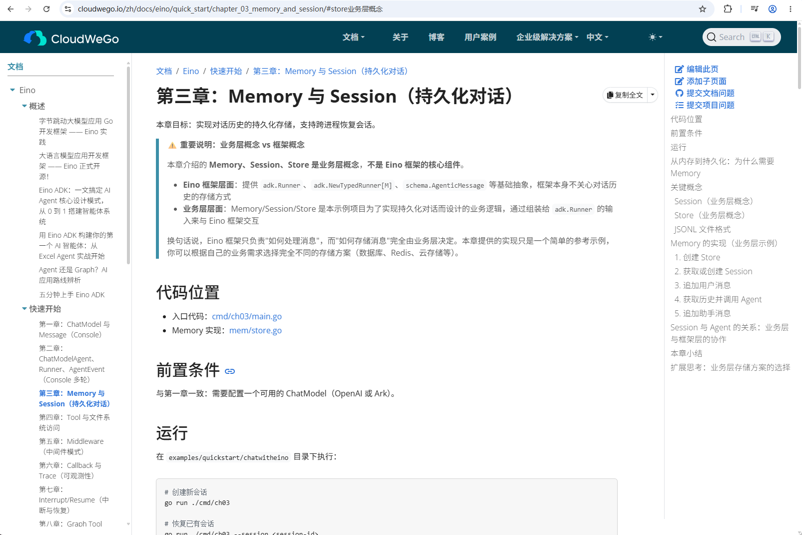
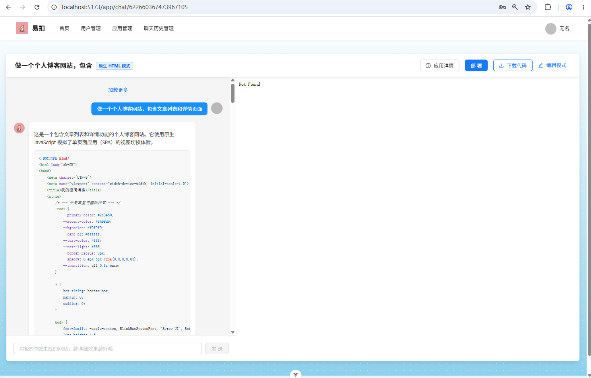
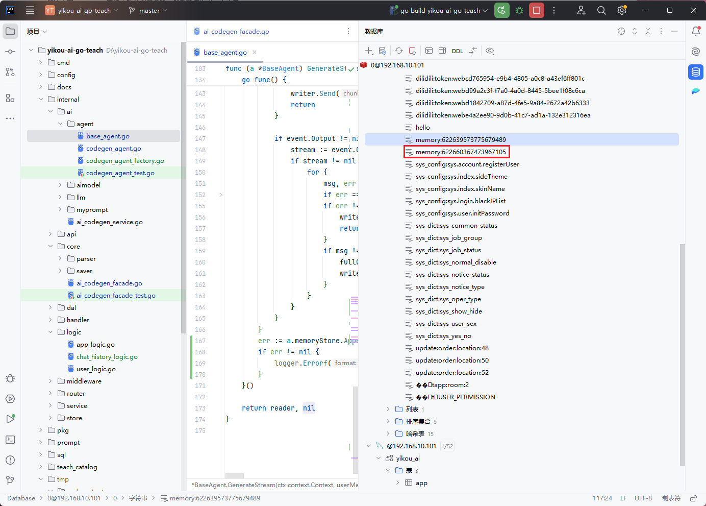
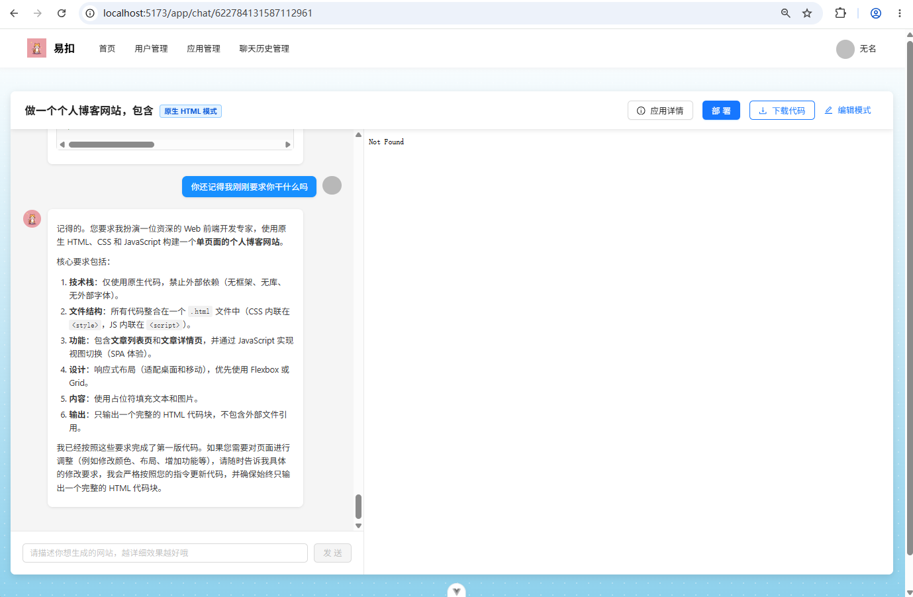

# 第5章：后端项目基于Eino对话记忆的对话历史模块搭建

## 一、方案设计

### 业务需求描述

在集成Eino对话记忆之前，我们的代码生成智能体存在以下核心问题：

##### 问题1：对话无持久化

**现状：**

```go
// 现有智能体的Generate方法 - 无状态设计
func (a *BaseAgent) Generate(ctx context.Context, userMessage string, 
    chatTemplate prompt.ChatTemplate, adkAgent *adk.ChatModelAgent) (*schema.Message, error) {
  
    // 直接格式化Prompt，没有任何历史上下文
    format, err := chatTemplate.Format(ctx, map[string]any{
        "content": userMessage,  // 只有当前消息，没有history！
    })
    // ...
}
```

**用户体验：**

- 每次都要重新描述需求
- AI无法理解"它"、"这个"、"那个"等指代词
- 对话不连贯，体验极差

##### 问题2：无法追溯对话历史

**现状：**

- 智能体运行时内存中保存对话
- 服务重启后所有对话丢失
- 无法查询历史对话记录
- 无法回溯用户的完整需求变更过程

**业务影响：**

- 用户无法回顾之前的对话内容
- 开发者无法调试AI生成的问题
- 无法进行数据分析（如用户常用功能统计）
- 不符合合规性要求（需要保留操作日志）

##### 问题3：无多对话隔离

**现状：**

单个智能体处理多个应用对话

**安全风险：**

- 应用A的用户可能看到应用B的对话
- 不同应用的对话历史混在一起
- 数据泄露风险高
- 无法按应用维度管理数据

##### 问题4：无自动总结机制

**现状：**

- 长对话导致Token消耗指数增长
- 20轮对话后，Prompt可能超过模型上下文窗口
- AI响应质量下降（注意力分散）
- API调用成本急剧上升

**成本估算示例：**

```
假设每条消息平均100 tokens：
- 第1轮：200 tokens (用户+AI)
- 第10轮：2000 tokens
- 第20轮：4000 tokens
- 第50轮：10000 tokens (超出许多模型的限制)

API成本增长曲线：线性 → 指数级增长
```

### 对话历史分页方案选型：传统分页 vs 游标分页

在对话历史模块中，我们同时使用了两种分页方式：管理员接口使用**传统分页**，用户接口使用**游标分页**。为什么要这样设计？下面通过一个真实的案例来说明。

#### 一个真实的场景

假设你的应用"任务管理系统"已经和AI进行了 **50轮对话**，产生了 **100条消息记录**。用户打开对话历史页面，每页显示10条。

#### 传统分页的做法

传统分页的思路很简单：告诉数据库"我要第3页，每页10条"。

```
请求：GET /api/chat/history?appId=123&pageNum=3&pageSize=10
```

数据库执行的SQL：

```sql
SELECT * FROM chat_history 
WHERE app_id = 123 
ORDER BY create_time DESC 
LIMIT 10 OFFSET 20;
```

翻译成白话就是："跳过前20条，取接下来的10条"。

**看起来没问题？让我们看看会发生什么。**

用户正在浏览第3页时，另一条新的AI消息到达了，插入到了最新位置。此时数据变成了101条，最新的一条被推到了第1页的顶部。

用户点击"下一页"想看第4页：

```sql
SELECT * FROM chat_history 
WHERE app_id = 123 
ORDER BY create_time DESC 
LIMIT 10 OFFSET 30;
```

**问题出现了**——用户看到了第3页最后一条消息的重复！因为新插入的消息把所有记录往下挤了一位，OFFSET 30实际上跳过了一条本该看到的消息，而把第3页末尾的那条又展示了一次。

```
插入前：                    插入后（新消息挤入第1页）：
第1页：Msg100, Msg99...     第1页：Msg101, Msg100, Msg99...
第2页：Msg90, Msg89...      第2页：Msg91, Msg90, Msg89...
第3页：Msg80, Msg79...      第3页：Msg81, Msg80, Msg79...  ← Msg81是新挤进来的
第4页：Msg70, Msg69...      第4页：Msg71, Msg70, Msg69...  ← 用户看到的第4页，Msg71重复了！
```

这就是传统分页的**数据漂移问题**——在有新数据插入时，页与页之间会出现重复或遗漏。

**另一个问题：性能**

当数据量很大时，OFFSET的代价很高：

```sql
-- 查看第1000页，每页10条
SELECT * FROM chat_history 
ORDER BY create_time DESC 
LIMIT 10 OFFSET 9990;
```

数据库并不是直接跳到第9990条，而是先扫描前9990条记录，然后丢弃它们，再返回接下来的10条。也就是说，**翻到越后面的页，查询越慢**。

```
第1页：  扫描 0 条  → 耗时 1ms
第10页： 扫描 90 条 → 耗时 3ms
第100页：扫描 990条 → 耗时 15ms
第1000页：扫描9990条 → 耗时 150ms
```

#### 游标分页的做法

游标分页的思路完全不同：不告诉数据库"我要第几页"，而是告诉它"我要在某个位置之后的数据"。

```
第一次请求：GET /api/chat/history?appId=123&pageSize=10
（没有游标，从头开始取）

返回结果：
  Msg100 (createTime: 2025-01-10 10:30:00)
  Msg99  (createTime: 2025-01-10 10:28:00)
  ...
  Msg91  (createTime: 2025-01-10 10:10:00)
  
  游标标记：lastCreateTime = 2025-01-10 10:10:00
```

用户向下滚动，加载更多：

```
第二次请求：GET /api/chat/history?appId=123&pageSize=10&lastCreateTime=2025-01-10 10:10:00
（告诉数据库：从这条之后继续取）
```

数据库执行的SQL：

```sql
SELECT * FROM chat_history 
WHERE app_id = 123 AND create_time < '2025-01-10 10:10:00'
ORDER BY create_time DESC 
LIMIT 10;
```

翻译成白话就是："给我比这个时间更早的10条"。

**关键区别来了**——即使此时有新消息插入，也不会影响结果。因为我们不是在说"跳过多少条"，而是在说"从这个时间点之前取"。新消息的时间一定比游标更新，不会出现在结果中。

```
插入前和插入后的查询结果完全一致：

第二次请求返回：
  Msg90 (createTime: 2025-01-10 10:08:00)
  Msg89 (createTime: 2025-01-10 10:06:00)
  ...
  Msg81 (createTime: 2025-01-10 09:50:00)
  
  不会出现重复，不会出现遗漏！
```

**性能方面**——游标分页利用了索引，无论翻到多深，查询速度都一样快：

```sql
-- 第1次查询和第100次查询的执行计划完全相同
-- 都是利用 create_time 索引定位，然后向后扫描10条
-- 耗时始终在 1-2ms
```

```
第1次加载：  利用索引定位 → 耗时 1ms
第10次加载：利用索引定位 → 耗时 1ms
第100次加载：利用索引定位 → 耗时 1ms
第1000次加载：利用索引定位 → 耗时 1ms
```

#### 那为什么管理员接口还用传统分页？

游标分页虽然好，但也有它的局限：

**局限1：无法跳页**

游标分页只能"下一页"，不能直接跳到第5页。用户必须从第1页开始，一页一页往下翻。

```
传统分页：可以直接跳到第50页 → GET /api/admin/chat/history?pageNum=50
游标分页：必须从第1页开始，连续翻50次 → 不现实
```

**局限2：无法显示总页数**

游标分页不知道总共有多少数据，所以无法显示"共100页"这样的信息。

```
传统分页：可以显示 "第3页/共100页"
游标分页：只能显示 "加载更多" 或 "没有更多了"
```

**局限3：排序字段必须唯一且递增**

游标分页依赖一个稳定的、单调递增的字段作为游标。如果排序字段有重复值，可能会漏数据。

```
用 createTime 做游标：
  如果两条消息的 createTime 完全相同（精度到秒）
  → 可能会漏掉其中一条
  → 解决方案：用 (createTime, id) 联合游标
```

#### 我们的选择

根据两种分页的特点，我们这样分配：

**用户查看对话历史 → 游标分页**

用户的场景是"向下滚动加载更多"，不需要跳页，不需要总页数。对话是实时产生的，用游标分页可以避免数据漂移，保证体验流畅。

```
前端交互：
  打开对话历史 → 加载最新10条
  向下滚动 → 基于最后一条的时间加载更多
  继续滚动 → 继续加载...
  没有更多了 → 显示"已加载全部"
```

**管理员查看所有对话 → 传统分页**

管理员的场景是"后台管理"，需要跳转到指定页码，需要看到总记录数，需要按多种条件筛选。数据变动对管理员来说影响不大。

```
前端交互：
  打开管理后台 → 显示第1页，共50页
  点击第5页 → 直接跳转
  输入页码25 → 直接跳转
  筛选条件变更 → 重新从第1页开始
```

### 数据库表设计

**对话历史表（chat_history）**

**表结构：**

| 字段名      | 类型        | 说明                | 约束                                |
| ----------- | ----------- | ------------------- | ----------------------------------- |
| id          | bigint      | 主键ID              | PRIMARY KEY, AUTO_INCREMENT         |
| message     | text        | 消息内容            | NOT NULL                            |
| messageType | varchar(32) | 消息类型（user/ai） | NOT NULL                            |
| appId       | bigint      | 应用ID              | NOT NULL, INDEX                     |
| userId      | bigint      | 用户ID              | NOT NULL, INDEX                     |
| turnNumber  | int         | 对话轮数            | NOT NULL, DEFAULT 1                 |
| createTime  | datetime    | 创建时间            | NOT NULL, DEFAULT CURRENT_TIMESTAMP |
| updateTime  | datetime    | 更新时间            | NOT NULL, DEFAULT CURRENT_TIMESTAMP |
| isDelete    | tinyint     | 是否删除            | NOT NULL, DEFAULT 0                 |

**索引设计：**

- 主键索引：id
- 联合索引：(appId, userId, turnNumber)
- 普通索引：createTime

**建表语句：**

```sql
-- 对话历史表
create table if not exists chat_history
(
    id           bigint auto_increment comment 'id' primary key,
    message      text                               not null comment '消息内容',
    messageType  varchar(32)                        not null comment '消息类型：user/ai',
    appId        bigint                             not null comment '应用ID',
    userId       bigint                             not null comment '用户ID',
    turnNumber   int      default 1                 not null comment '对话轮数',
    createTime   datetime default CURRENT_TIMESTAMP not null comment '创建时间',
    updateTime   datetime default CURRENT_TIMESTAMP not null on update CURRENT_TIMESTAMP comment '更新时间',
    isDelete     tinyint  default 0                 not null comment '是否删除',
    INDEX idx_appId_userId (appId, userId),
    INDEX idx_turnNumber (turnNumber),
    INDEX idx_createTime (createTime)
) comment '对话历史' collate = utf8mb4_unicode_ci;
```

## 二、对话历史接口开发

本节我将详细讲解对话历史模块的Service接口定义和Logic层实现，包括对话历史的增删改查、轮次管理、自动总结等核心功能。

### Service 接口定义

**文件位置：** `internal/service/chat_history_service.go`

**接口设计：**

```go
type IChatHistoryService interface {
    AddChatMessage(ctx context.Context, appId int64, message string, messageType enum.ChatHistoryMessageTypeEnum, userId int64) error
    DeleteByAppId(ctx context.Context, appId int64) error
    ListAppChatHistoryByPage(ctx context.Context, appId int64, pageSize int32, lastCreateTime time.Time, loginUser *vo.UserVo) (*response.PageResponse[*model.ChatHistory], error)
    ListAllChatHistoryByPageForAdmin(ctx context.Context, pageNum int32, pageSize int32, queryRequest *api.YiKouChatHistoryQueryRequest) (*response.PageResponse[*model.ChatHistory], error)
}
```

### Logic 层实现

**文件位置：** `internal/logic/chat_history_logic.go`

#### 服务初始化

```go
func NewChatHistoryService(db *gorm.DB) *ChatHistoryService {
    return &ChatHistoryService{
        db: db,
    }
}

type ChatHistoryService struct {
    db *gorm.DB
}
```

#### 分页查询应用对话历史（ListAppChatHistoryByPage）

**功能说明：** 分页获取指定应用的对话历史记录，支持游标分页和时间过滤。

**完整代码：**

```go
func (s *ChatHistoryService) ListAppChatHistoryByPage(ctx context.Context,
    appId int64, pageSize int32, lastCreateTime time.Time, loginUser *vo.UserVo) (*response.PageResponse[*model.ChatHistory], error) {
  
    // 1. 校验基本参数
    if appId == 0 || appId < 0 || pageSize <= 0 || pageSize > 50 {
        return nil, errorutil.ParamsError
    }
    if loginUser == nil {
        return nil, errorutil.NotLoginError
    }
  
    // 2. 校验用户角色是否为管理员或者应用创建者
    app, err := query.Use(s.db).App.Where(query.App.ID.Eq(appId)).First()
    if err != nil {
        return nil, err
    }
    if app.UserID != loginUser.ID && loginUser.UserRole != string(enum.AdminRole) {
        return nil, errorutil.NotAuthError
    }

    // 3. 构建查询条件
    chatHistoryQuery := query.Use(s.db).ChatHistory.
        Where(query.ChatHistory.AppID.Eq(appId)).
        Where(query.ChatHistory.MessageType.Neq(string(enum.SummaryMessageType)))

    // 4. 处理时间过滤（游标分页）
    if !lastCreateTime.IsZero() {
        chatHistoryQuery = chatHistoryQuery.Where(query.ChatHistory.CreateTime.Lt(lastCreateTime))
    }

    // 5. 查询总记录数
    totalRow, err := chatHistoryQuery.Count()
    if err != nil {
        return nil, err
    }

    // 6. 计算总页数
    totalPage := 0
    if totalRow > 0 {
        totalPage = int((totalRow + int64(pageSize) - 1) / int64(pageSize))
    }

    // 7. 分页查询应用的聊天记录
    chatHistoryList, err := chatHistoryQuery.
        Order(query.ChatHistory.CreateTime.Desc()).
        Limit(int(pageSize)).
        Find()
    if err != nil {
        return nil, err
    }

    // 8. 构建并返回分页响应
    return &response.PageResponse[*model.ChatHistory]{
        Records:            chatHistoryList,
        PageNum:            1,
        PageSize:           int(pageSize),
        TotalPage:          totalPage,
        TotalRow:           int(totalRow),
        OptimizeCountQuery: true,
    }, nil
}
```

#### 删除应用对话历史（DeleteByAppId）

**功能说明：** 删除指定应用的所有对话记录，通常在删除应用时调用。

**完整代码：**

```go
func (s *ChatHistoryService) DeleteByAppId(ctx context.Context, appId int64) error {
    // 1. 校验应用ID
    if appId == 0 || appId < 0 {
        return errorutil.ParamsError.WithMessage("应用ID不能为空")
    }
  
    // 2. 删除该应用的所有对话记录
    _, err := query.Use(s.db).ChatHistory.
        Where(query.ChatHistory.AppID.Eq(appId)).
        Delete()
    if err != nil {
        return err
    }
  
    return nil
}
```

#### 添加对话消息（AddChatMessage）⭐核心方法

**功能说明：** 添加一条对话消息到数据库，自动计算对话轮次，并在达到阈值时触发对话总结。

**完整代码：**

```go
func (s *ChatHistoryService) AddChatMessage(ctx context.Context, appId int64,
    message string, messageType enum.ChatHistoryMessageTypeEnum, userId int64) error {
  
    // 1. 校验参数
    if appId <= 0 || messageType == "" || userId <= 0 || message == "" {
        return errorutil.ParamsError
    }

    // 2. 获取上一条消息的轮次
    lastMessage, err := query.Use(s.db).ChatHistory.
        Where(query.ChatHistory.AppID.Eq(appId)).
        Order(query.ChatHistory.CreateTime.Desc()).
        First()

    var turnNumber int32
    if err != nil {
        turnNumber = 0  // 第一条消息，轮次为0
    } else {
        turnNumber = lastMessage.TurnNumber
    }

    // 3. 如果当前是用户消息，开启新的一轮
    if messageType == enum.UserMessageType {
        turnNumber += 1
    }

    // 4. 生成雪花算法ID
    chatMessageId, err := snowflake.GenerateSnowFlakeId()
    if err != nil {
        return err
    }
  
    // 5. 创建对话记录
    err = query.Use(s.db).ChatHistory.Create(&model.ChatHistory{
        ID:          chatMessageId,
        AppID:       appId,
        Message:     message,
        MessageType: string(messageType),
        UserID:      userId,
        TurnNumber:  turnNumber,
    })
    if err != nil {
        return err
    }

    // 6. 当对话轮次达到20轮且为AI消息时，异步生成总结
    if turnNumber >= 20 && messageType == enum.AIMessageType {
        go s.generateSummary(context.Background(), appId, userId)
    }

    return nil
}
```

**步骤详解：**

| 步骤 | 操作       | 说明                   |
| ---- | ---------- | ---------------------- |
| 1    | 参数校验   | 验证所有必填参数       |
| 2    | 查询轮次   | 获取上一条消息的轮次数 |
| 3    | 计算新轮次 | 用户消息则轮次+1       |
| 4    | 生成ID     | 使用雪花算法生成唯一ID |
| 5    | 保存记录   | 写入数据库             |
| 6    | 触发总结   | 达到阈值后异步生成总结 |

**对话轮次计算规则：**

```
示例对话流程：

轮次1：
  - 用户消息（turnNumber=1）
  - AI响应（turnNumber=1）

轮次2：
  - 用户消息（turnNumber=2）
  - AI响应（turnNumber=2）

轮次3：
  - 用户消息（turnNumber=3）
  - AI响应（turnNumber=3）
  
...
```

#### 生成对话总结（generateSummary）⭐高级功能

**功能说明：** 当对话达到一定轮次时，异步生成对话总结，用于优化长对话的上下文管理。

**完整代码：**

```go
// generateSummary 生成对话总结
func (s *ChatHistoryService) generateSummary(ctx context.Context, appId int64, userId int64) {
    // 1. 获取历史对话记录（按时间正序）
    historyList, err := query.Use(s.db).ChatHistory.
        Where(query.ChatHistory.AppID.Eq(appId)).
        Order(query.ChatHistory.CreateTime.Asc()).
        Find()
    if err != nil {
        logger.Errorf("获取历史对话失败: %v\n", err)
        return
    }

    // 2. 构建对话历史字符串
    var chatHistoryBuilder strings.Builder
    for _, history := range historyList {
        if history.MessageType == string(enum.UserMessageType) {
            chatHistoryBuilder.WriteString(fmt.Sprintf("用户: %s\n", history.Message))
        } else if history.MessageType == string(enum.AIMessageType) {
            chatHistoryBuilder.WriteString(fmt.Sprintf("AI: %s\n", history.Message))
        }
    }
  
    err = s.AddChatMessage(ctx, appId, chatHistoryBuilder.String(), enum.SummaryMessageType, userId)
    if err != nil {
	logger.Errorf("对话总结保存失败: %v\n", err)
    }
}
```

**对话格式化示例：**

```
输入：数据库中的对话记录列表

输出格式化的对话字符串：
用户: 我需要一个任务管理系统
AI: 好的，我来帮你创建一个任务管理系统。这个系统将包括任务的增删改查功能...
用户: 需要支持优先级设置
AI: 明白，我会添加优先级字段，支持高、中、低三个级别...
用户: 还要有截止日期提醒
AI: 没问题，我会集成日期选择器和提醒功能...
```

在后续我们会自定义一个对话总结智能体用于总结所有轮次的对话，实现真正意义上的节省token

#### 管理员分页查询所有对话历史（ListAllChatHistoryByPageForAdmin）

**功能说明：** 管理员专用的全量对话历史查询接口，支持多条件组合查询。

**完整代码：**

```go
func (s *ChatHistoryService) ListAllChatHistoryByPageForAdmin(ctx context.Context, 
    pageNum int32, pageSize int32, queryRequest *api.YiKouChatHistoryQueryRequest) (*response.PageResponse[*model.ChatHistory], error) {
  
    // 1. 校验基本参数
    if pageNum <= 0 || pageSize <= 0 || pageSize > 50 {
        return nil, errorutil.ParamsError
    }
    if queryRequest == nil {
        return nil, errorutil.ParamsError
    }

    // 2. 构建基础查询
    chatHistoryQuery := query.Use(s.db).ChatHistory.
        Where(query.ChatHistory.ID.IsNotNull())

    // 3. 动态添加查询条件
    if queryRequest.Id > 0 {
        chatHistoryQuery = chatHistoryQuery.Where(query.ChatHistory.ID.Eq(queryRequest.Id))
    }
    if queryRequest.AppId > 0 {
        chatHistoryQuery = chatHistoryQuery.Where(query.ChatHistory.AppID.Eq(queryRequest.AppId))
    }
    if queryRequest.UserId > 0 {
        chatHistoryQuery = chatHistoryQuery.Where(query.ChatHistory.UserID.Eq(queryRequest.UserId))
    }
    if queryRequest.MessageType != "" {
        chatHistoryQuery = chatHistoryQuery.Where(query.ChatHistory.MessageType.Eq(queryRequest.MessageType))
    }
    if queryRequest.Message != "" {
        chatHistoryQuery = chatHistoryQuery.Where(
            query.ChatHistory.Message.Like("%" + queryRequest.Message + "%")
        )
    }
    if !queryRequest.LastCreateTime.IsZero() {
        chatHistoryQuery = chatHistoryQuery.Where(
            query.ChatHistory.CreateTime.Lt(queryRequest.LastCreateTime)
        )
    }

    // 4. 查询总记录数
    totalRow, err := chatHistoryQuery.Count()
    if err != nil {
        return nil, err
    }

    // 5. 计算总页数
    totalPage := 0
    if totalRow > 0 {
        totalPage = int((totalRow + int64(pageSize) - 1) / int64(pageSize))
    }

    // 6. 计算偏移量
    offset := int((pageNum - 1) * pageSize)

    // 7. 执行分页查询
    chatHistoryList, err := chatHistoryQuery.
        Order(query.ChatHistory.CreateTime.Desc()).
        Limit(int(pageSize)).
        Offset(offset).
        Find()
    if err != nil {
        return nil, err
    }

    // 8. 构建并返回分页响应
    return &response.PageResponse[*model.ChatHistory]{
        Records:            chatHistoryList,
        PageNum:            int(pageNum),
        PageSize:           int(pageSize),
        TotalPage:          totalPage,
        TotalRow:           int(totalRow),
        OptimizeCountQuery: true,
    }, nil
}
```

### Handler 层实现

**文件位置：** `internal/handler/chat_history_handler.go`

#### Handler 结构体定义

```go
type ChatHistoryHandler struct {
    chatHistoryService service.IChatHistoryService
    userService        service.IUserService
}

func NewChatHistoryHandler(
    chatHistoryService service.IChatHistoryService,
    userService service.IUserService,
) *ChatHistoryHandler {
    return &ChatHistoryHandler{
        chatHistoryService: chatHistoryService,
        userService:        userService,
    }
}
```

#### 分页查询应用对话历史（ListAppChatHistory）

**接口说明：** 用户查看指定应用的对话历史，使用游标分页。

**完整代码：**

```go
func (h *ChatHistoryHandler) ListAppChatHistory(ctx context.Context, c *app.RequestContext) {
    // 1. 获取路径参数appId
    appIdStr := c.Param("appId")
    appId, err := strconv.ParseInt(appIdStr, 10, 64)
    if err != nil {
        c.JSON(consts.StatusOK, response.NewErrorResponse[any](errorutil.ParamsError.WithMessage("应用ID格式错误")))
        return
    }

    // 2. 获取查询参数pageSize，默认值为10
    pageSizeStr := c.Query("pageSize")
    pageSize := int32(10) // 默认值
    if pageSizeStr != "" {
        if ps, err := strconv.Atoi(pageSizeStr); err == nil {
            pageSize = int32(ps)
        }
    }

    // 3. 获取查询参数lastCreateTime，可选
    lastCreateTimeStr := c.Query("lastCreateTime")
    var lastCreateTime time.Time
    if lastCreateTimeStr != "" {
        if t, err := time.Parse(time.RFC3339, lastCreateTimeStr); err == nil {
            lastCreateTime = t
        }
    }

    // 4. 获取登录用户
    loginUser, err := h.userService.GetLoginUserVo(ctx, c)
    if err != nil {
        c.JSON(consts.StatusOK, response.NewErrorResponse[any](err))
        return
    }

    // 5. 调用服务层方法
    result, err := h.chatHistoryService.ListAppChatHistoryByPage(ctx, appId, pageSize, lastCreateTime, &loginUser)
    if err != nil {
        c.JSON(consts.StatusOK, response.NewErrorResponse[any](err))
        return
    }

    // 6. 返回成功响应
    c.JSON(consts.StatusOK, response.NewSuccessResponse[*response.PageResponse[*model.ChatHistory]](result))
}
```

#### 管理员分页查询所有对话历史（ListAllChatHistoryByPageForAdmin）

**接口说明：** 管理员查看所有应用的对话历史，支持多条件筛选，使用传统分页。

**请求参数（文件位置 `internal/api/chat_history.go`）：**

```go
type YiKouChatHistoryQueryRequest struct {
    Id             int64     `json:"id"`             // 对话ID
    AppId          int64     `json:"appId"`          // 应用ID
    UserId         int64     `json:"userId"`         // 用户ID
    MessageType    string    `json:"messageType"`    // 消息类型
    Message        string    `json:"message"`        // 消息内容（模糊搜索）
    LastCreateTime time.Time `json:"lastCreateTime"` // 创建时间过滤
}

type YiKouChatHistoryQueryResponse response.BaseResponse[response.PageResponse[*model.ChatHistory]]
```

**完整代码：**

```go
func (h *ChatHistoryHandler) ListAllChatHistoryByPageForAdmin(ctx context.Context, c *app.RequestContext) {
    // 1. 绑定请求参数
    req := &api.YiKouChatHistoryQueryRequest{}
    err := c.BindAndValidate(req)
    if err != nil {
        c.JSON(consts.StatusOK, response.NewErrorResponse[any](errorutil.ParamsError))
        return
    }

    // 2. 获取分页参数
    pageNum := int32(1)   // 默认值
    pageSize := int32(10) // 默认值

    // 3. 调用服务层方法
    result, err := h.chatHistoryService.ListAllChatHistoryByPageForAdmin(ctx, pageNum, pageSize, req)
    if err != nil {
        c.JSON(consts.StatusOK, response.NewErrorResponse[any](err))
        return
    }

    // 4. 返回成功响应
    c.JSON(consts.StatusOK, response.NewSuccessResponse[*response.PageResponse[*model.ChatHistory]](result))
}
```

#### 修改路由文件增加接口声明

文件位置 `internal/router/router.go`

```go
// RegisterRoutes 注册路由
func RegisterRoutes(h *server.Hertz, url func(config *swagger.Config), db *gorm.DB,
	userHandler *handler.UserHandler, appHandler *handler.AppHandler, chatHistoryHandler *handler.ChatHistoryHandler) {
	// 注册全局中间件
	// 处理跨域问题
	h.Use(cors.New(cors.Config{
		AllowAllOrigins:  true,
		AllowMethods:     []string{"GET", "POST", "PUT", "DELETE", "OPTIONS"},
		AllowHeaders:     []string{"Origin", "Content-Type", "Authorization"},
		ExposeHeaders:    []string{"Content-Length"},
		AllowCredentials: false,
		MaxAge:           12 * time.Hour,
	}))
	// 全局异常处理
	h.Use(recovery.Recovery(recovery.WithRecoveryHandler(CustomRecoveryHandler)))

	// 测试接口
	h.GET("/ping", handler.Ping)
	// swaggo文档
	h.GET("/swagger/*any", swagger.WrapHandler(swaggerFiles.Handler, url))

	userRoute := h.Group("/user")
	{
		userRoute.POST("/register", userHandler.UserRegister)
		userRoute.POST("/login", userHandler.UserLogin)
		userRoute.GET("/get/vo", userHandler.GetUserVo)

		// 需要登录的接口
		userRoute.GET("/get/login", middleware.AuthMiddleware(enum.UserRole, db), userHandler.GetLoginUser)
		userRoute.POST("/logout", middleware.AuthMiddleware(enum.UserRole, db), userHandler.Logout)

		// 需要管理员权限的接口
		userRoute.POST("/add", middleware.AuthMiddleware(enum.AdminRole, db), userHandler.AddUser)
		userRoute.GET("/get", middleware.AuthMiddleware(enum.AdminRole, db), userHandler.GetUser)
		userRoute.POST("/delete", middleware.AuthMiddleware(enum.AdminRole, db), userHandler.DeleteUser)
		userRoute.POST("/update", middleware.AuthMiddleware(enum.AdminRole, db), userHandler.UpdateUser)
		userRoute.POST("/list/page/vo", middleware.AuthMiddleware(enum.AdminRole, db), userHandler.ListUserVoByPage)
	}

	appRoute := h.Group("/app")
	{
		appRoute.POST("/good/list/page/vo", appHandler.ListGoodApp)
		appRoute.GET("/get/vo", middleware.AuthMiddleware(enum.UserRole, db), appHandler.GetAppVo)

		// 需要登录的接口
		appRoute.GET("/chat/gen/code", middleware.AuthMiddleware(enum.UserRole, db), appHandler.ChatToGenCode)
		appRoute.POST("/my/list/page/vo", middleware.AuthMiddleware(enum.UserRole, db), appHandler.ListMyApp)
		appRoute.POST("/add", middleware.AuthMiddleware(enum.UserRole, db), appHandler.AddApp)
		appRoute.POST("/update", middleware.AuthMiddleware(enum.UserRole, db), appHandler.UpdateApp)
		appRoute.POST("/delete", middleware.AuthMiddleware(enum.UserRole, db), appHandler.DeleteApp)

		// 需要管理员权限的接口
		appRoute.POST("/admin/update", middleware.AuthMiddleware(enum.AdminRole, db), appHandler.AdminUpdateApp)
		appRoute.POST("/admin/delete", middleware.AuthMiddleware(enum.AdminRole, db), appHandler.AdminDeleteApp)
		appRoute.GET("/admin/get/vo", middleware.AuthMiddleware(enum.AdminRole, db), appHandler.AdminGetAppVo)
		appRoute.POST("/admin/list/page/vo", middleware.AuthMiddleware(enum.AdminRole, db), appHandler.AdminListApp)
	}

	// 聊天历史路由
	chatHistoryRoute := h.Group("/chatHistory")
	{
		// 需要管理员权限的接口
		chatHistoryRoute.POST("/admin/list/page/vo", middleware.AuthMiddleware(enum.AdminRole, db), chatHistoryHandler.ListAllChatHistoryByPageForAdmin)

		chatHistoryRoute.GET("/app/:appId", middleware.AuthMiddleware(enum.UserRole, db), chatHistoryHandler.ListAppChatHistory)
	}
}
```

### 应用模块集成对话历史服务

除了专门的对话历史接口外，应用模块也需要调用对话历史服务来保存用户和AI的对话记录。本节将详细描述 `app_handler.go` 和 `app_logic.go` 中如何集成对话历史服务。

#### Handler 层集成

**文件位置：** `internal/handler/app_handler.go`

##### AppHandler 结构体修改

在 `AppHandler` 中注入 `chatHistoryService`：

```go
type AppHandler struct {
    appService         service.IAppService
    userService        service.IUserService
    chatHistoryService service.IChatHistoryService  // ← 新增：对话历史服务
}

func NewAppHandler(
    appService service.IAppService,
    userService service.IUserService,
    chatHistoryService service.IChatHistoryService,  // ← 新增参数
) *AppHandler {
    return &AppHandler{
        appService:         appService,
        userService:        userService,
        chatHistoryService: chatHistoryService,
    }
}
```

##### ChatToGenCode 方法中的调用

**功能说明：** 在流式代码生成完成后，异步保存AI的响应消息到对话历史表。

**调用位置：** 流式响应结束后

**完整代码片段：**

```go
func (a *AppHandler) ChatToGenCode(ctx context.Context, c *app.RequestContext) {
    // ... 前面的代码省略
  
    var aiResponseBuilder strings.Builder
    for {
        // ... 流式读取代码省略
        aiResponseBuilder.WriteString(chunk.Content)
        // ... 发送SSE事件省略
    }

    // ← 关键调用：保存AI响应到对话历史
    err = a.chatHistoryService.AddChatMessage(ctx, appId, aiResponseBuilder.String(), enum.AIMessageType, userVo.ID)
    if err != nil {
        logger.Errorf("保存对话历史失败: %v\n", err)
    }

    _ = w.WriteEvent(lastEventID, "done", []byte{1})
}
```

#### Service 层集成

**文件位置：** `internal/logic/app_logic.go`

##### AppService 结构体修改

在 `AppService` 中注入 `chatHistoryService`：

```go
func NewAppService(
    aiCodeGenFacade *core.YiKouAiCodegenFacade,
    userService service.IUserService,
    chatHistoryService service.IChatHistoryService,  // ← 新增：对话历史服务
    db *gorm.DB,
) *AppService {
    return &AppService{
        aiCodeGenFacade:    aiCodeGenFacade,
        userService:        userService,
        chatHistoryService: chatHistoryService,
        db:                 db,
    }
}

type AppService struct {
    aiCodeGenFacade    *core.YiKouAiCodegenFacade
    userService        service.IUserService
    chatHistoryService service.IChatHistoryService  // ← 新增字段
    db                 *gorm.DB
}
```

##### ChatToGenCode 方法中的调用

**功能说明：** 在调用代码生成服务前，先保存用户的对话消息到对话历史表。

**调用位置：** 参数校验通过后，调用代码生成服务前

**完整代码片段：**

```go
func (s *AppService) ChatToGenCode(ctx context.Context, appId int64, message string, loginUser *vo.UserVo) (*schema.StreamReader[*schema.Message], error) {
    // 1. 校验参数
    if message == "" {
        return nil, errorutil.ParamsError.WithMessage("消息不能为空")
    }
    if appId == 0 || appId < 0 {
        return nil, errorutil.ParamsError.WithMessage("应用ID不能为空")
    }
  
    // 2. 校验应用是否存在
    app, err := query.Use(s.db).App.Where(query.App.ID.Eq(appId), query.App.IsDelete.Eq(0)).First()
    if err != nil {
        return nil, err
    }
  
    // 3. 校验用户是否有权限使用该应用
    if app.UserID != loginUser.ID {
        return nil, errorutil.NotAuthError.WithMessage("无权使用该应用")
    }
  
    // 4. 获取代码生成类型
    if enum.CodeGenTypeTextMap[enum.CodeGenTypeEnum(app.CodeGenType)] == "" {
        return nil, errorutil.ParamsError.WithMessage("应用代码生成类型不支持")
    }
  
    // ← 关键调用：保存用户消息到对话历史
    err = s.chatHistoryService.AddChatMessage(ctx, appId, message, enum.UserMessageType, loginUser.ID)
    if err != nil {
        logger.Errorf("保存对话历史失败: %v\n", err)
    }
  
    // 6. 调用代码生成服务
    return s.aiCodeGenFacade.GenCodeStreamAndSave(ctx, message, enum.CodeGenTypeEnum(app.CodeGenType), appId)
}
```

##### DeleteApp 方法中的调用

**功能说明：** 在删除应用时，级联删除该应用的所有对话历史记录。

**调用位置：** 应用逻辑删除成功后

**完整代码片段：**

```go
func (s *AppService) DeleteApp(ctx context.Context, id int64, userId int64) (bool, error) {
    // 1. 查询应用
    app, err := query.Use(s.db).App.Where(query.App.ID.Eq(id)).First()
    if err != nil {
        return false, err
    }

    // 2. 校验权限
    if app.UserID != userId {
        return false, errorutil.ParamsError.WithMessage("无权删除该应用")
    }

    // 3. 逻辑删除应用
    _, err = query.Use(s.db).App.Where(query.App.ID.Eq(id)).Update(query.App.IsDelete, 1)
    if err != nil {
        return false, err
    }

    // ← 关键调用：级联删除对话历史
    err = s.chatHistoryService.DeleteByAppId(ctx, id)
    if err != nil {
        logger.Errorf("对话历史删除失败: %v\n", err)
    }
  
    return true, nil
}
```

## 三、集成Eino对话记忆

本节将详细讲解Eino框架的对话记忆机制在项目中的完整实现，包括基础设施层、存储层、Agent层和工厂层的架构设计与代码实现。

### 对话记忆的保存方案设计

在深入实现细节之前，我们需要先理解一个核心设计决策：**为什么Eino对话记忆保存在Redis，而不是MySQL？**

#### 一个关键的区别：对话历史 vs 对话记忆

很多人会混淆这两个概念，但它们有本质区别：

**对话历史（Chat History）**

- 保存在MySQL的 `chat_history` 表中
- 是**完整的、永久的**对话记录
- 用于**审计、统计、回溯**
- 数据结构：包含 appId、userId、turnNumber、messageType 等完整字段
- 查询场景：管理员查看、用户翻阅历史、数据分析

**对话记忆（Conversation Memory）**

- 保存在Redis的 `memory:{appId}` 键中
- 是**裁剪的、临时的**对话上下文
- 用于**AI实时推理**
- 数据结构：只包含 role 和 content 的消息列表
- 查询场景：AI调用时加载上下文

用一个比喻来理解：

```
对话历史 = 银行的交易流水账本
  - 永久保存，不能修改
  - 记录每一笔交易的完整信息
  - 用于对账、审计、统计
  - 存储在数据库

对话记忆 = 你的记账本摘要
  - 只记录最近几笔交易
  - 定期清理旧记录
  - 用于快速查看当前财务状况
  - 存储在便签纸上（Redis）
```

#### 为什么Eino对话记忆不用MySQL？

假设我们用MySQL存储Eino对话记忆，会发生什么？

**场景：用户发送一条消息，AI生成响应**

```
[步骤1] 用户发送消息 "添加删除功能"
    ↓
[步骤2] 从MySQL加载对话记忆
    执行SQL：
    SELECT * FROM chat_history 
    WHERE app_id = 123 
    ORDER BY create_time DESC 
    LIMIT 20;
  
    耗时：5-10ms（需要解析SQL、优化查询、扫描索引、回表）
    ↓
[步骤3] 将查询结果转换为Eino的Message格式
    遍历20条记录，构建 []*schema.Message
    耗时：1-2ms
    ↓
[步骤4] 调用AI模型（带上下文）
    耗时：2000-5000ms（网络请求）
    ↓
[步骤5] AI响应完成，保存新的对话记忆
    执行SQL：
    INSERT INTO chat_history (...) VALUES (...);
  
    耗时：3-5ms
    ↓
总耗时：2010-5020ms
```

**如果用Redis存储对话记忆：**

```
[步骤1] 用户发送消息 "添加删除功能"
    ↓
[步骤2] 从Redis加载对话记忆
    执行命令：
    GET memory:123
  
    耗时：0.5-1ms（直接内存读取，无SQL解析）
    ↓
[步骤3] JSON反序列化为Message格式
    耗时：0.5-1ms
    ↓
[步骤4] 调用AI模型（带上下文）
    耗时：2000-5000ms（网络请求）
    ↓
[步骤5] AI响应完成，保存新的对话记忆
    执行命令：
    SET memory:123 '...' EX 86400
  
    耗时：0.5-1ms
    ↓
总耗时：2002-5003ms
```

**性能对比：**

| 操作       | MySQL  | Redis   | 差异               |
| ---------- | ------ | ------- | ------------------ |
| 加载记忆   | 5-10ms | 0.5-1ms | **快10倍**   |
| 保存记忆   | 3-5ms  | 0.5-1ms | **快5倍**    |
| 总耗时影响 | +15ms  | +3ms    | **节省12ms** |

看起来差异不大？但考虑以下场景：

**场景：高并发情况下，每秒100个用户同时对话**

```
MySQL方案：
  每秒 100 次读取 + 100 次写入 = 200 次数据库操作
  数据库连接池压力：高
  慢查询风险：高（特别是OFFSET分页）
  主从延迟风险：高（写入后立即读取可能读到旧数据）

Redis方案：
  每秒 100 次读取 + 100 次写入 = 200 次Redis操作
  Redis单线程也能轻松处理（QPS可达10万+）
  连接池压力：低
  响应速度：稳定在1ms以内
```

#### 那对话历史为什么还保存在MySQL？

既然Redis这么快，为什么不把对话历史也保存在Redis？

**原因1：持久化要求**

对话历史是**审计数据**，必须永久保存。Redis虽然有RDB/AOF持久化，但：

- RDB是定期快照，可能丢失最近的数据
- AOF虽然实时，但文件体积大，恢复慢
- Redis重启后数据可能丢失

MySQL的InnoDB引擎提供ACID事务保证，数据绝对不会丢失。

**原因2：复杂查询需求**

对话历史需要支持：

- 分页查询（游标分页、传统分页）
- 多条件筛选（按appId、userId、messageType）
- 聚合统计（按应用统计对话数、按用户统计活跃度）
- 关联查询（JOIN应用表、用户表）

Redis只能做简单的Key-Value操作，无法支持这些复杂查询。

**原因3：数据分析需求**

运营需要分析：

- 用户最常问的问题是什么？
- 哪个应用的对话最多？
- 用户活跃度趋势如何？

这些需要SQL聚合查询，Redis无法支持。

**原因4：合规性要求**

很多行业要求保留用户操作日志至少6个月，甚至永久保存。Redis的内存成本太高，不适合存储海量历史数据。

#### 存储方案总结

| 维度             | 对话历史（MySQL）            | 对话记忆（Redis）         |
| ---------------- | ---------------------------- | ------------------------- |
| **用途**   | 审计、统计、回溯             | AI实时推理                |
| **数据量** | 全量永久保存                 | 最近20条，24小时TTL       |
| **字段**   | 完整字段（appId、userId等）  | 简化字段（role、content） |
| **查询**   | 复杂查询（分页、筛选、聚合） | 简单查询（GET、SET）      |
| **性能**   | 5-10ms                       | 0.5-1ms                   |
| **一致性** | 强一致（ACID）               | 最终一致                  |
| **持久化** | 永久保存                     | 可能丢失（可重建）        |
| **成本**   | 磁盘存储，成本低             | 内存存储，成本高          |

### Redis初始化

我们先在控制台执行以下命令下载go-redis库，然后修改dal包下的 `init.go`文件

```bash
go get github.com/redis/go-redis/v9 v9.7.3
```

**文件位置：** `internal/dal/init.go`

#### 功能说明

负责项目核心基础设施的初始化，包括MySQL数据库连接和Redis客户端连接。而Redis是整个对话记忆系统的基础设施支撑，我们在原来的初始化内容增加一个Redis的provider方法用于注入。

#### 完整代码

```go
package dal

import (
	"fmt"
	"github.com/redis/go-redis/v9"
	"gorm.io/driver/mysql"
	"gorm.io/gorm"
	"gorm.io/gorm/logger"
	"yikou-ai-go-teach/config"
	"yikou-ai-go-teach/internal/dal/query"
)

// InitDB 初始化数据库连接
func InitDB(config *config.Config) *gorm.DB {
	if config == nil {
		panic(fmt.Errorf("配置加载失败"))
	}

	dsn := config.Database.GetDSN()
	db, err := gorm.Open(mysql.Open(dsn), &gorm.Config{
		Logger: logger.Default.LogMode(logger.Info),
	})
	if err != nil {
		panic(fmt.Errorf("数据库连接失败: %w", err))
	}
	query.SetDefault(db)
	return db
}

// InitRedis 初始化Redis连接
func InitRedis(config *config.Config) *redis.Client {
	if config == nil {
		panic(fmt.Errorf("配置加载失败"))
	}

	redisClient := redis.NewClient(&redis.Options{
		Addr:     fmt.Sprintf("%s:%d", config.Redis.Host, config.Redis.Port),
		Password: config.Redis.Password,
		DB:       config.Redis.DB,
	})

	return redisClient
}
```

### RedisMemoryStore实现

**文件位置：** `internal/store/memory_store.go`

#### 功能说明

由于Eino官方不支持将对话记忆抽象为组件，所有我根据Eino官网的方案自定义了一个MemoryStore的接口，我们只需要自定义一种对话记忆存储方式实现然后在基础agent引用就行了。这里我实现了基于Redis的对话记忆存储，作为MemoryStore接口的具体实现。负责对话消息的持久化存储和读取。



#### 接口定义与实现

```go
package store

import (
	"context"
	"encoding/json"
	"fmt"
	"github.com/cloudwego/eino/schema"
	"github.com/redis/go-redis/v9"
	"time"
)

// MemoryStore 对话记忆存储接口
type MemoryStore interface {
	GetMessages(ctx context.Context) ([]*schema.Message, error)
	AppendMessage(ctx context.Context, message *schema.Message) error
}

// RedisMemoryStore Redis实现的内存存储
type RedisMemoryStore struct {
	redisClient       *redis.Client
	memoryId          string
	maxMemoryMessages int
	ttl               time.Duration
}
```

#### 构造函数

```go
func NewRedisMemoryStore(redisClient *redis.Client, memoryId string, maxMemoryMessages int, ttl time.Duration) *RedisMemoryStore {
	return &RedisMemoryStore{
		redisClient:       redisClient,
		memoryId:          memoryId,
		maxMemoryMessages: maxMemoryMessages,
		ttl:               ttl,
	}
}
```

#### 核心方法实现

##### 获取消息列表（GetMessages）

```go
func (r RedisMemoryStore) GetMessages(ctx context.Context) ([]*schema.Message, error) {
	key := fmt.Sprintf("memory:%s", r.memoryId)
	data, err := r.redisClient.Get(ctx, key).Bytes()
	if err != nil {
		return nil, err
	}
	return decodeMessagesFromJSON(data)
}
```

##### 追加消息（AppendMessage）

```go
func (r RedisMemoryStore) AppendMessage(ctx context.Context, message *schema.Message) error {
	messages, err := r.GetMessages(ctx)
	if err != nil {
		if errors.Is(err, redis.Nil) {
			messages = []*schema.Message{}
		} else {
			return err
		}
	}
	messages = append(messages, message)
	messagesToJSON, err := encodeMessagesToJSON(messages)
	if err != nil {
		return err
	}
	key := fmt.Sprintf("memory:%s", r.memoryId)
	return r.redisClient.Set(ctx, key, messagesToJSON, r.ttl).Err()
}
```

##### 序列化辅助函数

```go
func encodeMessagesToJSON(msgs []*schema.Message) ([]byte, error) {
	return json.Marshal(msgs)
}

func decodeMessagesFromJSON(data []byte) ([]*schema.Message, error) {
	if len(data) == 0 {
		return nil, nil
	}
	var msgs []*schema.Message
	err := json.Unmarshal(data, &msgs)
	return msgs, err
}
```

### 修改基础Agent - Eino对话记忆核心实现

**文件位置：** `internal/ai/agent/base_agent.go`

#### 修改结构体定义和构造函数

```go
type ChatModelWrapperAdaptor interface {
	GetChatModel() *openai.ChatModel
	GetModelName() string
}

type BaseAgent struct {
	model       *openai.ChatModel
	modelName   string
	memoryStore store.MemoryStore
}

func NewBaseAgent(chatModel ChatModelWrapperAdaptor, memoryStore store.MemoryStore) *BaseAgent {
	return &BaseAgent{
		model:       chatModel.GetChatModel(),
		modelName:   chatModel.GetModelName(),
		memoryStore: memoryStore,
	}
}
```

#### 修改流式生成方法（GenerateStream）

```go
func (a *BaseAgent) GenerateStream(ctx context.Context, userMessage string, chatTemplate prompt.ChatTemplate, adkAgent *adk.ChatModelAgent) (*schema.StreamReader[*schema.Message], error) {
	// 1. 从Redis加载对话历史
	messages, err := a.memoryStore.GetMessages(ctx)
	if err != nil {
		if errors.Is(err, redis.Nil) {
			messages = []*schema.Message{}
		} else {
			return nil, err
		}
	}

	// 2. 格式化Prompt（包含历史上下文）
	format, err := chatTemplate.Format(ctx, map[string]any{
		"content": userMessage,
		"history": messages,
	})
	if err != nil {
		return nil, err
	}

	err = a.memoryStore.AppendMessage(ctx, schema.UserMessage(userMessage))
	if err != nil {
		return nil, err
	}

	// 3. 创建流式Runner
	runner := adk.NewRunner(ctx, adk.RunnerConfig{
		Agent:           adkAgent,
		EnableStreaming: true,
	})

	iter := runner.Run(ctx, format)

	// 4. 创建管道用于流式传输
	reader, writer := schema.Pipe[*schema.Message](2)

	// 5. 异步处理流数据
	go func() {
		defer writer.Close()
		var fullContent string

		for {
			event, ok := iter.Next()
			if !ok {
				break
			}
			if event.Err != nil {
				writer.Send(nil, event.Err)
				return
			}

			if event.Output != nil && event.Output.MessageOutput != nil {
				stream := event.Output.MessageOutput.MessageStream
				if stream != nil {
					for {
						msg, err := stream.Recv()
						if err == io.EOF {
							break
						}
						if err != nil {
							writer.Send(nil, err)
							return
						}
						if msg != nil {
							fullContent += msg.Content
							writer.Send(msg, nil)
						}
					}
				}
			}
		}

		// 6. 将完整响应保存到Redis
		err := a.memoryStore.AppendMessage(ctx, schema.AssistantMessage(fullContent, nil))
		if err != nil {
			logger.Errorf("保存对话记忆失败: %v", err)
		}
	}()

	return reader, nil
}
```

### 修改代码生成Agent

**文件位置：** `internal/ai/agent/codegen_agent.go`

```go
func NewCodeGenAgent(chatModel ChatModelWrapperAdaptor, codeGenType enum.CodeGenTypeEnum, memoryStore store.MemoryStore) *CodeGenAgent {
	baseAgent := NewBaseAgent(chatModel, memoryStore)
	return &CodeGenAgent{
		BaseAgent: baseAgent,
		agentType: codeGenType,
	}
}
```

### 增加Agent工厂结构体

**文件位置：** `internal/ai/ai/agent/codegen_agent_factory.go`

#### 为什么使用工厂模式？

在修改代码实现后，由于原有的智能体业务发生了较大的改动，于是在这里我引用工厂模式进行创建代码生成智能体。当然，在学习业务逻辑前，我们先理解为什么需要引入工厂模式。通过对比**没有工厂模式**和**有工厂模式**的代码，你会发现工厂模式解决了哪些核心问题。

##### 问题场景：没有工厂模式时

假设我们直接在业务代码中创建 `CodeGenAgent`，会发生什么？

**场景：用户请求生成HTML代码**

```go
// 在 Handler 或 Service 中直接创建 Agent
func (h *AppHandler) ChatToGenCode(c *gin.Context) {
    // ... 获取参数
  
    redisStore := store.NewRedisMemoryStore(
        h.redisClient,           // 需要传递Redis客户端
        strconv.Itoa(int(appId)), // 需要手动转换类型
        20,                       // 魔法数字：最大消息数
        24*time.Hour,             // 魔法数字：TTL
    )
  
    agent := agent.NewCodeGenAgent(
        h.chatModel,      // 需要传递ChatModel
        codeGenType,      // 需要传递类型
        redisStore,       // 需要传递刚创建的Store
    )
  
    // ...
}
```

**这段代码有什么问题？**

**问题1：重复代码**

每次需要Agent时，都要重复这段创建逻辑：

```
创建RedisStore → 配置参数 → 创建Agent → 传递依赖
```

如果项目中有10个地方需要创建Agent，这段代码就要复制10次。

**问题2：违反开闭原则**

假设我们要修改RedisMemoryStore的配置：

```go
// 从 20条消息 改为 30条消息
redisStore := store.NewRedisMemoryStore(
    h.redisClient,
    strconv.Itoa(int(appId)),
    30,  // ← 修改这里
    24*time.Hour,
)
```

我们需要找到所有创建Agent的地方，逐一修改。如果有10处，就要改10次。

##### 解决方案：引入工厂模式

工厂模式的核心思想：**把对象的创建逻辑封装到一个专门的类中**。

```go
// 工厂类：专门负责创建 CodeGenAgent
type CodeGenAgentFactory struct {
    chatModel          *llm.ChatModelWrapper     // 持有依赖
    redisClient        *redis.Client             // 持有依赖
    chatHistoryService service.IChatHistoryService // 持有依赖
}

// 工厂方法：封装创建逻辑
func (c CodeGenAgentFactory) GetCodeGenAgent(appId int64, codeGenType enum.CodeGenTypeEnum) (*CodeGenAgent, error) {
    // 所有创建逻辑都在这里
    redisStore := store.NewRedisMemoryStore(c.redisClient, strconv.Itoa(int(appId)), 20, 24*time.Hour)
    return NewCodeGenAgent(c.chatModel, codeGenType, redisStore), nil
}
```

**业务代码变得简洁：**

```go
// 在 Handler 或 Service 中
func (h *AppHandler) ChatToGenCode(c *gin.Context) {
    // ... 获取参数
  
    // 一行代码创建Agent，所有细节都被封装
    agent, err := h.agentFactory.GetCodeGenAgent(appId, codeGenType)
    if err != nil {
        // 错误处理
    }
  
    // 业务逻辑清晰，不被创建逻辑干扰
    stream, err := agent.GenerateHtmlCodeStream(ctx, userMessage)
    // ...
}
```

#### 结构体定义

```go
type CodeGenAgentFactory struct {
	chatModel          *llm.ChatModelWrapper
	redisClient        *redis.Client
	chatHistoryService service.IChatHistoryService
}
```

#### 构造函数

```go
func NewCodeGenAgentFactory(chatModel *llm.ChatModelWrapper,
	redisClient *redis.Client, chatHistoryService service.IChatHistoryService) *CodeGenAgentFactory {
	return &CodeGenAgentFactory{
		chatModel:          chatModel,
		redisClient:        redisClient,
		chatHistoryService: chatHistoryService,
	}
}
```

#### 创建Agent方法

```go
func (c CodeGenAgentFactory) GetCodeGenAgent(appId int64, codeGenType enum.CodeGenTypeEnum) (*CodeGenAgent, error) {
	redisStore := store.NewRedisMemoryStore(c.redisClient, strconv.Itoa(int(appId)), 20, 24*time.Hour)
	return NewCodeGenAgent(c.chatModel, codeGenType, redisStore), nil
}
```

### 修改门面结构体

**文件位置：** `internal/core/ai_codegen_facade.go`

```go
package core

import (
    "context"
    "fmt"
    "io"
    "strings"
  
    "github.com/bytedance/gopkg/util/logger"
    "github.com/cloudwego/eino/schema"
  
    "yikou-ai-go-teach/internal/ai/agent"
    "yikou-ai-go-teach/internal/core/parser"
    "yikou-ai-go-teach/internal/core/saver"
    "yikou-ai-go-teach/pkg/enum"
)

// YiKouAiCodegenFacade 代码生成门面
type YiKouAiCodegenFacade struct {
    codeGenFactory        *agent.CodeGenAgentFactory     // Agent工厂
    codeParserExecutor    *parser.CodeParserExecutor     // 代码解析器
    codeFileSaverExecutor *saver.CodeFileSaverExecutor   // 代码保存器
}

// NewYiKouAiCodegenFacade 构造函数
func NewYiKouAiCodegenFacade(
    codeGenFactory *agent.CodeGenAgentFactory,
    codeParserExecutor *parser.CodeParserExecutor,
    codeFileSaverExecutor *saver.CodeFileSaverExecutor,
) *YiKouAiCodegenFacade {
    return &YiKouAiCodegenFacade{
        codeGenFactory:        codeGenFactory,
        codeParserExecutor:    codeParserExecutor,
        codeFileSaverExecutor: codeFileSaverExecutor,
    }
}

// GenCodeStreamAndSave 流式代码生成并保存（核心方法）
func (y *YiKouAiCodegenFacade) GenCodeStreamAndSave(
    ctx context.Context,
    userMessage string,
    typeStr enum.CodeGenTypeEnum,
    appId int64,
) (*schema.StreamReader[*schema.Message], error) {
    // 创建Agent
    genAgent, err := y.codeGenFactory.GetCodeGenAgent(appId, typeStr)
    if err != nil {
        return nil, err
    }
  
    // 根据类型调用不同的生成方法
    switch typeStr {
    case enum.HtmlCodeGen:
        streamResp, err := genAgent.GenerateHtmlCodeStream(ctx, userMessage)
        if err != nil {
            return nil, err
        }
        return y.processCodeStream(streamResp, typeStr, appId)
  
    case enum.MultiFileGen:
        streamResp, err := genAgent.GenerateMultiFileCodeStream(ctx, userMessage)
        if err != nil {
            return nil, err
        }
        return y.processCodeStream(streamResp, typeStr, appId)
  
    default:
        return nil, fmt.Errorf("不支持的代码生成类型: %s", typeStr)
    }
}

// processCodeStream 处理流式响应并异步保存
func (y *YiKouAiCodegenFacade) processCodeStream(
    respStream *schema.StreamReader[*schema.Message],
    typeStr enum.CodeGenTypeEnum,
    appId int64,
) (*schema.StreamReader[*schema.Message], error) {
    // 复制流
    streams := respStream.Copy(2)
    processingStream := streams[0]
    returnStream := streams[1]
  
    // 异步处理
    go func() {
        var builder strings.Builder
        defer processingStream.Close()
  
        // 读取流
        for {
            chunk, err := processingStream.Recv()
            if err == io.EOF {
                break
            }
            if err != nil {
                return
            }
            builder.WriteString(chunk.Content)
        }
  
        // 解析和保存
        parsedResp, err := y.codeParserExecutor.ExecuteParser(builder.String(), typeStr)
        if err != nil {
            return
        }
  
        dirPath, err := y.codeFileSaverExecutor.ExecuteSaver(parsedResp, typeStr, appId)
        if err != nil {
            return
        }
  
        logger.Info("代码已保存到目录: %s", dirPath)
    }()
  
    return returnStream, nil
}
```

### 修改依赖注入文件

**文件位置：** `wire/wire.go`

##### 修改点1：新增Redis客户端Provider

```go
// 数据库依赖
var dbSet = wire.NewSet(
    dal.InitDB,    // MySQL客户端
    dal.InitRedis, // ← 新增：Redis客户端
)
```

##### 修改点2：新增ChatHistoryService注册并移除原来的agentService注入

```go
// Service依赖
var serviceSet = wire.NewSet(
    logic.NewAppService,
    wire.Bind(new(service.IAppService), new(*logic.AppService)),
    logic.NewUserService,
    wire.Bind(new(service.IUserService), new(*logic.UserService)),
  
    // ← 新增：ChatHistoryService
    logic.NewChatHistoryService,
    wire.Bind(new(service.IChatHistoryService), new(*logic.ChatHistoryService)),
)
```

##### 修改点3：新增ChatHistoryHandler

```go
// Handler依赖
var handlerSet = wire.NewSet(
	handler.NewUserHandler,
	handler.NewAppHandler,
	handler.NewChatHistoryHandler,
)
```

##### 修改点4：新增CodeGenAgentFactory注册

```go
// 初始化函数
func InitializeApp() (*server.Hertz, error) {
    panic(wire.Build(
        initServer,
        configSet,
        dbSet,
        serviceSet,
        handlerSet,
        llmSet,
        parser.NewCodeParserExecutor,
        saver.NewCodeFileSaverExecutor,
        agent.NewCodeGenAgentFactory,  // ← 新增：Agent工厂
        core.NewYiKouAiCodegenFacade,
    ))
}
```

##### 修改点5：initServer方法

```go
// initServer 初始化 Web 服务器
func initServer(cfg *config.Config, userHandler *handler.UserHandler, appHandler *handler.AppHandler,
	db *gorm.DB, chatHistoryHandler *handler.ChatHistoryHandler) *server.Hertz {
	// 动态设置 Swagger 信息
	docs.SwaggerInfo.Host = fmt.Sprintf("localhost:%d", cfg.Server.Port)
	docs.SwaggerInfo.BasePath = cfg.Server.ContextPath

	// 初始化swagger路径
	swaggerPath := fmt.Sprintf("http://localhost:%d%s/swagger/doc.json", cfg.Server.Port, cfg.Server.ContextPath)
	url := swagger.URL(swaggerPath)

	// 创建 Hertz 服务器
	h := server.Default(
		server.WithHostPorts(":"+strconv.Itoa(cfg.Server.Port)),
		server.WithBasePath(cfg.Server.ContextPath),
	)

	// 注册路由
	router.RegisterRoutes(h, url, db, userHandler, appHandler, chatHistoryHandler)
	return h
}
```

**最后在wire目录下运行以下生成命令**

```bash
wire gen wire/wire.go
```

如果配置正确，会生成 `wire/wire_gen.go` 文件，无报错。

### 测试对话记忆功能

直接启动前端服务器，然后随便生成一个应用



然后查看Redis保存记忆对话是否成功



可以得到对话记忆如下

```json
[
  {
    "role": "user",
    "content": "做一个个人博客网站，包含文章列表和详情页面"
  },
  {
    "role": "assistant",
    "content": "这是一个包含文章列表和详情功能的个人博客网站。它使用原生 JavaScript 模拟了单页面应用（SPA）的视图切换体验。\n\n```html\n\u003c!DOCTYPE html\u003e\n\u003chtml lang=\"zh-CN\"\u003e\n\u003chead\u003e\n    \u003cmeta charset=\"UTF-8\"\u003e\n    \u003cmeta name=\"viewport\" content=\"width=device-width, initial-scale=1.0\"\u003e\n    \u003ctitle\u003e我的极简博客\u003c/title\u003e\n    \u003cstyle\u003e\n        /* --- 全局重置与基础样式 --- */\n        :root {\n            --primary-color: #2c3e50;\n            --accent-color: #3498db;\n            --bg-color: #f9f9f9;\n            --card-bg: #ffffff;\n            --text-color: #333;\n            --text-light: #666;\n            --border-radius: 8px;\n            --shadow: 0 4px 6px rgba(0,0,0,0.05);\n            --transition: all 0.3s ease;\n        }\n\n        * {\n            box-sizing: border-box;\n            margin: 0;\n            padding: 0;\n        }\n\n        body {\n            font-family: -apple-system, BlinkMacSystemFont, \"Segoe UI\", Roboto, \"Helvetica Neue\", Arial, sans-serif;\n            line-height: 1.6;\n            color: var(--text-color);\n            background-color: var(--bg-color);\n            display: flex;\n            flex-direction: column;\n            min-height: 100vh;\n        }\n\n        a {\n            text-decoration: none;\n            color: inherit;\n        }\n\n        ul {\n            list-style: none;\n        }\n\n        img {\n            max-width: 100%;\n            display: block;\n        }\n\n        /* --- 头部导航 --- */\n        header {\n            background-color: var(--card-bg);\n            box-shadow: var(--shadow);\n            position: sticky;\n            top: 0;\n            z-index: 100;\n        }\n\n        .nav-container {\n            max-width: 1200px;\n            margin: 0 auto;\n            padding: 1rem 2rem;\n            display: flex;\n            justify-content: space-between;\n            align-items: center;\n        }\n\n        .logo {\n            font-size: 1.5rem;\n            font-weight: 700;\n            color: var(--primary-color);\n        }\n\n        .nav-links a {\n            margin-left: 20px;\n            font-weight: 500;\n            color: var(--text-light);\n            transition: var(--transition);\n        }\n\n        .nav-links a:hover {\n            color: var(--accent-color);\n        }\n\n        /* --- 主要内容区域 --- */\n        main {\n            flex: 1;\n            max-width: 1200px;\n            margin: 2rem auto;\n            padding: 0 2rem;\n            width: 100%;\n        }\n\n        /* --- 文章列表视图 --- */\n        .view-section {\n            display: none; /* 默认隐藏所有视图 */\n            animation: fadeIn 0.5s ease;\n        }\n\n        .view-section.active {\n            display: block; /* 激活时显示 */\n        }\n\n        .page-title {\n            margin-bottom: 2rem;\n            font-size: 2rem;\n            color: var(--primary-color);\n            border-bottom: 2px solid var(--accent-color);\n            display: inline-block;\n            padding-bottom: 0.5rem;\n        }\n\n        .post-grid {\n            display: grid;\n            grid-template-columns: repeat(auto-fill, minmax(300px, 1fr));\n            gap: 2rem;\n        }\n\n        .post-card {\n            background: var(--card-bg);\n            border-radius: var(--border-radius);\n            overflow: hidden;\n            box-shadow: var(--shadow);\n            transition: var(--transition);\n            cursor: pointer;\n            display: flex;\n            flex-direction: column;\n        }\n\n        .post-card:hover {\n            transform: translateY(-5px);\n            box-shadow: 0 10px 15px rgba(0,0,0,0.1);\n        }\n\n        .post-card-image {\n            height: 200px;\n            width: 100%;\n            object-fit: cover;\n        }\n\n        .post-card-content {\n            padding: 1.5rem;\n            flex: 1;\n            display: flex;\n            flex-direction: column;\n        }\n\n        .post-meta {\n            font-size: 0.85rem;\n            color: var(--text-light);\n            margin-bottom: 0.5rem;\n        }\n\n        .post-title {\n            font-size: 1.25rem;\n            margin-bottom: 0.75rem;\n            color: var(--primary-color);\n        }\n\n        .post-excerpt {\n            color: var(--text-light);\n            font-size: 0.95rem;\n            margin-bottom: 1.5rem;\n            flex: 1;\n        }\n\n        .read-more {\n            color: var(--accent-color);\n            font-weight: 600;\n            font-size: 0.9rem;\n            align-self: flex-start;\n        }\n\n        /* --- 文章详情视图 --- */\n        .back-btn {\n            display: inline-flex;\n            align-items: center;\n            margin-bottom: 1.5rem;\n            color: var(--text-light);\n            cursor: pointer;\n            font-weight: 500;\n            transition: var(--transition);\n        }\n\n        .back-btn:hover {\n            color: var(--accent-color);\n        }\n\n        .back-btn::before {\n            content: '←';\n            margin-right: 5px;\n            font-size: 1.2rem;\n        }\n\n        .article-header {\n            margin-bottom: 2rem;\n            text-align: center;\n        }\n\n        .article-title {\n            font-size: 2.5rem;\n            margin-bottom: 1rem;\n            color: var(--primary-color);\n        }\n\n        .article-cover {\n            width: 100%;\n            height: 400px;\n            object-fit: cover;\n            border-radius: var(--border-radius);\n            margin-bottom: 2rem;\n            box-shadow: var(--shadow);\n        }\n\n        .article-content {\n            background: var(--card-bg);\n            padding: 3rem;\n            border-radius: var(--border-radius);\n            box-shadow: var(--shadow);\n            font-size: 1.1rem;\n            line-height: 1.8;\n        }\n\n        .article-content p {\n            margin-bottom: 1.5rem;\n        }\n\n        .article-content h2 {\n            margin-top: 2rem;\n            margin-bottom: 1rem;\n            color: var(--primary-color);\n        }\n\n        /* --- 底部 --- */\n        footer {\n            background-color: var(--primary-color);\n            color: #fff;\n            text-align: center;\n            padding: 2rem;\n            margin-top: auto;\n        }\n\n        /* --- 动画 --- */\n        @keyframes fadeIn {\n            from { opacity: 0; transform: translateY(10px); }\n            to { opacity: 1; transform: translateY(0); }\n        }\n\n        /* --- 响应式调整 --- */\n        @media (max-width: 768px) {\n            .nav-container {\n                flex-direction: column;\n                gap: 1rem;\n            }\n            \n            .nav-links a {\n                margin: 0 10px;\n            }\n\n            .article-title {\n                font-size: 1.8rem;\n            }\n\n            .article-cover {\n                height: 250px;\n            }\n\n            .article-content {\n                padding: 1.5rem;\n            }\n        }\n    \u003c/style\u003e\n\u003c/head\u003e\n\u003cbody\u003e\n\n    \u003c!-- 导航栏 --\u003e\n    \u003cheader\u003e\n        \u003cdiv class=\"nav-container\"\u003e\n            \u003ca href=\"#\" class=\"logo\" onclick=\"app.showHome()\"\u003eMyBlog\u003c/a\u003e\n            \u003cnav class=\"nav-links\"\u003e\n                \u003ca href=\"#\" onclick=\"app.showHome()\"\u003e首页\u003c/a\u003e\n                \u003ca href=\"#\"\u003e关于我\u003c/a\u003e\n                \u003ca href=\"#\"\u003e联系\u003c/a\u003e\n            \u003c/nav\u003e\n        \u003c/div\u003e\n    \u003c/header\u003e\n\n    \u003c!-- 主内容区 --\u003e\n    \u003cmain\u003e\n        \u003c!-- 1. 文章列表视图 --\u003e\n        \u003csection id=\"list-view\" class=\"view-section active\"\u003e\n            \u003ch1 class=\"page-title\"\u003e最新文章\u003c/h1\u003e\n            \u003cdiv class=\"post-grid\" id=\"post-container\"\u003e\n                \u003c!-- 文章卡片将通过 JS 插入这里 --\u003e\n            \u003c/div\u003e\n        \u003c/section\u003e\n\n        \u003c!-- 2. 文章详情视图 --\u003e\n        \u003csection id=\"detail-view\" class=\"view-section\"\u003e\n            \u003cdiv class=\"back-btn\" onclick=\"app.showHome()\"\u003e返回列表\u003c/div\u003e\n            \n            \u003carticle id=\"article-container\"\u003e\n                \u003c!-- 文章详情将通过 JS 插入这里 --\u003e\n            \u003c/article\u003e\n        \u003c/section\u003e\n    \u003c/main\u003e\n\n    \u003c!-- 页脚 --\u003e\n    \u003cfooter\u003e\n        \u003cp\u003e\u0026copy; 2023 My Personal Blog. All rights reserved.\u003c/p\u003e\n        \u003cp style=\"font-size: 0.8rem; margin-top: 0.5rem; opacity: 0.7;\"\u003eDesigned with Native HTML/CSS/JS\u003c/p\u003e\n    \u003c/footer\u003e\n\n    \u003cscript\u003e\n        // --- 模拟数据 ---\n        const postsData = [\n            {\n                id: 1,\n                title: \"探索现代 Web 开发的边界\",\n                date: \"2023-10-24\",\n                image: \"https://picsum.photos/id/1/800/600\",\n                excerpt: \"随着技术的飞速发展，前端开发变得越来越复杂。本文将探讨如何在保持代码简洁的同时构建高性能应用。\",\n                content: `\n                    \u003cp\u003eWeb 开发领域正在经历一场前所未有的变革。从简单的静态页面到复杂的单页应用（SPA），再到如今的服务器端渲染（SSR）和边缘计算，我们手中的工具越来越强大，但同时也带来了更多的挑战。\u003c/p\u003e\n                    \u003ch2\u003e性能优化的重要性\u003c/h2\u003e\n                    \u003cp\u003e在移动设备普及的今天，性能不再是锦上添花，而是生存之本。用户对于加载时间的容忍度极低。我们需要关注核心 Web 指标（Core Web Vitals），如 LCP、FID 和 CLS。\u003c/p\u003e\n                    \u003cp\u003e优化不仅仅是压缩代码，更包括合理的资源加载策略、图片优化以及高效的渲染路径。原生 JavaScript 的性能往往优于庞大的框架，因此在某些场景下，回归原生可能是一个明智的选择。\u003c/p\u003e\n                    \u003ch2\u003e保持代码的可维护性\u003c/h2\u003e\n                    \u003cp\u003e无论使用什么技术栈，代码的可读性和可维护性始终是关键。良好的命名规范、组件化设计以及清晰的文档，能让团队协作更加顺畅。\u003c/p\u003e\n                    \u003cp\u003eLorem ipsum dolor sit amet, consectetur adipiscing elit. Sed do eiusmod tempor incididunt ut labore et dolore magna aliqua. Ut enim ad minim veniam, quis nostrud exercitation ullamco laboris nisi ut aliquip ex ea commodo consequat.\u003c/p\u003e\n                `\n            },\n            {\n                id: 2,\n                title: \"极简主义设计的艺术\",\n                date: \"2023-10-18\",\n                image: \"https://picsum.photos/id/20/800/600\",\n                excerpt: \"少即是多。在信息过载的时代，极简设计不仅是一种美学选择，更是一种功能性的必需。\",\n                content: `\n                    \u003cp\u003e极简主义（Minimalism）不仅仅意味着“少”，它意味着“恰到好处”。在设计中，每一个元素都应该有其存在的理由。多余的装饰会分散用户的注意力，降低信息的传递效率。\u003c/p\u003e\n                    \u003ch2\u003e留白的力量\u003c/h2\u003e\n                    \u003cp\u003e留白（White Space）是极简设计的核心。它不是浪费空间，而是为了突出内容，给用户的眼睛提供休息的区域。合理的留白能提升阅读体验，让页面看起来更加高端和精致。\u003c/p\u003e\n                    \u003cp\u003eDuis aute irure dolor in reprehenderit in voluptate velit esse cillum dolore eu fugiat nulla pariatur. Excepteur sint occaecat cupidatat non proident, sunt in culpa qui officia deserunt mollit anim id est laborum.\u003c/p\u003e\n                    \u003ch2\u003e色彩与排版\u003c/h2\u003e\n                    \u003cp\u003e在极简设计中，色彩通常被限制在少数几种，通常是一个主色调加上中性色。排版则成为了视觉的主角，字体的选择、大小、行高都至关重要。\u003c/p\u003e\n                `\n            },\n            {\n                id: 3,\n                title: \"JavaScript 异步编程指南\",\n                date: \"2023-10-10\",\n                image: \"https://picsum.photos/id/48/800/600\",\n                excerpt: \"从回调地狱到 Promise，再到 Async/Await，理解 JavaScript 的异步机制是成为高级开发者的必经之路。\",\n                content: `\n                    \u003cp\u003eJavaScript 是单线程语言，这意味着它一次只能执行一个任务。为了处理耗时操作（如网络请求、文件读取），异步编程应运而生。\u003c/p\u003e\n                    \u003ch2\u003ePromises 的崛起\u003c/h2\u003e\n                    \u003cp\u003ePromise 对象代表一个异步操作的最终完成（或失败）及其结果值。它解决了回调地狱的问题，让代码逻辑更加清晰。我们可以使用 .then() 和 .catch() 来处理结果和错误。\u003c/p\u003e\n                    \u003cp\u003eUt enim ad minim veniam, quis nostrud exercitation ullamco laboris nisi ut aliquip ex ea commodo consequat. Duis aute irure dolor in reprehenderit in voluptate velit esse cillum dolore eu fugiat nulla pariatur.\u003c/p\u003e\n                    \u003ch2\u003eAsync/Await 的优雅\u003c/h2\u003e\n                    \u003cp\u003eAsync/Await 是基于 Promise 的语法糖，它让异步代码看起来像同步代码一样。这使得错误处理变得更加直观，可以使用 try/catch 块来捕获异常。\u003c/p\u003e\n                `\n            },\n            {\n                id: 4,\n                title: \"CSS Grid 布局实战\",\n                date: \"2023-09-28\",\n                image: \"https://picsum.photos/id/60/800/600\",\n                excerpt: \"告别浮动和定位，CSS Grid 带来了二维布局的革命。本文将通过实战案例展示 Grid 的强大之处。\",\n                content: `\n                    \u003cp\u003eCSS Grid Layout 是 CSS 中最强大的布局系统。与 Flexbox（一维布局）不同，Grid 允许我们在行和列上同时控制元素的位置。\u003c/p\u003e\n                    \u003ch2\u003e基本概念\u003c/h2\u003e\n                    \u003cp\u003e要使用 Grid，首先需要将容器设置为 display: grid。然后，我们可以使用 grid-template-columns 和 grid-template-rows 来定义网格结构。\u003c/p\u003e\n                    \u003cp\u003eSed ut perspiciatis unde omnis iste natus error sit voluptatem accusantium doloremque laudantium, totam rem aperiam, eaque ipsa quae ab illo inventore veritatis et quasi architecto beatae vitae dicta sunt explicabo.\u003c/p\u003e\n                    \u003ch2\u003e响应式网格\u003c/h2\u003e\n                    \u003cp\u003eGrid 非常适合响应式设计。通过使用 auto-fit 和 minmax() 函数，我们可以轻松创建能够根据屏幕宽度自动调整列数的布局，而无需编写大量的媒体查询。\u003c/p\u003e\n                `\n            }\n        ];\n\n        // --- 应用程序逻辑 ---\n        const app = {\n            // 初始化\n            init: function() {\n                this.renderPostList();\n            },\n\n            // 渲染文章列表\n            renderPostList: function() {\n                const container = document.getElementById('post-container');\n                container.innerHTML = ''; // 清空容器\n\n                postsData.forEach(post =\u003e {\n                    const card = document.createElement('div');\n                    card.className = 'post-card';\n                    card.onclick = () =\u003e this.showDetail(post.id); // 绑定点击事件\n\n                    card.innerHTML = `\n                        \u003cimg src=\"${post.image}\" alt=\"${post.title}\" class=\"post-card-image\" loading=\"lazy\"\u003e\n                        \u003cdiv class=\"post-card-content\"\u003e\n                            \u003cdiv class=\"post-meta\"\u003e${post.date}\u003c/div\u003e\n                            \u003ch3 class=\"post-title\"\u003e${post.title}\u003c/h3\u003e\n                            \u003cp class=\"post-excerpt\"\u003e${post.excerpt}\u003c/p\u003e\n                            \u003cspan class=\"read-more\"\u003e阅读全文 →\u003c/span\u003e\n                        \u003c/div\u003e\n                    `;\n                    container.appendChild(card);\n                });\n            },\n\n            // 渲染文章详情\n            showDetail: function(id) {\n                const post = postsData.find(p =\u003e p.id === id);\n                if (!post) return;\n\n                const container = document.getElementById('article-container');\n                \n                // 构建详情 HTML\n                container.innerHTML = `\n                    \u003cheader class=\"article-header\"\u003e\n                        \u003ch1 class=\"article-title\"\u003e${post.title}\u003c/h1\u003e\n                        \u003cdiv class=\"post-meta\" style=\"font-size: 1rem;\"\u003e发布于 ${post.date}\u003c/div\u003e\n                    \u003c/header\u003e\n                    \u003cimg src=\"${post.image}\" alt=\"${post.title}\" class=\"article-cover\"\u003e\n                    \u003cdiv class=\"article-content\"\u003e\n                        ${post.content}\n                    \u003c/div\u003e\n                `;\n\n                // 切换视图\n                this.switchView('detail');\n                // 滚动到顶部\n                window.scrollTo(0, 0);\n            },\n\n            // 返回首页\n            showHome: function() {\n                this.switchView('list');\n                window.scrollTo(0, 0);\n            },\n\n            // 视图切换逻辑\n            switchView: function(viewName) {\n                const listView = document.getElementById('list-view');\n                const detailView = document.getElementById('detail-view');\n\n                if (viewName === 'list') {\n                    listView.classList.add('active');\n                    detailView.classList.remove('active');\n                } else {\n                    listView.classList.remove('active');\n                    detailView.classList.add('active');\n                }\n            }\n        };\n\n        // 启动应用\n        document.addEventListener('DOMContentLoaded', () =\u003e {\n            app.init();\n        });\n    \u003c/script\u003e\n\u003c/body\u003e\n\u003c/html\u003e\n```\n\n### 代码说明：\n\n1.  **HTML 结构**:\n    *   页面分为 `header`（导航）、`main`（内容）和 `footer`（页脚）。\n    *   `main` 标签内包含两个主要的 `section`：`#list-view`（文章列表）和 `#detail-view`（文章详情）。通过 CSS 类 `.active` 来控制哪个视图显示。\n2.  **CSS 样式**:\n    *   使用了 CSS 变量 (`:root`) 来管理颜色，方便统一修改主题。\n    *   使用了 **CSS Grid** (`display: grid`) 来实现文章列表的响应式布局，自动适应屏幕宽度。\n    *   使用了 **Flexbox** 来处理导航栏和卡片内部的布局。\n    *   添加了简单的 `@keyframes` 动画，使视图切换更加平滑。\n    *   包含了针对移动端的媒体查询 (`@media`)，确保在手机上也美观。\n3.  **JavaScript 逻辑**:\n    *   **数据模拟**: 创建了一个 `postsData` 数组，包含文章的 ID、标题、日期、图片 URL、摘要和详细内容。\n    *   **状态管理**: 定义了一个 `app` 对象来封装逻辑。\n    *   **渲染函数**:\n        *   `renderPostList()`: 遍历数据数组，动态生成 HTML 卡片并插入页面。\n        *   `showDetail(id)`: 根据 ID 查找对应文章，生成详情页 HTML，并切换到详情视图。\n    *   **视图切换**: `switchView()` 函数通过添加/移除 CSS 类来隐藏或显示不同的 section，实现了类似单页应用（SPA）的效果，无需刷新页面。"
  }
]

```

## 四、Go-cache缓存优化

在上一节中，我们实现了基本的Agent工厂模式，每次调用 `GetCodeGenAgent` 都会创建一个新的Agent实例。但在实际生产环境中，这会带来严重的性能问题。本节将详细说明如何使用 **go-cache** 库优化Agent实例的管理。

### 为什么需要缓存优化？

#### 问题场景：无缓存时的性能瓶颈

假设我的网站每分钟有100个用户同时对话：

```
每分钟的请求：
  100个用户 × 每人发送1条消息 = 100次调用 GetCodeGenAgent

每次调用：
  1. 创建 RedisMemoryStore（分配内存、初始化连接）
  2. 创建 CodeGenAgent（分配内存、初始化字段）
  3. 配置 Redis Key、TTL等参数
  
耗时：
  创建 RedisMemoryStore：~1ms
  创建 CodeGenAgent：~0.5ms
  总耗时：~1.5ms
  
每分钟总耗时：
  100次 × 1.5ms = 150ms
  
看起来不多？但考虑以下问题：
```

**问题1：内存泄漏**

```
每次创建新的Agent实例：
  Agent实例大小：~2KB（包含字段、指针等）
  
每分钟创建：
  100个实例 × 2KB = 200KB
  
每小时：
  200KB × 60 = 12MB
  
每天：
  12MB × 24 = 288MB
  
如果不释放，内存会持续增长！
```

**问题2：GC压力**

```
频繁创建和销毁对象：
  → 增加垃圾回收器的负担
  → 导致GC停顿时间变长
  → 影响整体性能
```

### 解决方案：使用go-cache缓存Agent实例

**核心思想：**

> 对于同一个应用的同一个代码生成类型，Agent实例是可以复用的。因为Agent本身是无状态的，状态存储在Redis中。

### go-cache库介绍

**go-cache** 是一个纯Go实现的内存缓存库，特点：

| 特性               | 说明                    |
| ------------------ | ----------------------- |
| **自动过期** | 支持TTL，过期自动删除   |
| **LRU淘汰**  | 支持自定义淘汰策略      |
| **线程安全** | 内置锁，并发安全        |
| **简单易用** | API简洁，Set/Get/Delete |

**安装：**

```bash
go get github.com/patrickmn/go-cache
```

**基本用法：**

```go
import "github.com/patrickmn/go-cache"

// 创建缓存，默认过期时间30分钟，清理间隔10分钟
c := cache.New(30*time.Minute, 10*time.Minute)

// 设置缓存
c.Set("key", value, cache.DefaultExpiration)

// 获取缓存
if x, found := c.Get("key"); found {
    value := x.(MyType)
}

// 删除缓存
c.Delete("key")
```

### 完整的缓存优化实现

下面是对于缓存每个逻辑步骤的详细讲解，最后我提供了完整的修改内容

#### 全局缓存和实例计数

```go
package agent

import (
    "github.com/patrickmn/go-cache"
    "github.com/redis/go-redis/v9"
    "strconv"
    "sync"
    "time"
    "yikou-ai-go-teach/internal/ai/llm"
    "yikou-ai-go-teach/internal/service"
    "yikou-ai-go-teach/internal/store"
    "yikou-ai-go-teach/pkg/enum"
)

// MaxAgentInstances 最大Agent实例数量
const MaxAgentInstances = 1000

var (
    // serviceCache 全局缓存，存储Agent实例
    // 默认过期时间：30分钟
    // 清理间隔：10分钟
    serviceCache = cache.New(30*time.Minute, 10*time.Minute)
  
    // instanceCount 当前实例数量
    instanceCount int
  
    // instanceCountMu 实例计数锁（并发安全）
    instanceCountMu sync.Mutex
)
```

#### 工厂结构体定义

```go
type CodeGenAgentFactory struct {
    chatModel          *llm.ChatModelWrapper
    redisClient        *redis.Client
    chatHistoryService service.IChatHistoryService
}

func NewCodeGenAgentFactory(
    chatModel *llm.ChatModelWrapper,
    redisClient *redis.Client,
    chatHistoryService service.IChatHistoryService,
) *CodeGenAgentFactory {
    // 注册淘汰回调，记录日志
    serviceCache.OnEvicted(func(k string, v interface{}) {
        logger.Debugf("AI服务实例被移除，缓冲键: %v", k)
    })
  
    return &CodeGenAgentFactory{
        chatModel:          chatModel,
        redisClient:        redisClient,
        chatHistoryService: chatHistoryService,
    }
}
```

#### 缓存Key构建

```go
// buildCacheKey 构建缓存Key
// 格式：{appId}_{codeGenType}
// 示例：100_HtmlCodeGen, 200_MultiFileGen
func buildCacheKey(appId int64, codeGenType enum.CodeGenTypeEnum) string {
    return strconv.Itoa(int(appId)) + "_" + string(codeGenType)
}
```

#### LRU淘汰策略

当缓存实例数达到上限时，需要淘汰最老的实例：

```go
// evictOldest 淘汰最老的缓存项（LRU策略）
func (c CodeGenAgentFactory) evictOldest() {
    items := serviceCache.Items()
    oldestKey := ""
    var oldestExpiration int64
  
    // 遍历所有缓存项，找到过期时间最早的
    for k, item := range items {
        if item.Expiration == 0 {
            continue  // 永不过期的项，跳过
        }
        if oldestKey == "" || item.Expiration < oldestExpiration {
            oldestExpiration = item.Expiration
            oldestKey = k
        }
    }
  
    // 删除最老的项
    if oldestKey != "" {
        serviceCache.Delete(oldestKey)
        instanceCountMu.Lock()
        instanceCount--
        instanceCountMu.Unlock()
    }
}
```

**LRU（Least Recently Used）策略：**

```
假设缓存已满（1000个实例）：

当前缓存项：
  Key1: 过期时间 10:00
  Key2: 过期时间 10:05
  Key3: 过期时间 10:10
  ...

淘汰策略：
  找到过期时间最早的 → Key1
  删除 Key1
  释放一个位置
  
新实例：
  创建新的Agent实例
  放入缓存
```

#### 核心方法：GetCodeGenAgent

```go
func (c CodeGenAgentFactory) GetCodeGenAgent(
    appId int64,
    codeGenType enum.CodeGenTypeEnum,
) (*CodeGenAgent, error) {
    redisStore := store.NewRedisMemoryStore(
        c.redisClient,
        strconv.Itoa(int(appId)),
        20,
        24*time.Hour,
    )
    // 1. 构建缓存Key
    key := buildCacheKey(appId, codeGenType)
  
    // 2. 尝试从缓存获取
    if agent, found := serviceCache.Get(key); found {
        // 缓存命中，直接返回
        return agent.(*CodeGenAgent), nil
    }
  
    // 3. 缓存未命中，检查实例数量
    instanceCountMu.Lock()
    if instanceCount >= MaxAgentInstances {
        // 达到上限，淘汰最老的实例
        c.evictOldest()
    }
    instanceCountMu.Unlock()
  
    // 4. 创建新的Agent实例
   
    agent := NewCodeGenAgent(c.chatModel, codeGenType, redisStore)
  
    // 5. 放入缓存
    serviceCache.Set(key, agent, cache.DefaultExpiration)
  
    // 6. 更新实例计数
    instanceCountMu.Lock()
    instanceCount++
    instanceCountMu.Unlock()
  
    return agent, nil
}
```

### 性能对比分析

#### 无缓存 vs 有缓存

**场景：同一应用，连续100次调用**

```
无缓存：
  每次调用：
    创建 RedisMemoryStore: 1ms
    创建 CodeGenAgent: 0.5ms
    总耗时: 1.5ms
  
  100次调用：
    总耗时: 100 × 1.5ms = 150ms
    创建实例数: 100个
    内存占用: 100 × 2KB = 200KB

有缓存：
  第1次调用：
    缓存未命中
    创建实例: 1.5ms
    放入缓存: 0.1ms
    总耗时: 1.6ms
  
  第2-100次调用：
    缓存命中
    查缓存: 0.01ms
    总耗时: 0.01ms
  
  100次调用：
    总耗时: 1.6ms + 99 × 0.01ms = 2.59ms
    创建实例数: 1个
    内存占用: 1 × 2KB = 2KB

性能提升：
  耗时：150ms → 2.59ms（快58倍）
  实例数：100 → 1（减少99%）
  内存：200KB → 2KB（减少99%）
```

### 并发安全性分析

#### 多个请求同时调用GetCodeGenAgent

```
请求1: GetCodeGenAgent(100, HtmlCodeGen)
请求2: GetCodeGenAgent(100, HtmlCodeGen)  ← 同时到达
请求3: GetCodeGenAgent(200, HtmlCodeGen)

可能的竞态条件：
  请求1和请求2同时发现缓存未命中
  → 都创建新的Agent实例
  → 都尝试放入缓存
  → 重复创建
```

**解决方案：instanceCountMu互斥锁**

```go
instanceCountMu.Lock()
if instanceCount >= MaxAgentInstances {
    c.evictOldest()
}
instanceCountMu.Unlock()
```

**注意：这里的锁只保护实例计数，不保护缓存操作**

go-cache内部已经实现了线程安全：

```go
// go-cache源码（简化）
func (c *cache) Set(k string, x interface{}, d time.Duration) {
    c.mu.Lock()  // 内部锁
    // ... 设置操作
    c.mu.Unlock()
}

func (c *cache) Get(k string) (interface{}, bool) {
    c.mu.Lock()  // 内部锁
    // ... 获取操作
    c.mu.Unlock()
}
```

### 完整代码

```go
package agent

import (
    "github.com/bytedance/gopkg/util/logger"
    "github.com/patrickmn/go-cache"
    "github.com/redis/go-redis/v9"
    "strconv"
    "sync"
    "time"
    "yikou-ai-go-teach/internal/ai/llm"
    "yikou-ai-go-teach/internal/service"
    "yikou-ai-go-teach/internal/store"
    "yikou-ai-go-teach/pkg/enum"
)

const MaxAgentInstances = 1000

var (
    serviceCache    = cache.New(30*time.Minute, 10*time.Minute)
    instanceCount   int
    instanceCountMu sync.Mutex
)

type CodeGenAgentFactory struct {
    chatModel          *llm.ChatModelWrapper
    redisClient        *redis.Client
    chatHistoryService service.IChatHistoryService
}

func NewCodeGenAgentFactory(
    chatModel *llm.ChatModelWrapper,
    redisClient *redis.Client,
    chatHistoryService service.IChatHistoryService,
) *CodeGenAgentFactory {
    serviceCache.OnEvicted(func(k string, v interface{}) {
        logger.Debugf("AI服务实例被移除，缓冲键: %v", k)
    })
    return &CodeGenAgentFactory{
        chatModel:          chatModel,
        redisClient:        redisClient,
        chatHistoryService: chatHistoryService,
    }
}

func (c CodeGenAgentFactory) evictOldest() {
    items := serviceCache.Items()
    oldestKey := ""
    var oldestExpiration int64

    for k, item := range items {
        if item.Expiration == 0 {
            continue
        }
        if oldestKey == "" || item.Expiration < oldestExpiration {
            oldestExpiration = item.Expiration
            oldestKey = k
        }
    }
    if oldestKey != "" {
        serviceCache.Delete(oldestKey)
        instanceCountMu.Lock()
        instanceCount--
        instanceCountMu.Unlock()
    }
}

func buildCacheKey(appId int64, codeGenType enum.CodeGenTypeEnum) string {
    return strconv.Itoa(int(appId)) + "_" + string(codeGenType)
}

func (c CodeGenAgentFactory) GetCodeGenAgent(appId int64, codeGenType enum.CodeGenTypeEnum) (*CodeGenAgent, error) {
    redisStore := store.NewRedisMemoryStore(c.redisClient, strconv.Itoa(int(appId)), 20, 24*time.Hour)
    key := buildCacheKey(appId, codeGenType)
  
    // 查缓存
    if agent, found := serviceCache.Get(key); found {
        return agent.(*CodeGenAgent), nil
    }
  
    // 检查实例数
    instanceCountMu.Lock()
    if instanceCount >= MaxAgentInstances {
        c.evictOldest()
    }
    instanceCountMu.Unlock()

    // 创建新实例
    agent := NewCodeGenAgent(c.chatModel, codeGenType, redisStore)

    // 放入缓存
    serviceCache.Set(key, agent, cache.DefaultExpiration)
  
    // 更新计数
    instanceCountMu.Lock()
    instanceCount++
    instanceCountMu.Unlock()
  
    return agent, nil
}
```

## 五、加载对话历史到Eino智能体的对话记忆中

在前面的章节中，我们实现了对话历史的MySQL持久化和Eino对话记忆的Redis存储。但存在一个关键问题：**如果Redis数据丢失（重启、过期、故障），对话记忆如何恢复？**

本节将详细说明如何从MySQL加载对话历史到Eino智能体的对话记忆中，实现**容灾恢复**和**冷启动优化**。

### 为什么需要加载历史到记忆？

**问题场景：Redis数据丢失**

```
场景1：TTL过期
  24小时未使用应用 → Redis Key过期被删除
  用户重新使用应用 → AI从零开始 → 丢失之前的对话背景

场景2：Redis故障
  Redis服务宕机 → 无法读取对话记忆
  降级处理 → AI无历史上下文 → 体验下降
```

**解决方案：从MySQL恢复到Redis**

### Service接口新增方法

**文件位置：** `internal/service/chat_history_service.go`

```go
type IChatHistoryService interface {
	AddChatMessage(ctx context.Context, appId int64, message string, messageType enum.ChatHistoryMessageTypeEnum, userId int64) error
	DeleteByAppId(ctx context.Context, appId int64) error
	ListAppChatHistoryByPage(ctx context.Context, appId int64, pageSize int32, lastCreateTime time.Time, loginUser *vo.UserVo) (*response.PageResponse[*model.ChatHistory], error)
	ListAllChatHistoryByPageForAdmin(ctx context.Context, pageNum int32, pageSize int32, queryRequest *api.YiKouChatHistoryQueryRequest) (*response.PageResponse[*model.ChatHistory], error)
	LoadChatHistoryToMemory(ctx context.Context, appId int64, memoryStore store.MemoryStore, maxCount int) (int, error)
}
```

### Logic层实现

**文件位置：** `internal/logic/chat_history_logic.go`

```go
func (s *ChatHistoryService) LoadChatHistoryToMemory(
    ctx context.Context,
    appId int64,
    memoryStore store.MemoryStore,
    maxCount int,
) (int, error) {
    // 1. 查询摘要消息（如果有）
    historySummary, err := query.Use(s.db).ChatHistory.
        Where(
            query.ChatHistory.AppID.Eq(appId),
            query.ChatHistory.MessageType.Eq(string(enum.SummaryMessageType)),
        ).
        Order(query.ChatHistory.CreateTime.Desc()).
        Limit(maxCount).
        Find()
  
    var historyList []*model.ChatHistory
  
    // 2. 根据摘要情况决定加载策略
    if err != nil && historySummary == nil {
        // 2.1 无摘要：加载最近的对话历史
        historyList, err = query.Use(s.db).ChatHistory.
            Where(query.ChatHistory.AppID.Eq(appId)).
            Order(query.ChatHistory.CreateTime.Desc()).
            Limit(maxCount).
            Find()
        if err != nil {
            return 0, err
        }
        // 排除第一条（因为第一条是当前正在进行的对话）
        if len(historyList) > 1 {
            historyList = historyList[1:]
        }
    } else {
        // 2.2 有摘要：只加载摘要消息
        historyList = historySummary
    }
  
    // 3. 清空MemoryStore（避免重复）
    err = memoryStore.ClearMessages(ctx)
    if err != nil {
        return 0, err
    }
  
    // 4. 按时间正序添加消息（从旧到新）
    loadedCount := 0
    for i := len(historyList) - 1; i >= 0; i-- {
        history := historyList[i]
  
        // 根据消息类型创建不同的Message
        if history.MessageType == string(enum.UserMessageType) {
            err = memoryStore.AppendMessage(ctx, schema.UserMessage(history.Message))
            if err != nil {
                return loadedCount, err
            }
            loadedCount++
  
        } else if history.MessageType == string(enum.AIMessageType) {
            err = memoryStore.AppendMessage(ctx, schema.AssistantMessage(history.Message, nil))
            if err != nil {
                return loadedCount, err
            }
            loadedCount++
  
        } else if history.MessageType == string(enum.SummaryMessageType) {
            err = memoryStore.AppendMessage(ctx, schema.SystemMessage(history.Message))
            if err != nil {
                return loadedCount, err
            }
            loadedCount++
        }
    }
  
    return loadedCount, nil
}
```

### 修改Factory获取agent方法

**文件位置：** `internal/ai/agent/codegen_agent_factory.go`

```go
func (c CodeGenAgentFactory) GetCodeGenAgent(
    appId int64,
    codeGenType enum.CodeGenTypeEnum,
) (*CodeGenAgent, error) {
     // 1. 创建RedisMemoryStore
    redisStore := store.NewRedisMemoryStore(
        c.redisClient,
        strconv.Itoa(int(appId)),
        20,
        24*time.Hour,
    )
    // 2. 新增：从MySQL加载对话历史到Redis
    _, err := c.chatHistoryService.LoadChatHistoryToMemory(
        context.Background(),
        appId,
        redisStore,
        20,
    )
    if err != nil {
        return nil, err
    }
    if err != nil {
        return nil, err
    }
    // 3. 构建缓存Key
    key := buildCacheKey(appId, codeGenType)
  
    // 4. 尝试从缓存获取
    if agent, found := serviceCache.Get(key); found {
        return agent.(*CodeGenAgent), nil
    }
  
    // 5. 检查实例数量
    instanceCountMu.Lock()
    if instanceCount >= MaxAgentInstances {
        c.evictOldest()
    }
    instanceCountMu.Unlock()
  
    // 6. 创建CodeGenAgent
    agent := NewCodeGenAgent(c.chatModel, codeGenType, redisStore)
  
    // 7. 放入缓存
    serviceCache.Set(key, agent, cache.DefaultExpiration)
  
    // 8. 更新计数
    instanceCountMu.Lock()
    instanceCount++
    instanceCountMu.Unlock()
  
    return agent, nil
}
```

### 重新测试

若Redis之前还保留着对话记忆，你可以直接删除键值对，然后重新询问智能体你还记得我刚刚要求你干什么吗，测试是否能回答出



可以看出来，加载对话历史的功能成功

## 六、使用Redis优化用户登录功能

在对话历史模块中，我们使用Redis作为对话记忆的存储介质。为了保持技术栈的一致性，本节将用户登录功能也迁移到Redis，实现统一的会话管理方案。

### 为什么使用Redis存储用户登录状态？

#### 传统Session方案的问题

```go
// 全局map存储session
var sessions = make(map[string]*User)

func Login(user *User) string {
    sessionId := generateSessionId()
    sessions[sessionId] = user  // 存储在内存中
    return sessionId
}
```

**问题：**

- **单机限制**：无法支持多实例部署
- **重启丢失**：服务重启后所有用户需要重新登录
- **内存泄漏**：长时间运行可能导致内存溢出
- **无法共享**：多个服务实例无法共享session

#### Redis方案的优势

1. **高性能**：Redis基于内存，读写速度极快（微秒级）
2. **自动过期**：TTL机制自动清理过期session，无需手动维护
3. **分布式支持**：多个服务实例共享同一个Redis，实现分布式session
4. **持久化**：Redis支持RDB/AOF持久化，重启不丢失数据
5. **高可用**：支持主从复制、哨兵、集群模式

### Service 层修改

**文件位置：** `internal/logic/user_logic.go`

#### UserService 结构体修改

注入 `redisClient` 依赖：

```go
type UserService struct {
    db          *gorm.DB
    redisClient *redis.Client  // ← 新增：Redis客户端
}

func NewUserService(db *gorm.DB, redisClient *redis.Client) *UserService {
    return &UserService{
        db:          db,
        redisClient: redisClient,
    }
}
```

#### UserLogin 方法：用户登录

**功能说明：** 用户登录成功后，将用户信息存入Redis，并返回sessionId。

**完整代码：**

```go
func (s *UserService) UserLogin(ctx context.Context, req *api.YiKouUserLoginRequest, c *app.RequestContext) (vo.UserVo, error) {
    // 1. 校验参数
    if req.UserAccount == "" || req.UserPassword == "" {
        return vo.UserVo{}, errorutil.ParamsError
    }
  
    // 2. 校验用户是否存在
    user, err := query.Use(s.db).User.Where(query.User.UserAccount.Eq(req.UserAccount)).First()
    if err != nil {
        return vo.UserVo{}, err
    }
  
    // 3. 校验密码是否正确
    encryptPassword := s.GetEncryptPassword(ctx, req.UserPassword)
    if user.UserPassword != encryptPassword {
        return vo.UserVo{}, errorutil.ParamsError.WithMessage("密码错误")
    }
  
    // 4. 生成 sessionId
    sessionId := fmt.Sprintf("session:%d", time.Now().UnixNano())
  
    // 关键步骤：将用户信息转换为json并存入Redis
    userJson, err := json.Marshal(user)
    if err != nil {
        return vo.UserVo{}, err
    }
    err = s.redisClient.Set(ctx, sessionId, string(userJson), 24*time.Hour).Err()
    if err != nil {
        return vo.UserVo{}, err
    }
  
    // 6. 保存sessionId到cookie
    c.SetCookie(constants.UserLoginState, sessionId,
        86400, "/", "", protocol.CookieSameSiteLaxMode, false, true)
  
    // 7. 构建userVo对象
    loginUserVo := vo.UserVo{
        ID:          user.ID,
        UserAccount: user.UserAccount,
        UserName:    user.UserName,
        UserAvatar:  user.UserAvatar,
        UserProfile: user.UserProfile,
        UserRole:    user.UserRole,
        CreateTime:  user.CreateTime,
        UpdateTime:  user.UpdateTime,
    }
    return loginUserVo, nil
}
```

#### GetLoginUserVo 方法：获取登录用户信息

**功能说明：** 从Redis中获取当前登录用户的详细信息。

**完整代码：**

```go
func (s *UserService) GetLoginUserVo(ctx context.Context, c *app.RequestContext) (vo.UserVo, error) {
    // 1. 获取sessionId（从Cookie中）
    sessionId := c.Request.Header.Cookie(constants.UserLoginState)
    if sessionId == nil {
        return vo.UserVo{}, errorutil.ParamsError
    }
  
    // 2. URL解码sessionId
    decodedSessionId, err := url.QueryUnescape(string(sessionId))
    if err != nil {
        return vo.UserVo{}, err
    }
  
    // 关键步骤：从Redis获取用户信息
    userJson, err := s.redisClient.Get(ctx, decodedSessionId).Result()
    if err != nil {
        return vo.UserVo{}, errorutil.ParamsError.WithMessage("登录已过期，请重新登录")
    }
  
    // 4. 反序列化用户信息
    var user model.User
    err = json.Unmarshal([]byte(userJson), &user)
    if err != nil {
        return vo.UserVo{}, err
    }
  
    // 5. 校验用户是否存在（双重校验）
    _, err = query.Use(s.db).User.Where(query.User.ID.Eq(user.ID), query.User.IsDelete.Eq(0)).First()
    if err != nil {
        return vo.UserVo{}, err
    }
  
    // 6. 构建 UserVo
    loginUserVo := vo.UserVo{
        ID:          user.ID,
        UserAccount: user.UserAccount,
        UserName:    user.UserName,
        UserAvatar:  user.UserAvatar,
        UserProfile: user.UserProfile,
        UserRole:    user.UserRole,
        CreateTime:  user.CreateTime,
        UpdateTime:  user.UpdateTime,
    }
    return loginUserVo, nil
}
```

#### Logout 方法：用户登出

**功能说明：** 从Redis中删除用户session，实现登出功能。

**完整代码：**

```go
func (s *UserService) Logout(ctx context.Context, c *app.RequestContext) error {
    // 1. 获取sessionId
    sessionId := c.Request.Header.Cookie(constants.UserLoginState)
    if sessionId == nil {
        return errorutil.ParamsError.WithMessage("用户未登录")
    }
  
    // 2. URL解码sessionId
    decodedSessionId, err := url.QueryUnescape(string(sessionId))
    if err != nil {
        return err
    }
  
    // 关键步骤：从Redis删除session
    _ = s.redisClient.Del(ctx, decodedSessionId).Err()
  
    // 4. 清除Cookie
    c.SetCookie(constants.UserLoginState, "", 0, "/", "", protocol.CookieSameSiteLaxMode, false, true)
    return nil
}
```

### Middleware修改

**文件位置：** `internal/middleware/auth.go`

#### AuthMiddleware 函数修改

注入 `redisClient` 参数，从Redis获取用户信息进行鉴权。

**完整代码：**

```go
// AuthMiddleware 鉴权中间件
func AuthMiddleware(roleEnum enum.UserRoleEnum, db *gorm.DB, redisClient *redis.Client) app.HandlerFunc {
    return func(ctx context.Context, c *app.RequestContext) {
        // 1. 校验权限
        var decodeUser []byte
        if roleEnum != "" {
            // 2. 获取sessionId（从Cookie中）
            sessionId := c.Request.Header.Cookie(constants.UserLoginState)
            if sessionId == nil {
                c.JSON(200, errorutil.NotLoginError)
                c.Abort()
                return
            }
  
            // 3. URL解码sessionId
            decodedSessionId, err := url.QueryUnescape(string(sessionId))
            if err != nil {
                c.JSON(200, errorutil.NotAuthError)
                c.Abort()
                return
            }
  
            // 关键步骤：从Redis获取用户信息
            userJsonStr, err := redisClient.Get(ctx, decodedSessionId).Result()
            if err != nil {
                c.JSON(200, errorutil.NotLoginError.WithMessage("登录已过期，请重新登录"))
                c.Abort()
                return
            }
            decodeUser = []byte(userJsonStr)
        }

        // 5. 解析用户信息
        var user model.User
        err := json.Unmarshal(decodeUser, &user)
        if err != nil {
            c.JSON(200, errorutil.SystemError.WithMessage(err.Error()))
            c.Abort()
            return
        }

        // 6. 校验用户权限等级是否符合要求
        dbUser, err := query.Use(db).User.Where(query.User.ID.Eq(user.ID), query.User.IsDelete.Eq(0)).First()
        if err != nil {
            c.JSON(200, errorutil.NotAuthError)
            c.Abort()
            return
        }
  
        // 7. 校验角色权限
        if roleEnum == enum.AdminRole && enum.UserRoleEnum(dbUser.UserRole) != roleEnum {
            c.JSON(200, errorutil.NotAuthError)
            c.Abort()
            return
        }

        c.Next(ctx)
    }
}
```

### Router 层修改

**文件位置：** `internal/router/router.go`

#### RegisterRoutes 函数修改

在路由注册函数中注入 `redisClient` 参数，并传递给中间件。

**完整代码：**

```go
// RegisterRoutes 注册路由
func RegisterRoutes(h *server.Hertz, url func(config *swagger.Config), db *gorm.DB, redisClient *redis.Client,
    userHandler *handler.UserHandler, appHandler *handler.AppHandler, chatHistoryHandler *handler.ChatHistoryHandler) {
  
    // 注册全局中间件
    // 处理跨域问题
    h.Use(cors.New(cors.Config{
        AllowAllOrigins:  true,
        AllowMethods:     []string{"GET", "POST", "PUT", "DELETE", "OPTIONS"},
        AllowHeaders:     []string{"Origin", "Content-Type", "Authorization"},
        ExposeHeaders:    []string{"Content-Length"},
        AllowCredentials: false,
        MaxAge:           12 * time.Hour,
    }))
  
    // 全局异常处理
    h.Use(recovery.Recovery(recovery.WithRecoveryHandler(CustomRecoveryHandler)))

    // 测试接口
    h.GET("/ping", handler.Ping)
  
    // swaggo文档
    h.GET("/swagger/*any", swagger.WrapHandler(swaggerFiles.Handler, url))

    userRoute := h.Group("/user")
    {
        userRoute.POST("/register", userHandler.UserRegister)
        userRoute.POST("/login", userHandler.UserLogin)
        userRoute.GET("/get/vo", userHandler.GetUserVo)

        // 需要登录的接口（传递redisClient）
        userRoute.GET("/get/login", middleware.AuthMiddleware(enum.UserRole, db, redisClient), userHandler.GetLoginUser)
        userRoute.POST("/logout", middleware.AuthMiddleware(enum.UserRole, db, redisClient), userHandler.Logout)

        // 需要管理员权限的接口（传递redisClient）
        userRoute.POST("/add", middleware.AuthMiddleware(enum.AdminRole, db, redisClient), userHandler.AddUser)
        userRoute.GET("/get", middleware.AuthMiddleware(enum.AdminRole, db, redisClient), userHandler.GetUser)
        userRoute.POST("/delete", middleware.AuthMiddleware(enum.AdminRole, db, redisClient), userHandler.DeleteUser)
        userRoute.POST("/update", middleware.AuthMiddleware(enum.AdminRole, db, redisClient), userHandler.UpdateUser)
        userRoute.POST("/list/page/vo", middleware.AuthMiddleware(enum.AdminRole, db, redisClient), userHandler.ListUserVoByPage)
    }

    appRoute := h.Group("/app")
    {
        appRoute.POST("/good/list/page/vo", appHandler.ListGoodApp)
        appRoute.GET("/get/vo", middleware.AuthMiddleware(enum.UserRole, db, redisClient), appHandler.GetAppVo)

        // 需要登录的接口（传递redisClient）
        appRoute.GET("/chat/gen/code", middleware.AuthMiddleware(enum.UserRole, db, redisClient), appHandler.ChatToGenCode)
        appRoute.POST("/my/list/page/vo", middleware.AuthMiddleware(enum.UserRole, db, redisClient), appHandler.ListMyApp)
        appRoute.POST("/add", middleware.AuthMiddleware(enum.UserRole, db, redisClient), appHandler.AddApp)
        appRoute.POST("/update", middleware.AuthMiddleware(enum.UserRole, db, redisClient), appHandler.UpdateApp)
        appRoute.POST("/delete", middleware.AuthMiddleware(enum.UserRole, db, redisClient), appHandler.DeleteApp)

        // 需要管理员权限的接口（传递redisClient）
        appRoute.POST("/admin/update", middleware.AuthMiddleware(enum.AdminRole, db, redisClient), appHandler.AdminUpdateApp)
        appRoute.POST("/admin/delete", middleware.AuthMiddleware(enum.AdminRole, db, redisClient), appHandler.AdminDeleteApp)
        appRoute.GET("/admin/get/vo", middleware.AuthMiddleware(enum.AdminRole, db, redisClient), appHandler.AdminGetAppVo)
        appRoute.POST("/admin/list/page/vo", middleware.AuthMiddleware(enum.AdminRole, db, redisClient), appHandler.AdminListApp)
    }

    // 聊天历史路由
    chatHistoryRoute := h.Group("/chatHistory")
    {
        // 需要管理员权限的接口（传递redisClient）
        chatHistoryRoute.POST("/admin/list/page/vo", middleware.AuthMiddleware(enum.AdminRole, db, redisClient), chatHistoryHandler.ListAllChatHistoryByPageForAdmin)

        chatHistoryRoute.GET("/app/:appId", middleware.AuthMiddleware(enum.UserRole, db, redisClient), chatHistoryHandler.ListAppChatHistory)
    }
}
```

### Wire 依赖注入修改

**文件位置：** `wire/wire.go`

```go
// initServer 初始化 Web 服务器
func initServer(cfg *config.Config, userHandler *handler.UserHandler, appHandler *handler.AppHandler,
	db *gorm.DB, redisClient *redis.Client, chatHistoryHandler *handler.ChatHistoryHandler) *server.Hertz {
	// 动态设置 Swagger 信息
	docs.SwaggerInfo.Host = fmt.Sprintf("localhost:%d", cfg.Server.Port)
	docs.SwaggerInfo.BasePath = cfg.Server.ContextPath

	// 初始化swagger路径
	swaggerPath := fmt.Sprintf("http://localhost:%d%s/swagger/doc.json", cfg.Server.Port, cfg.Server.ContextPath)
	url := swagger.URL(swaggerPath)

	// 创建 Hertz 服务器
	h := server.Default(
		server.WithHostPorts(":"+strconv.Itoa(cfg.Server.Port)),
		server.WithBasePath(cfg.Server.ContextPath),
	)

	// 注册路由
	router.RegisterRoutes(h, url, db, redisClient, userHandler, appHandler, chatHistoryHandler)
	return h
}
```

**在wire目录下执行生成命令**

```bash
cd wire
wire
```

到这里，本章的教学内容就结束，这一章的内容量特别大，希望各位读者能好好消化。下一章我会增加难度，讲解如何实现智能体生成vue工程化项目代码。要是对该教程感兴趣的，可以star一下仓库 [https://github.com/FeiWuSama/yikou-ai-go](https://github.com/FeiWuSama/yikou-ai-go) 给予博主更多支持哦，谢谢各位看到这里的读者！
